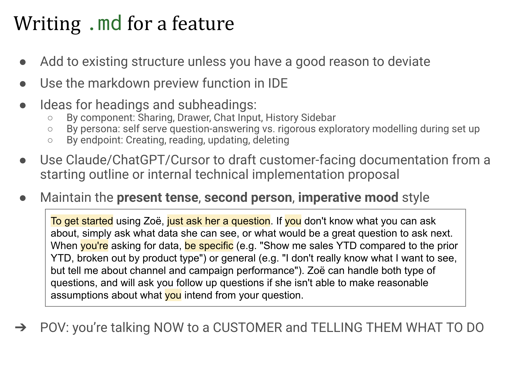
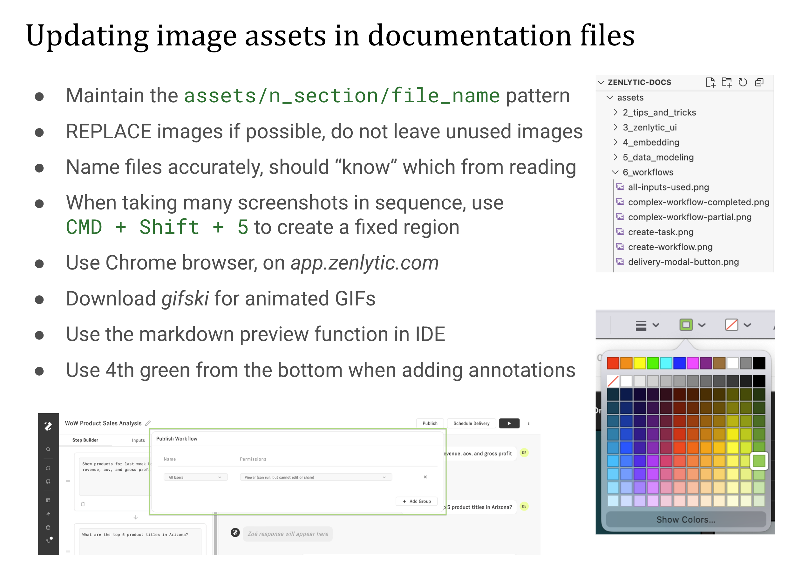
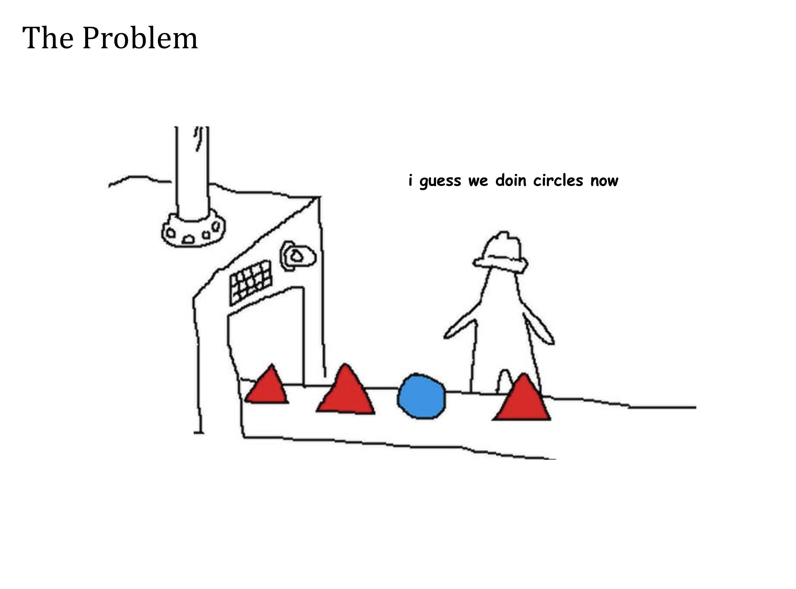
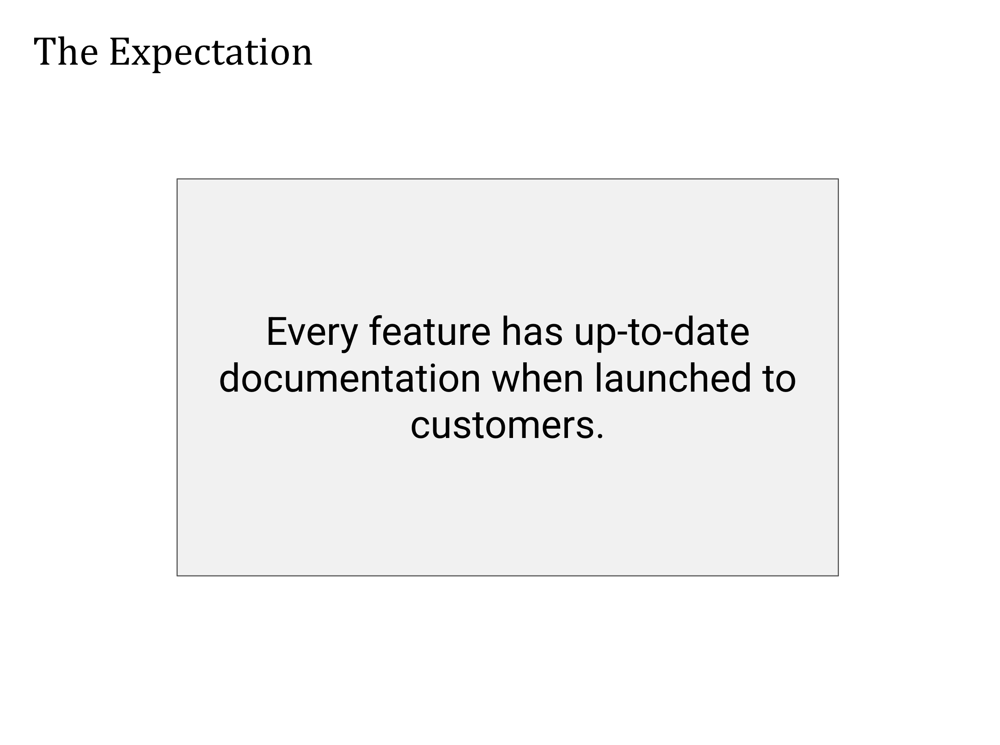

# Zenlytic Documentation Guide

## Quick Reference

| **Resource** | **Link** |
| --- | --- |
| **Published Docs** | [docs.zenlytic.com](https://docs.zenlytic.com) |
| **Git Repository** | [github.com/Zenlytic/zenlytic-docs](https://github.com/Zenlytic/zenlytic-docs) |
| **WYSIWYG Editor** | [Zenlytic Unified Docs on GitBook](https://app.gitbook.com/o/LgQQKGZY6Kzii4OzQGze/s/T9EV2yuH6oO9jfgfgYUW/getting-started/intro) |

> **Note:** GitBook requires a paid license invitation. Only request access if needed. Refer to GitBook API documentation for help with new sections and layouts.

## Documentation Process Overview

Engineers follow a 3-step process to document new features:

1. Write or update markdown files
2. Add or update images, if there are UI changes
3. Request PR review from Greg and Noah in `Zenlytic/zenlytic-docs` repo against `main` branch

## Step 1: Writing Markdown Files

### Guidelines

* **Follow existing structure** unless you have a compelling reason to deviate
* **Use your IDE's markdown preview** to review formatting as you write
* **Choose clear organizational patterns** for headings and subheadings:
  * **By component:** Sharing, Drawer, Chat Input, History Sidebar
  * **By user persona:** Self-serve question-answering vs. rigorous exploratory modeling during setup
  * **By functionality:** Creating, reading, updating, deleting
* **Leverage AI tools** like Claude, ChatGPT, or Cursor to draft customer-facing documentation from outlines or technical proposals
* **Maintain consistent voice:** Use present tense, second person, imperative mood

> To get started using Zoë, **just ask her a question**.
> If **you** don't know what you can ask about, simply ask what data she can see, or what would be a great question to ask next.
> When **you're** asking for data, **be specific** (e.g. "Show me sales YTD compared to the prior YTD, broken out by product type") or general (e.g. "I don't really know what I want to see, but tell me about channel and campaign performance").
> Zoë can handle both types of questions, and will ask you follow-up questions if she isn't able to make reasonable assumptions about what **you** intend from your question.

### Writing Perspective

**Remember:** You're writing directly to customers, giving them clear instructions on what to do right now.

## Step 2: Managing Image Assets

### File Organization

* **Follow the naming pattern:** `assets/n_section/file_name`
* **Replace images when updating** — avoid leaving unused files in the repository
* **Use descriptive file names** that clearly indicate the content

### Creating Screenshots and GIFs

* **For screenshot sequences:** Use `CMD + Shift + 5` to create a consistent capture region
* **Use Chrome browser** when capturing app screenshots from `app.zenlytic.com`
* **For animated content:** Download and use **gifski** for high-quality GIFs
* **Preview your work:** Use your IDE's markdown preview to verify image display
* **For annotations:** Use the 4th green color from the bottom of the color palette

## Step 3: Submitting and Reviewing Changes

### Pull Request Process

1. **Create a PR** in `Zenlytic/zenlytic-docs` against the `main` branch
2. **Request review** from Greg (`@zenlyticgreg`) and Noah (`@nmcdnld`) — this should happen automatically
3. **Collaborate on improvements** — reviewers will help with grammar, tone, and style
4. **Address feedback** — you may be asked to add missing sections or refine content
5. **Await merge** — reviewers will merge once approved

> **Important:** Only submit documentation for features that are ready for public release, as approved changes will be immediately visible to customers.

## Why Documentation Quality Matters

High-quality documentation is essential because:

* **First impressions count** — prospective customers, talent, and investors evaluate our product through our documentation
* **Customer success depends on clarity** — users need accurate, comprehensive guides to succeed with our platform
* **Internal efficiency improves** — well-documented features reduce support burden and onboarding time

## Building a Documentation-First Culture

Documentation becomes significantly easier when it's part of a broader writing culture. Consider creating documentation from existing materials such as:

* Figma mockups and design specifications
* Technical implementation proposals
* Product requirement documents
* Customer case studies and feedback
* Product marketing content
* Customer call recordings and notes

### Pre-Release Documentation

For features that are not yet generally available and should not be publicly visible before release, create documentation as a public-facing Notion document instead of adding it to this repository.

## Coverage Audit

### How to Use This Table

* **Add yourself as an owner** if you're willing to review and update specific documentation pages
* **Add your project** if you've built customer-facing functionality in the last 6 months that lacks documentation
* **Update status** as work progresses: ⏳ TODO → 👀 Needs Review → ✅ Done

| **Section** | **Page** | **Status** | **Owner** |
| --- | --- | --- | --- |
| Getting Started | Start Here | ⏳ |  |
| Tips and Tricks | All pages | 👀 |  |
| Zenlytic UI | Zoë | ✅ [View Docs](https://docs.zenlytic.com/zenlytic-ui/zoe) | Noah |
| Zenlytic UI | Using Zenlytic, Exploring, Follow Ups, Dashboards | ⏳ | Noah |
| Zenlytic UI | Data Model Editor, User Attributes, User Roles, Workspace Groups and Permissions, … | 👀 |  |
| Data Modeling | All pages | 👀 |  |
| Workflows | All pages | ✅ [View Docs](https://docs.zenlytic.com/workflows/getting-started) | Noah |
| Embedding | All pages | 👀 |  |
| Data Sources | All pages | 👀 |  |
| Auth and Security | All pages | 👀 |  |
| Dynamic Fields | All pages | ✅ | Tale & Nick |
| Memory | All pages | ✅ | geoff |
| Topics | All pages | ✅ | Tale |

> **Need to add something?** Add a new row above with your section, page, current status, and your name as owner.
