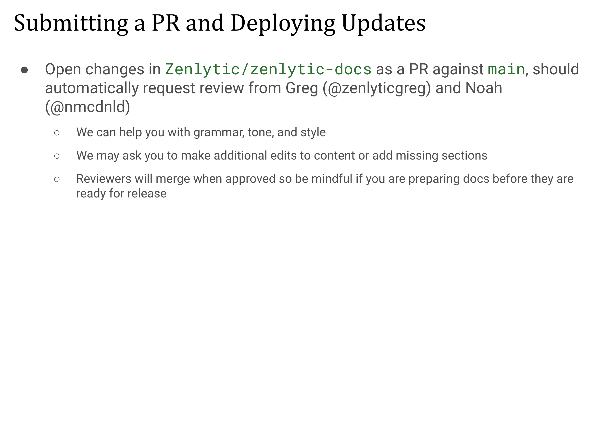

| **Public Link** | docs.zenlytic.com |
| --- | --- |
| **Git Repo** | https://github.com/Zenlytic/zenlytic-docs |
| **WYSWYG App UI** | “Zenlytic Unified Docs” on GitBooks [[link]](https://app.gitbook.com/o/LgQQKGZY6Kzii4OzQGze/s/T9EV2yuH6oO9jfgfgYUW/getting-started/intro)
• Invite required for a paid monthly license, only request if needed
• Look up GitBooks API docs if you need help making new sections, layouts, etc |

## [TODO: Add recording from July 21 Engineering meeting]

# It’s a 3 step process for Engineers to write documentation for their features:

1. Write or update markdown files
2. Add or update images, if there are UI changes
3. Request PR review from Greg and Noah in `Zenlytic/zenlytic-docs` repo against `main` branch

## Why it’s important:

- Prospective customers, talent, and investors will look at our documentation pages and expect to see a polished and accurate picture of the product

## A writing culture makes this easier:

- Documentation is made easier if it isn’t the only written artifact that emerges from development, can be synthesized from Figma mockups, technical implementation proposals, product requirement documents, case studies, customer calls, product marketing content, etc.

* If a feature is not GA and should not be leaked before release, the documentation should be a public facing Notion document

## Coverage Audit

Please add yourself to this list if you are willing to take responsibility for reviewing and making one of these pages up to date. Please add your self and project to this list if you have added customer-facing functionality in the last 6 months that is not currently documented. 

| **Section** | **Page** | **Status** | **Owner** |
| --- | --- | --- | --- |
| Getting Started | Start Here | TODO |  |
| Tips and Tricks | All pages | Needs Review |  |
| Zenlytic UI | Zoe | [Done](https://docs.zenlytic.com/zenlytic-ui/zoe) | Noah |
| Zenlytic UI | Using Zenlytic, Exploring, Follow Ups, Dashboards | TODO | Noah |
| Zenlytic UI | Data Model Editor, User Attributes, User Roles, Workspace Groups and Permissions, … | Needs Review |  |
| Data Modeling | All pages | Needs Review |  |
| Workflows | All pages | [Done](https://docs.zenlytic.com/workflows/getting-started) | Noah |
| Embedding | All pages | Needs Review |  |
| Data Sources | All pages | Needs Review |  |
| Auth and Security | All pages | Needs Review |  |
| Dynamic Fields | All pages | TODO | Tale & Nick ? |
| Memory | All pages | TODO | geoff ? |
| Topics | All pages | TODO | Tale ? |
| ??? | ??? | ??? | ??? |