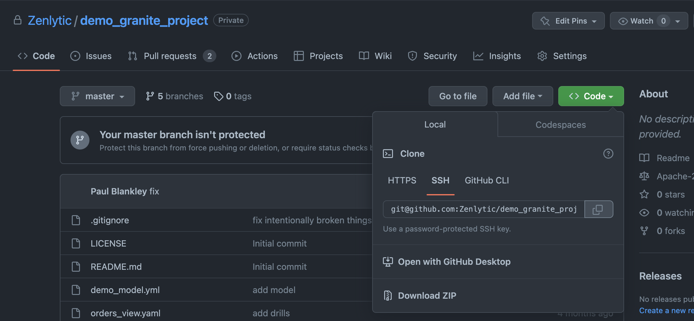
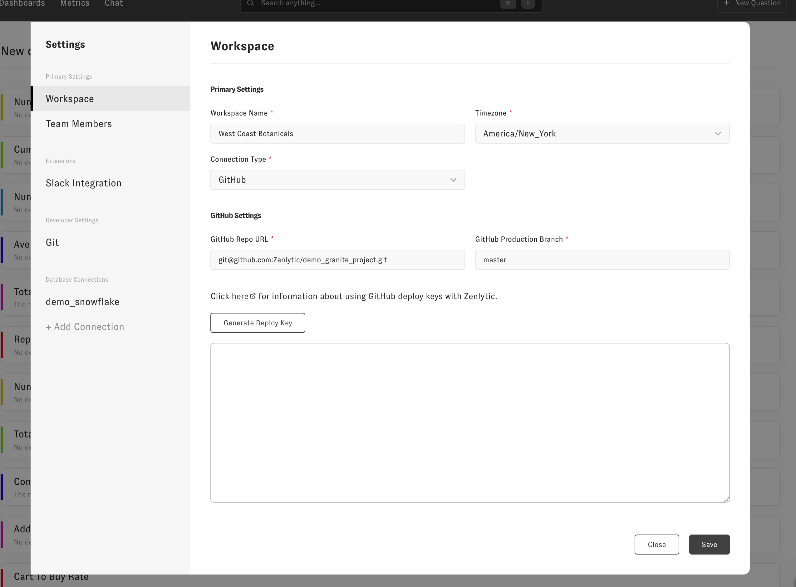
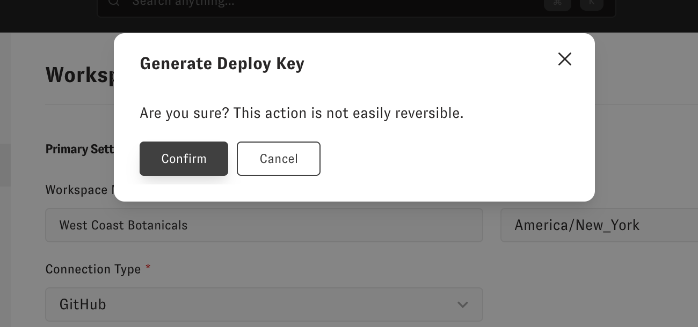
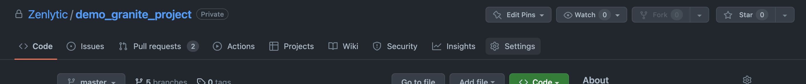
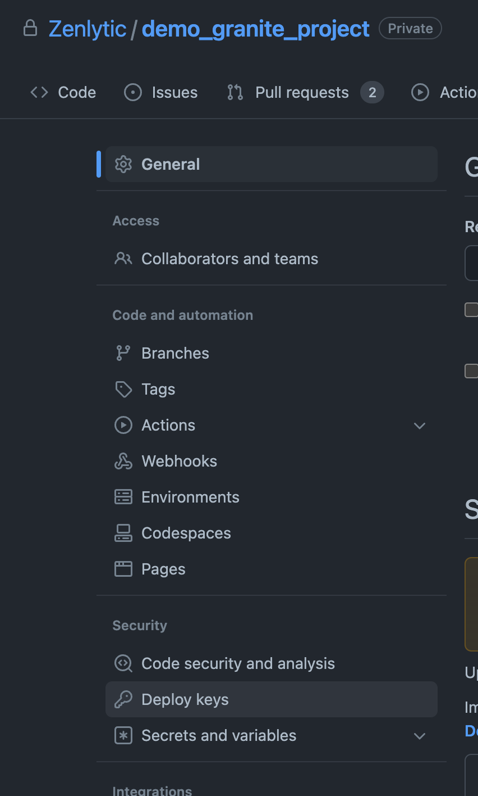

# Connecting To Github With A Deploy Key

## Commit identity and repository rules

Zenlytic writes to your repo every time a user saves model files from Context Manager. Every commit Zenlytic creates uses a fixed identity:

* **Author:** the email of the Zenlytic user who made the change
* **Committer:** `Zenlytic <hello@zenlytic.com>` on every commit, regardless of who made the change
* **Signature:** none — Zenlytic does not sign its commits


If your organization enforces rules on commit metadata, allow `hello@zenlytic.com` **before** you connect. Otherwise branch creation will succeed but every save will fail — these rules apply to every branch, not only protected ones. That's why creating a branch from Context Manager can succeed (no commit is created yet) while the first save fails (a commit is created).


Check these settings in GitHub, at both the organization and repository level (a clean repo-level ruleset doesn't rule out an organization-level one):

| Setting | Where to find it | What to do |
|---|---|---|
| Restrict commit metadata (committer email) | Rulesets | Allow `hello@zenlytic.com` |
| Require signed commits | Rulesets, or classic branch protection | Disable for this repo |

Metadata restrictions (including committer email pattern) require **GitHub Enterprise Cloud or Enterprise Server** — this option won't appear under Rulesets on GitHub Free, Pro, or Team.

The push itself still authenticates with the deploy key you install below — your access control is unchanged. Only the commit metadata carries the Zenlytic service identity.

**Symptom if this isn't configured:** "Save Model Files Unsuccessful / Failed to save model" in Context Manager on every branch. The underlying push is rejected with a rule violation naming the committer email `hello@zenlytic.com`.

## Connecting your repository

**Step 1:** In Zenlytic, you'll first go into Settings, then Workspace Settings

**Step 2:** Next, find your git repo details (these will be in Github).

Make sure to use the "SSH" format of the git URL. The format looks like `git@github.com:<YOUR_ORGANIZATION>/<YOUR_REPO>.git`, and you can find it here in your Github repo under the "Code" button with the SSH tab as shown below.

**Step 3:** Now that you have that URL and the branch you want to use as your production branch, return to Zenlytic. In this example, we pasted our Github repo url (SSH format) and our production branch, which was: `master`.

**Step 4:** Next we need to generate the SSH key we'll use to connect. Hit the "Generate Deploy Key" button, then the "Confirm" button, and copy the public SSH key generated.

**Step 5:** Then hit Copy Deploy Key.

**Step 6:** Now that you have the deploy key copied return to Github and go to "Settings."

**Step 7:** Then go to Deploy Keys in the left-hand menu.

**Step 8:** Then, click "Add new" and give your deploy key a name. Finally, paste that SSH key and click "Add Key."

**Step 9:** Then click "Save" in the Zenlytic UI. If this saves without an error, you can close the window. You're fully connected to Github!

