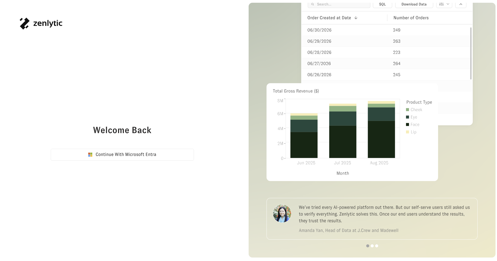

# Enforce SSO-Only Login

In SSO-enabled workspaces, the default username and password sign-in path on the workspace login page can be disabled by request. After Zenlytic applies the change, the workspace login page shows only your configured SSO provider as a sign-in option. This is a configuration Zenlytic applies on your behalf — it is not a self-serve setting in the workspace UI.

## What it does

By default, Zenlytic workspaces accept sign-ins from both:

* The **default Cognito provider** (username and password), and
* Any **SSO providers** you've configured (Microsoft Entra, Okta, etc.).

When the default Cognito provider is disabled for your workspace, username/password sign-in is no longer available on the workspace login page.

<figure><figcaption>
The Zenlytic sign-in page in a workspace with the default Cognito provider disabled — only the configured SSO provider is offered.
</figcaption></figure>

## Prerequisites

* At least one SSO provider must be configured and verified working. See:
  * [Microsoft Entra Zenlytic](microsoft_entra_zenlytic.md)
  * [Okta Zenlytic](okta_zenlytic.md)
* **Strongly recommended:** before requesting the change, confirm at least one administrator can successfully sign in via SSO.

## How to request the change

To have the default Cognito provider disabled for your workspace:

1. Contact your Zenlytic account team or [support@zenlytic.com](mailto:support@zenlytic.com).
2. Confirm which workspace(s) you want the change applied to.
3. Confirm at least one administrator account can sign in via SSO.

Zenlytic will apply the change on your behalf.

## Recovery

If your IdP becomes unavailable after the default Cognito provider is disabled on the workspace login page, administrators can still sign in by going to [app.zenlytic.com](https://app.zenlytic.com) directly with their username and password, then switching into the affected workspace from the workspace selector. The workspace-level setting only removes the Cognito option from the workspace login page — existing username/password credentials still authenticate at the top-level app entry point.

**Recommendation:** Admin and Organization Admin users should keep both an SSO login and a username/password login on file, so they always have a backup sign-in path if the IdP is ever unavailable.

## Related

* [Microsoft Entra Zenlytic](microsoft_entra_zenlytic.md)
* [Okta Zenlytic](okta_zenlytic.md)
* [Login Troubleshooting](login_troubleshooting.md)
