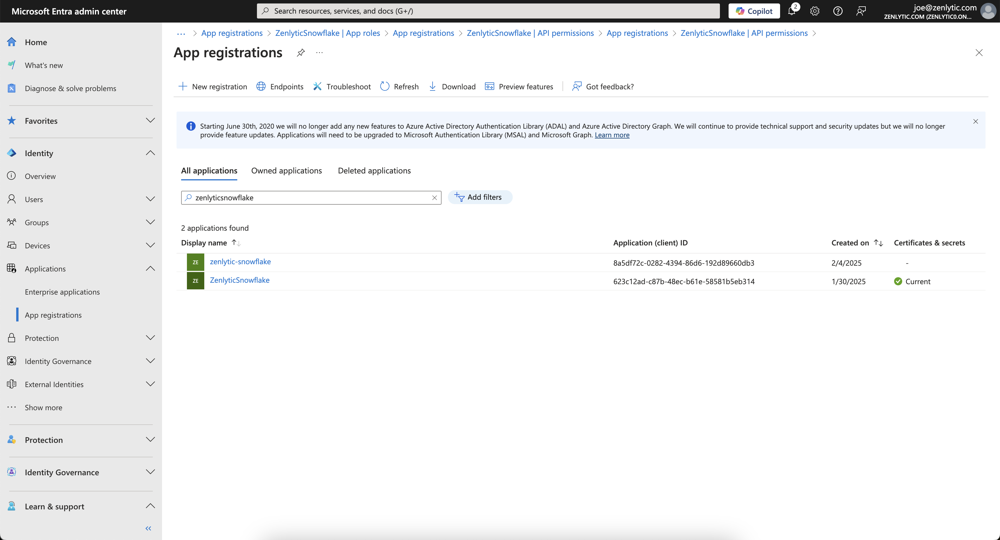
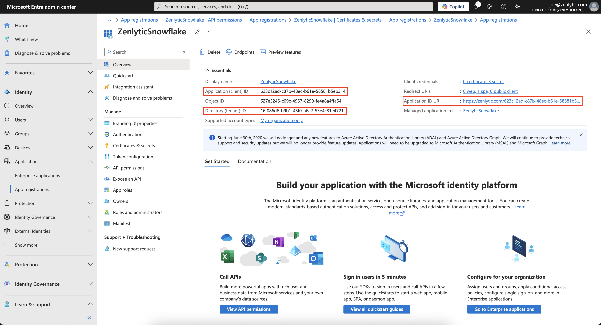
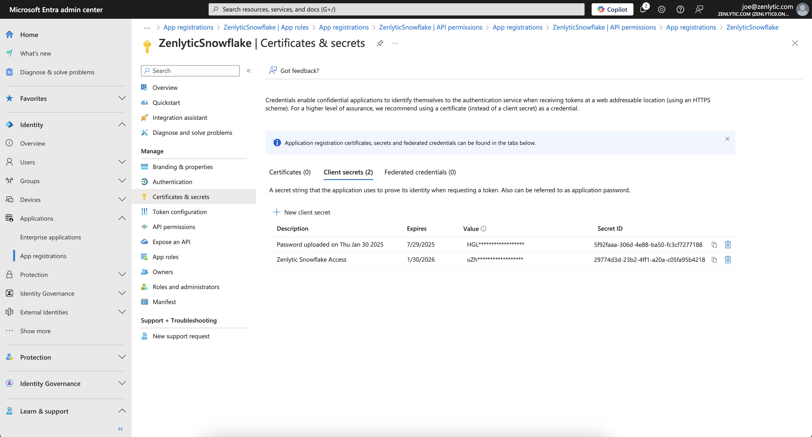
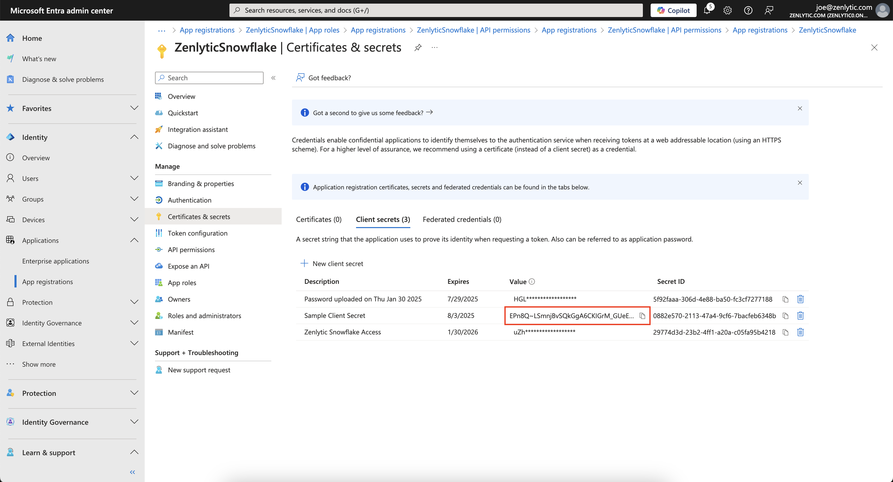

# Snowflake with Entra - What to Send

Before continuing, complete the setup process in this document to configure Zenlytic as an OAuth provider for Snowflake and Microsoft Entra.

## The following items are a prerequisite to send to Zenlytic

1. Application (client) ID
2. Directory (tenant)
3. Application ID URI
4. Client Secret

## Step by Step

1. Inside of your Zenlytic Snowflake App Registration, navigate to the Overview section.

2. Copy and save the Application (client) ID from the Application (client) ID field.

3. Now navigate to the Directory (tenant) ID section and copy the value.

4.  In the Application ID URI section, copy the value.

    a. **TIP**: Make sure to keep this information secure and share it only with your Zenlytic contact.

