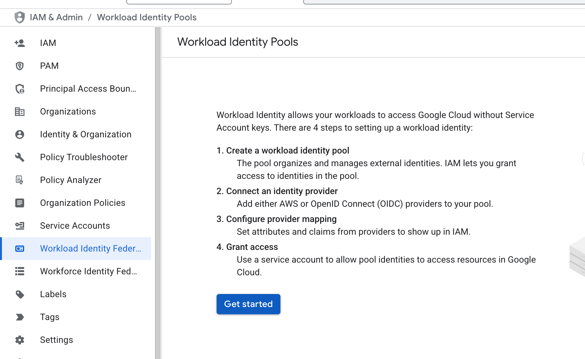
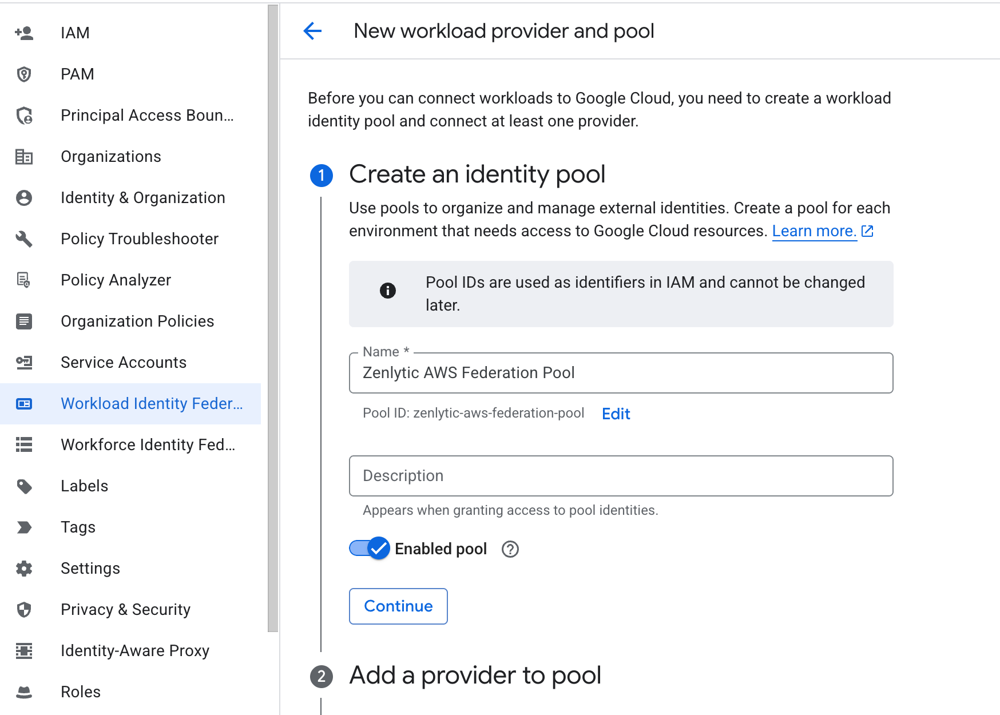
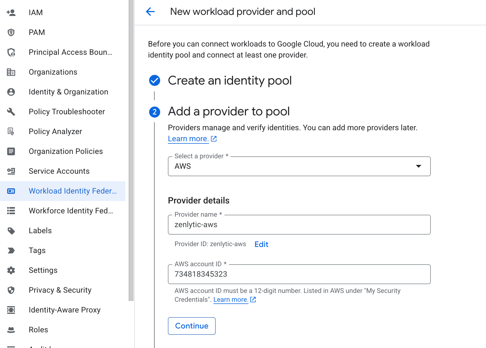
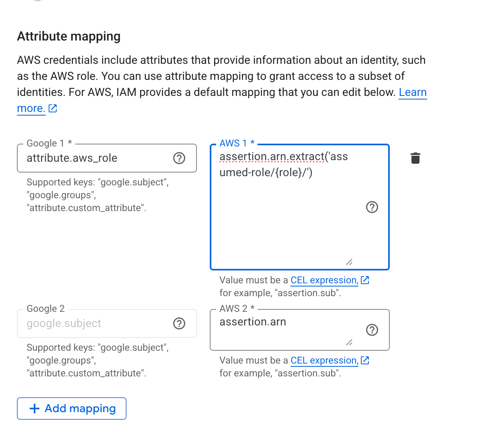
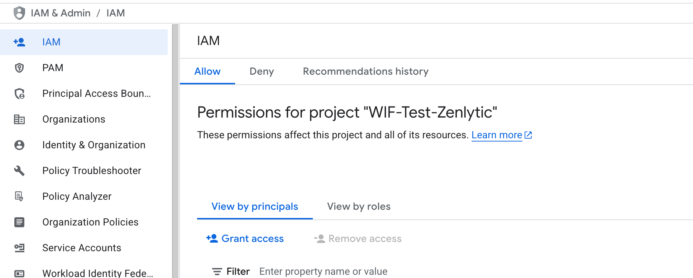
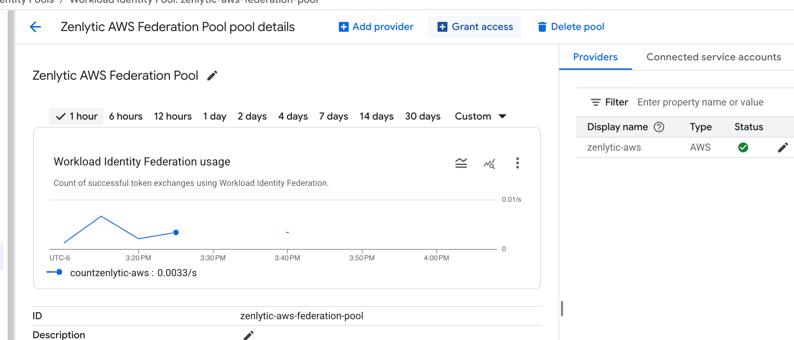
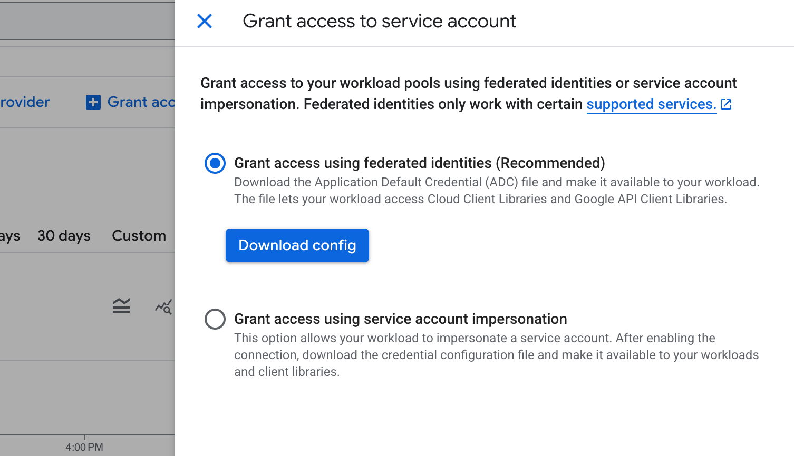
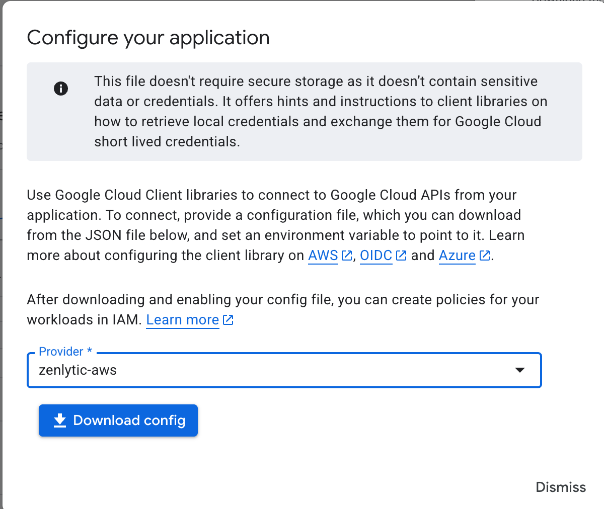

# Google Workload Identity Federation

These are the steps a customer needs to take to enable Workload Identity Federation (WIF) to let Zenlytic (hosted in AWS) connect their BigQuery instance (hosted in GCP).

1. Enable the required APIs: **Security Token Service (STS)**, **IAM Service Account Credentials**, and **BigQuery** APIs
2. Create a Workload Identity Pool. You can create this via the console, following these instructions. First, navigate to Workload identity federation and begin the process to create a workload identity pool



After clicking Get Started, fill out the next screen



3. Next, create the provider and add it to the Pool. Select AWS, and use the Zenlytic AWS account id 734818345323



4. Modify the provider attribute for attribute.aws\_role to become the value assertion.arn.extract('assumed-role/{role}/'), and then click Save at the bottom of the screen.



5. Get the principle value to add permissions to in GCP. You will need to follow the format in these [Google Cloud Workload Identity Federation documentation](https://cloud.google.com/iam/docs/workload-identity-federation?_gl=1*1a70t2e*_ga*MTA2MzMwNDkwMS4xNzQ4NTMzOTU2*_ga_WH2QY8WWF5*czE3NDg1MzM5NTYkbzEkZzEkdDE3NDg1Mzg1NTEkajQ1JGwwJGgw#impersonation) from Google, which will be:

```bash
principalSet://iam.googleapis.com/projects/<PROJECT_NUMBER>/locations/global/workloadIdentityPools/<POOL_ID>/attribute.aws_role/<ATTRIBUTE_VALUE>
```

You will fill in those values with the values you have from this process so far, and one value from the Zenlytic team.

* `<PROJECT_NUMBER>` is the project number of your GCP project. (e.g. `123456789`)
* `<POOL_ID>` is the id of the pool you've created (note the light grey text in step 2, for this example the value is zenlytic-aws-federation-pool)
* `<ATTRIBUTE_VALUE>` you will confirm this with your Zenlytic account contact, but the value will follow a pattern like this, which corresponds to the special purpose AWS role Zenlytic will use to call out to your resources (e.g. \<company\_name>-gcp-workload-identity-federation-role-prod)

Using those values, the final principle would be

```bash
principalSet://iam.googleapis.com/projects/123456789/locations/global/workloadIdentityPools/zenlytic-aws-federation-pool/attribute.aws_role/mycompany-gcp-workload-identity-federation-role-prod
```

6. Give that principle access to the resources in BigQuery you would like it to have. For example, in the IAM screen, click **"Grant Access"**



Then paste the full url of the principle that you defined earlier in the principle option and hit enter. After you do that, you can give the principle the required roles for BigQuery.


Finally, click Save.

7. Download the config for the principle to connect. In the Workload Identity Pool, click Grant Access to get started



Then leave the first option checked, and click Download config



Select the Zenlytic AWS **zenlytic-aws provider**, and click Download config



You will put this config into Zenlytic to configure the connection to BigQuery, after adding the project\_id to the json.

8. Finally, the json will look like

```json
{
	"project_id": "<your-project-id>", // NOTE: You must add this line
  "universe_domain": "googleapis.com",
  "type": "external_account",
  "audience": "//iam.googleapis.com/projects/33333333333/locations/global/workloadIdentityPools/zenlytic-aws-federation-pool/providers/zenlytic-aws",
  "subject_token_type": "urn:ietf:params:aws:token-type:aws4_request",
  "token_url": "https://sts.googleapis.com/v1/token",
  "credential_source": {
    "environment_id": "aws1",
    "region_url": "http://169.254.169.21/latest/meta-data/placement/availability-zone",
    "url": "http://169.254.169.21/latest/meta-data/iam/security-credentials",
    "regional_cred_verification_url": "https://sts.{region}.amazonaws.com?Action=GetCallerIdentity&Version=2011-06-15"
  }
}
```
