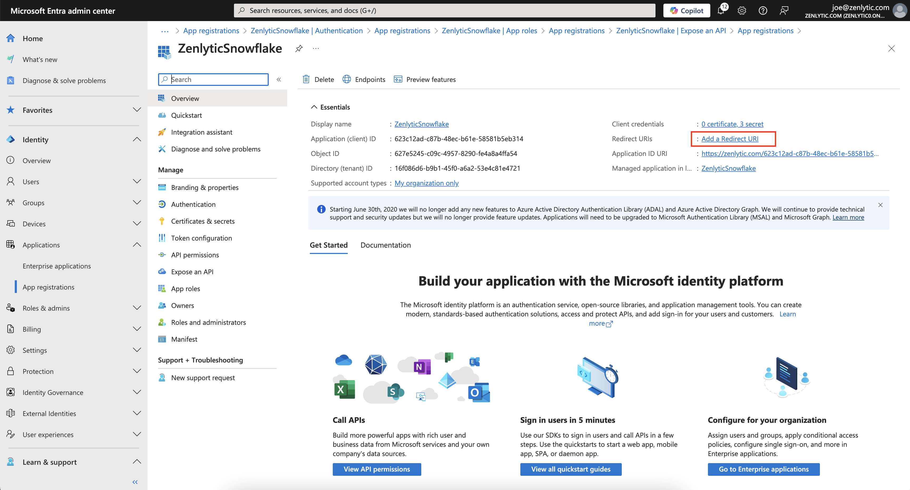
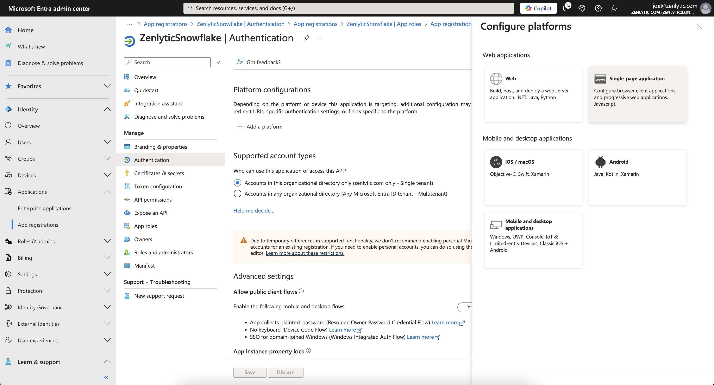
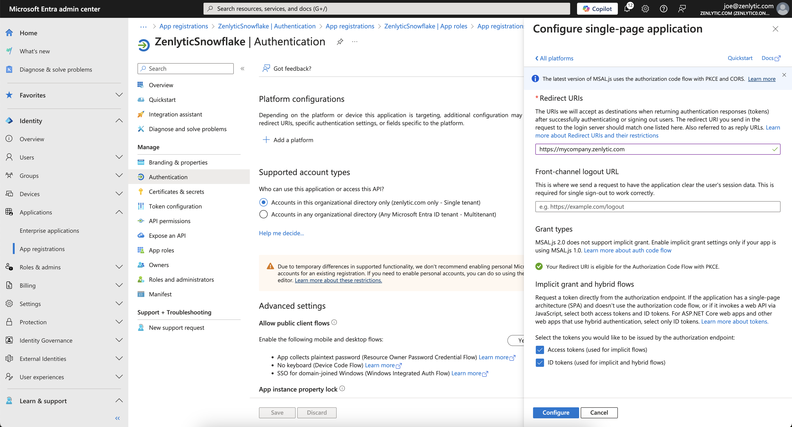
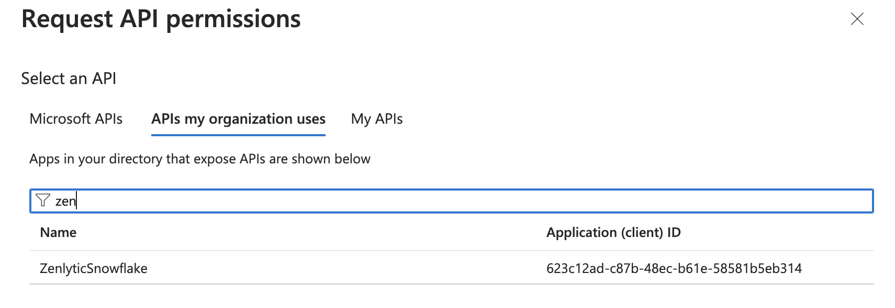

---
layout:
  title:
    visible: true
  description:
    visible: false
  tableOfContents:
    visible: true
  outline:
    visible: true
  pagination:
    visible: true
---

# Snowflake with Microsoft Entra

This document will guide you through the process of enabling Microsoft Entra (formerly Active Directory) as an authentication option with Snowflake.

## Outcome

* You'll have a custom sign in page with an option to Sign in with Microsoft Entra.
* You'll be able to control access to Zenlytic via Microsoft Entra

## Prerequisites

* Before continuing make sure you understand the full process outlined here in [Snowflake's guide](https://docs.snowflake.com/en/user-guide/oauth-azure#label-configure-oauth-resource-in-microsoft-idp). This guide mostly comprises Snowflake's, with some extra context added in some potentially confusing areas.

## Understanding the Requirements

Zenlytic will need both access to both of the flows listed in Snowflake's guide:

1. The authorization server can grant the OAuth client an access token on behalf of the user.
2. The authorization server can grant the OAuth client an access token for the OAuth client itself.

## Step 1: Configure Zenlytic in Microsoft Entra ID

### Create the OAuth Resource

1. Navigate to the [Microsoft Azure Portal](https://portal.azure.com/) and authenticate.
2. Navigate to Microsoft Entra ID.
3. Click on **App Registrations**.
4. Click on **New Registration**.
5. Enter `Zenlytic Snowflake`, or similar value as the **Name**.
6. Verify the **Supported account types** is set to **Single Tenant**.
7. Leave **Redirect URI** empty
8. Click **Register**.

### Expose the API

1. Click on **Expose an API**.
2. Click on the **Add** link next to **Application ID URI** to set the `Application ID URI`.

> **Important**
>
> The Application ID URI must be unique within your organization's directory, such as https://your.company.com/4d2a8c2b-a5f4-4b86-93ca-294185f45f2e.
>
> **Tip**: You can use a unique id generator website like [UUID Generator](https://www.uuidgenerator.net/) for the second part of the url

3. Now we'll add the scope for the web app client, click on **Add a scope** to add a scope representing the Snowflake role.
   * Enter the scope by having the name of the Snowflake role with the `session:scope:` prefix. For example, for the Snowflake Analyst role, enter `session:scope:analyst`.
   * Select who can consent.
   * Enter a **display name** for the scope (e.g.: Account Admin).
   * Enter a **description** for the scope (e.g.: Can administer the Snowflake account).
   * Click **Add Scope**.
4. And now we'll add the scope for the api
   * Click on **Manifest**.
   * Locate the `appRoles` element.
   * Enter an **App Role** with the following settings.
   * The App Role manifests as follows.

| Setting            | Description                                                                                                               |
| ------------------ | ------------------------------------------------------------------------------------------------------------------------- |
| allowedMemberTypes | Application                                                                                                               |
| description        | A description of the role                                                                                                 |
| displayName        | A friendly name for users to view                                                                                         |
| id                 | A unique ID. You can use the `[System.Guid]::NewGuid()` function from PowerShell to generate a unique ID if needed.       |
| isEnabled          | Set to `true`                                                                                                             |
| origin             | Set to `Application`                                                                                                      |
| value              | Set to the name of the Snowflake role with the `session:role:` prefix. For the Analyst role, enter `session:role:analyst` |

The App Role manifests as follows.

```json
"appRoles":[{
    "allowedMemberTypes": [ "Application" ],
    "description": "Account Administrator.",
    "displayName": "Account Admin",
    "id": "3ea51f40-2ad7-4e79-aa18-12c45156dc6a",
    "isEnabled": true,
    "origin": "Application",
    "value": "session:role:analyst"
}]
```

5. Click Save

### Set up Redirect URI

1. Go to the home page of your new `Zenlytic Snowflake` **App Registration** and click **Add a Redirect URI**



2. Click Add a Platform
3. Choose Single-page application



4. Under the **Redirect URIs** section, enter `https://<your_company_subdomain>.zenlytic.com`\
   a. Ex: `https://mycompany.zenlytic.com`\
   b. If you're not sure what your subdomain is, reach out to your Zenlytic contact
5. Select **Access tokens (used for implicit flows)** and **ID tokens (used for implicit and hybrid flows)**
6. Click Add a Platform
7. Choose Single-page application
8. Click Configure

<figure><figcaption></figcaption></figure>

4. Under the **Redirect URIs** section, enter `https://<your_company_subdomain>.zenlytic.com`\
   a. Ex: `https://mycompany.zenlytic.com`\
   b. If you're not sure what your subdomain is, reach out to your Zenlytic contact or [email support](mailto:support@zenlytic.com)
5.  Select **Access tokens (used for implicit flows)** and **ID tokens (used for implicit and hybrid flows)**

    <figure><figcaption></figcaption></figure>
6. Click Configure

## Step 2: Create the OAuth Client

1. In the **Overview** section of your `Zenlytic Snowflake` application , copy the `ClientID` from the **Application (client) ID** field.
2. Click on **Certificates & secrets** and then **New client secret**.
3. Add a description of the secret.
4. Select the time period that you feel comfortable with. Once this secret expires, Zenlytic will lose the ability to authenticate with Snowflake. You'll need to generate and share with Zenlytic a new secret before that expires to avoid downtime.
5. Click **Add**. Copy the secret for later.
6. Now we need to configure Delegated permissions for the Zenlytic
   * Click on **API Permissions**.
   * Click on **Add Permission**.
   * Click on **My APIs**.
   *   Click on the **Snowflake OAuth Resource** that you created in [Step 1: Configure Zenlytic in Microsoft Entra ID](microsoft_entra_snowflake.md#step-1-configure-zenlytic-in-microsoft-entra-id)

       <figure><figcaption></figcaption></figure>
   * Click on the **Delegated Permissions** box.
   * Check on the Permission related to the Scopes defined in the Application that you wish to grant to this client.
   * Click **Add Permissions**.
   * Choose the permission you wish to grant Zenlytic
   * Click **Add Permission**.
7. Now we need to configure API permissions for Applications as follows.
   * Click on **API Permissions**.
   * Click on **Add Permission**.
   * Click on **My APIs**.
   *   Click on the **Snowflake OAuth Resource** that you created in [Step 1: Configure Zenlytic in Microsoft Entra ID](microsoft_entra_snowflake.md#step-1-configure-zenlytic-in-microsoft-entra-id)

       <figure><figcaption></figcaption></figure>
   * Click on the **Application Permissions**.
   * Check on the **Permission** related to the Roles manually defined in the `Manifest` of the Application that you wish to grant to this client.
   * Click **Add Permissions**.
   * Choose the permission you wish to grant Zenlytic
   * Click **Yes**.

## Step 3: Next Steps

1. You'll now need to make sure your Entra instance and Snowflake have the appropriate security integrations. Follow the guide [here](https://docs.snowflake.com/en/user-guide/oauth-azure#collect-azure-ad-information-for-snowflake).
2. Next, you'll need to send your Zenlytic contact the appropriate information outlined [here](entra-snowflake-what-to-send.md).
3. Reach out to your Zenlytic contact or [support@zenlytic.com](mailto:support@zenlytic.com) with any questions/issues about the process
