---
layout:
  title:
    visible: true
  description:
    visible: false
  tableOfContents:
    visible: true
  outline:
    visible: true
  pagination:
    visible: true
---

# Microsoft Entra Zenlytic

## How to setup Microsoft Entra to Authenticate in Zenlytic

This document will guide you through the process of enabling Microsoft Entra (formerly Active Directory) as an authentication option with Snowflake.

### Outcome

* You'll have a custom sign in page with an option to `Sign in with Microsoft Entra`.
* You'll be able to control access to Zenlytic via Microsoft Entra

### Prerequisites

* Please note that the Microsoft Entra Sign-On integration is exclusively available for workspaces on the Enterprise plan.

### 1. First Steps

To begin the process, reach out to your Zenlytic contact and let them know you'd like to use Microsoft Entra SSO.

You'll work with them to create a company specific login page on your custom Zenlytic subdomain (`mycompany.zenlytic.com`)

After that conversation, they will provide you with these two important values for future use:

```
1. `Identifier (Entity ID)`
2. `Reply URL (Assertion Consumer Service URL)`
```

### 2. Creating an Entra Application for Zenlytic

Go to the `Enterprise application` section in Microsoft Entra and click `New Application`

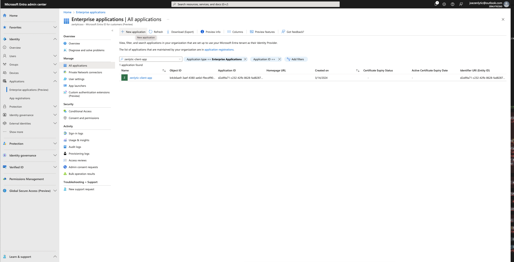

Click the `Create your own application` button.

Here we'll give it a name, for example `zenlytic-client-app`, then select the `Non-gallery option`.

Then click the Create button.

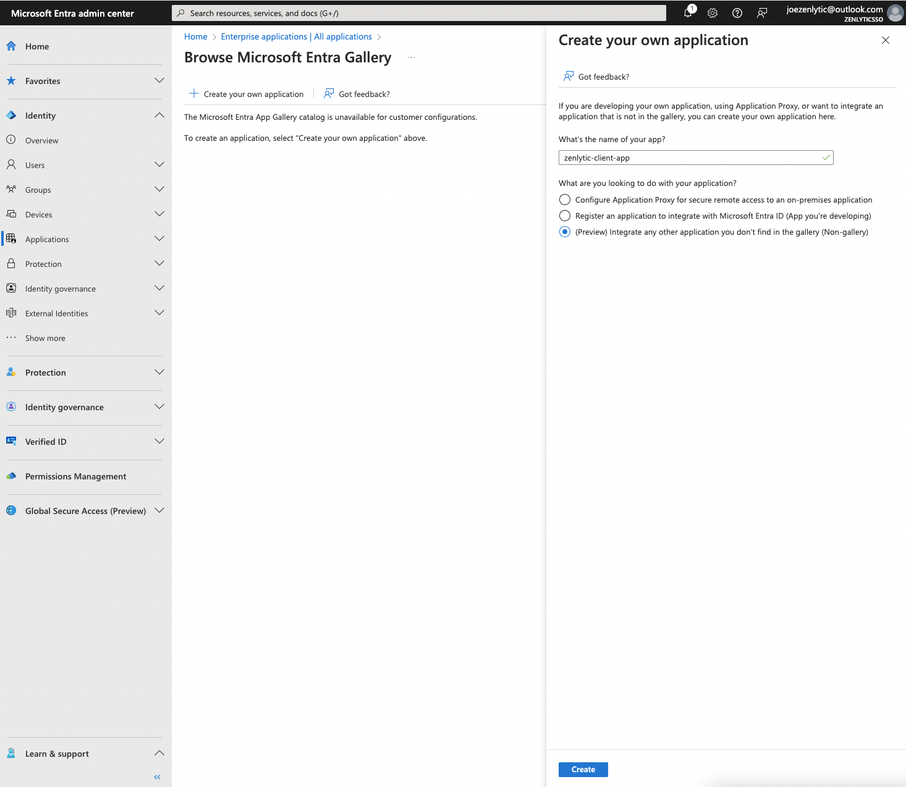

### 3. Configuring your Zenlytic Application

Before continuing, ensure that you have obtained these values from your Zenlytic contact:

```
1. `Identifier (Entity ID)`
2. `Reply URL (Assertion Consumer Service URL)`
```

Now go to our newly created application under the `Enterprise applications` section. Go ahead and click the name to open it.

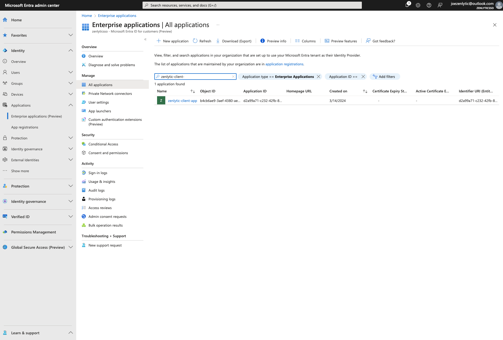

We'll select the Single sign-on section, then choose SAML as the single sign-on method

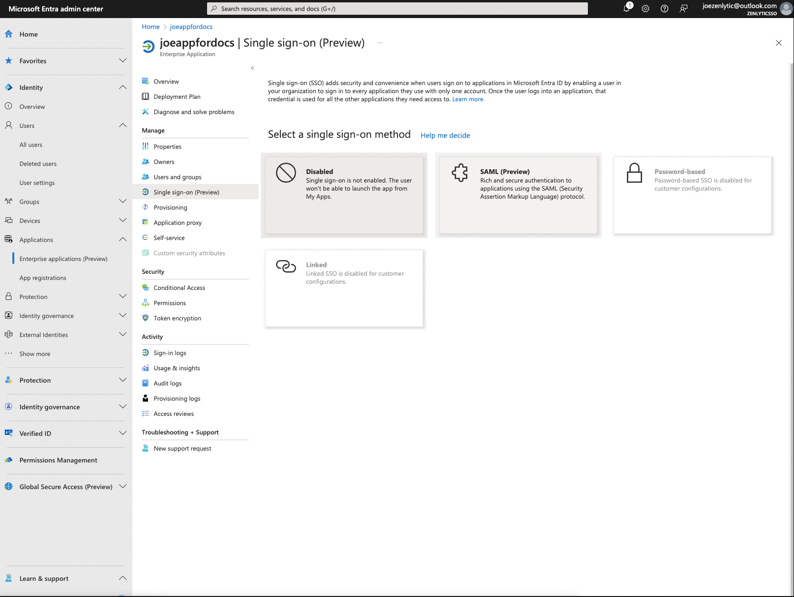

Click the `Edit` button for `Basic SAML Configuration`

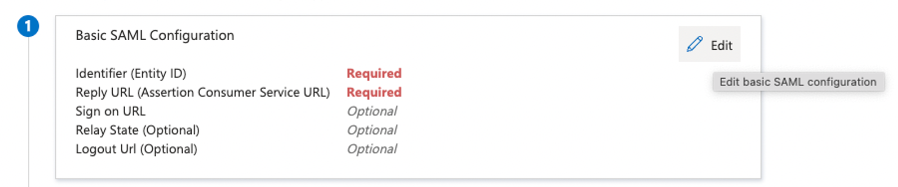

Choose `Add identifier` for the `Identifier (Entity ID)` section and enter the Entity ID that the Zenlytic support team gave you.

Now under `Reply URL (Assertion Consumer Service URL)`, enter the value the Zenlytic support gave you.

Your form should look similar to this:

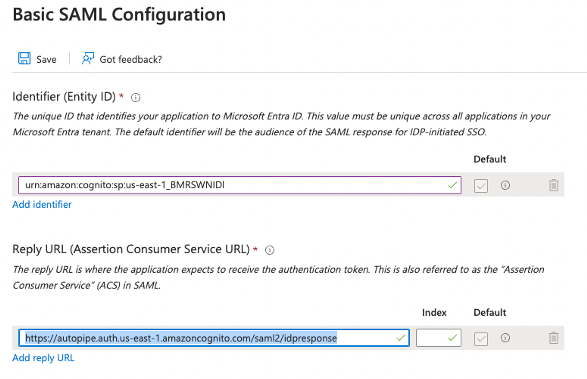

Hit the Save button and hit the `X` button.

### 4. Manage Attributes and Claims

In this section, you'll configure what you send to Zenlytic when a user signs in. We'll need to make a few adjustments to ensure Zenlytic is using the correct fields for a user.

Click the `Edit` button for `Attributes & Claims`

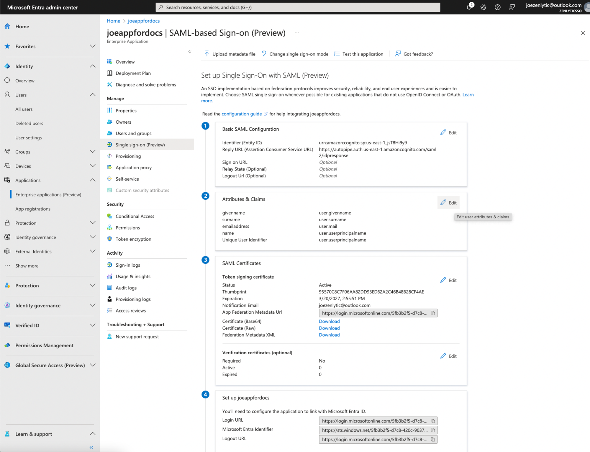

* Zenlytic requires these fields to be mapped:
  * `emailaddress`
  * `givenname`
  * `name`
  * `surname`

By default, your mappings will look something like this:

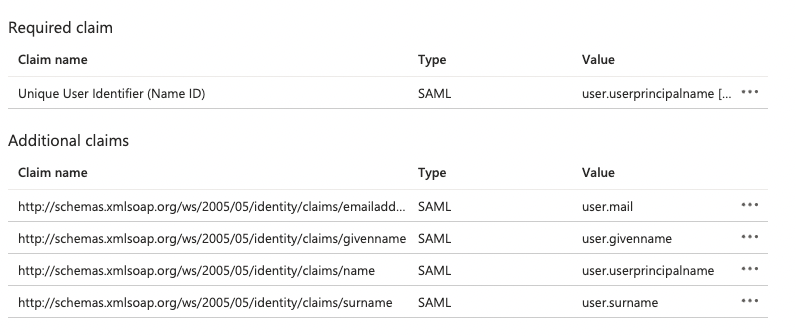

In the past we've some users have varying `namespaces` for their claims. So just in case, we'll clear those values out.

Click on each of the claims under `Additional Claims`, and clear out the `Namespace value`

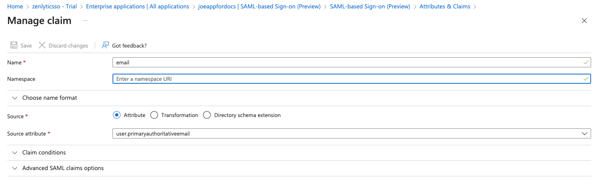

Your claim section should now similar to this:

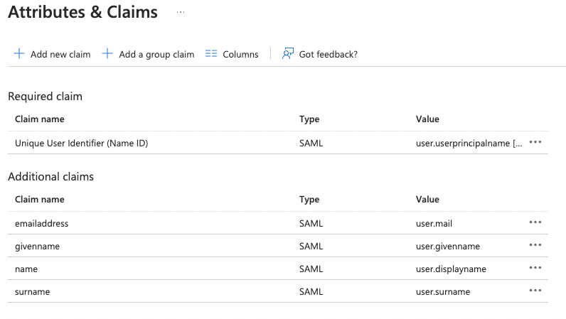

It's important to note that your company may be using non-default values to represent your users. Specifically, we've seen some customers not have a value for the `user.mail` field.

If we hit issues later on in the process, we'd recommend reaching out to an admin on your Entra account about this, or reach out to Zenlytic and we'll walk you through which value to use there. Please check out the Debug section of this article for additional notes.

#### You may optionally include these fields:

`zenlytic_role`

When a user first signs into Zenlytic using Entra, this will be the access level they are granted.

Must be one of these values:\
\- admin\
\- develop\
\- develop\_without\_deploy\
\- explore\
\- view

​`zenlytic_user_attributes`

Allows you to manually control access to data.\
Read about how user attributes work here in [Zenlytic Docs](../3_zenlytic_ui/user_attributes/).\
Should follow this format. An array of key/value pairs.\
\- Ex: `[{\"department\": \"Engineering\"}]`

> **💡 Tip:** For help with setting up custom Entra attributes, check out the [How-To section for this optional step](microsoft_entra_zenlytic.md#how-to-set-up-custom-claims-in-entra)

Now click the X button to return back to your Application

You may be taken back to the this screen, if so just go back to your application by clicking this section:

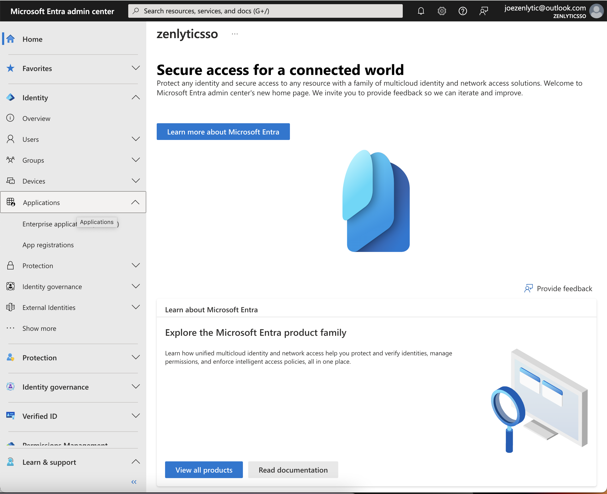

### 5. Providing Zenlytic your App Federation Metadata Url

* Copy this Url and you'll need to send it to your Zenlytic contact.

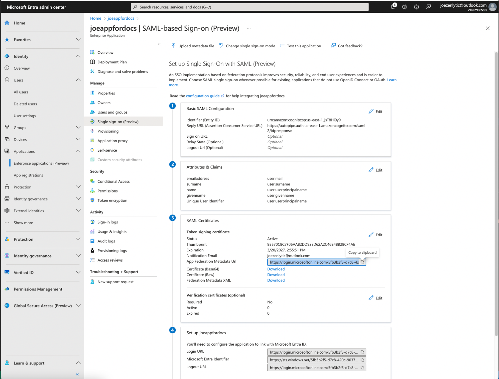

Once we receive that url, we'll finish up the rest of the setup on our and let you know when you're all set!

### 6. Adding Users/Groups to Zenlytic

With your application selected, click the "Users and Groups" tab.\
Now click the "Add user/group" button.\
Assign whomever you'd like to have access to Zenlytic.

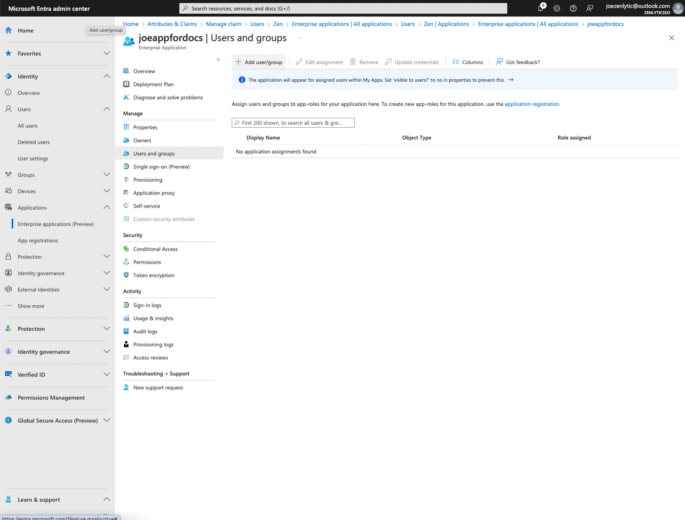

### 7. On Completion

* **Requirements:** Make sure you've sent your Zenlytic contact the `App Federation Metadata Url` for your application.

Your Zenlytic contact will let you know when your SSO onboarding is ready for use. Once you hear from them, you'll now be able to use your company specific login page:

`mycompany.zenlytic.com/login`

## Optional Steps

### How-to Set up Custom Claims in Entra

For information on available custom claims, see this section.

First we'll go back to the `Single sign-on` section for our App and click `Edit` on `Attributes & Claims`

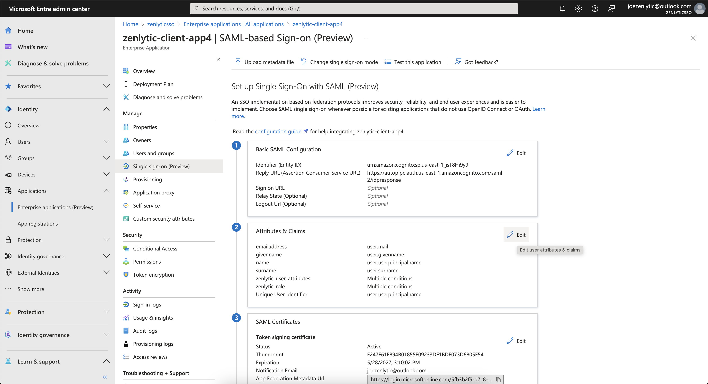

Now click Add new claim

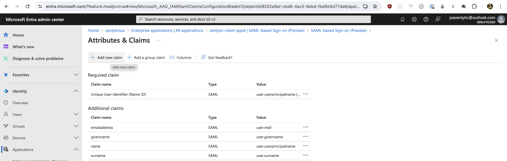

We'll set up the `zenlytic_role` field, so in the `Name` input, type `zenlytic_role`

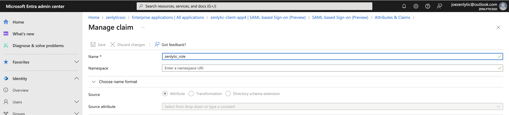

Now open `Claim Conditions` and select Any for your `User type`

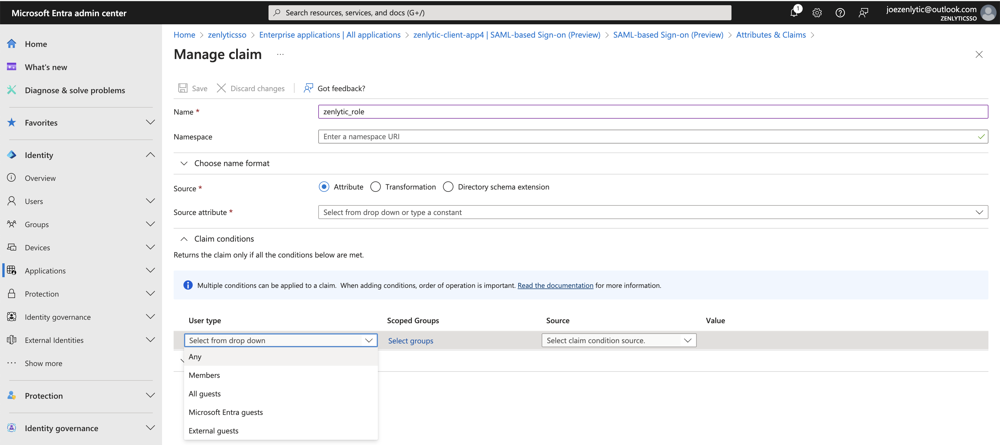

Now under `Scoped Groups`, select the user group that you'd like to set the `zenlytic_role` for.

In our case, we've created a group called `Zenlytic Admin` which denotes user that should have full access to Zenlytic.

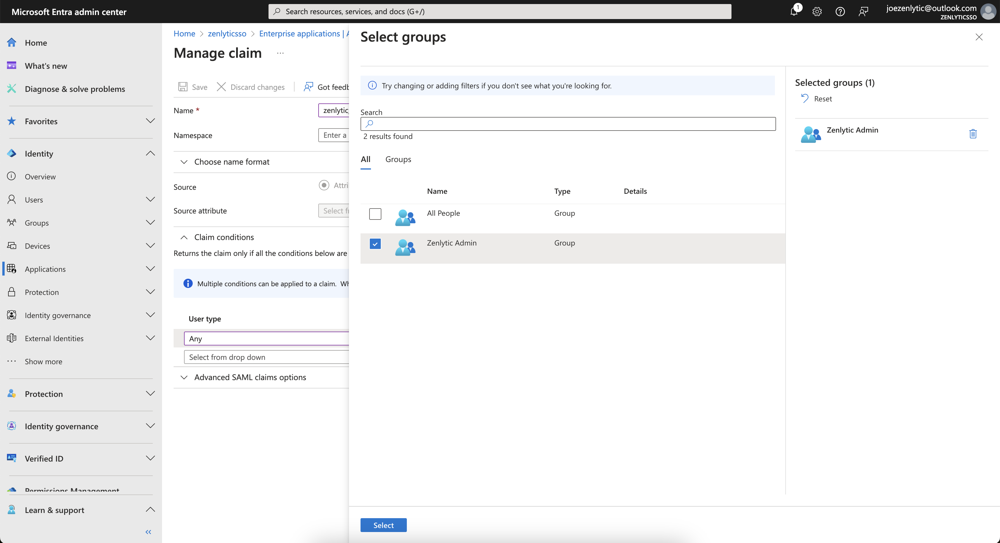

Select `Attribute` in `Source`

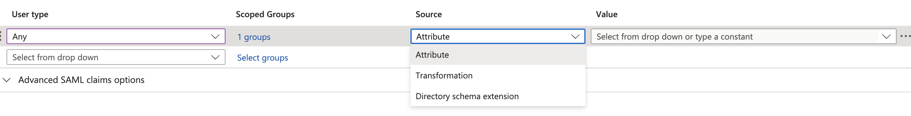

Now type in the value that you wish this user group to have for `zenlytic_role`. In our case, we want it to have `admin`. Make sure to hit enter after typing your value.​

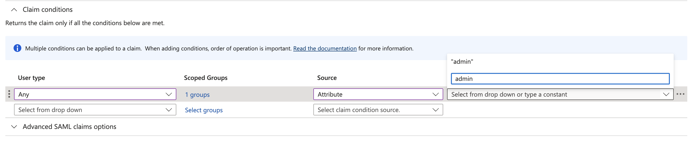

Lets say we want all other users to have the lowest level of access, view, you would just add another condition, where here my `Scoped Group` is a group called `All Users`.

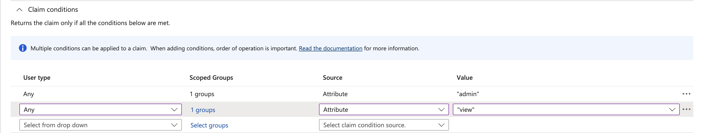

### Debug Steps

Feel free to reach out to your Zenlytic contact or support@zenlytic.com if you encounter issues during setup.

If you're attempting to sign in to Zenlytic using Entra, and you're seeing errors about permissions, ensure that your Entra user has the appropriate permissions in Entra.

You can adjust a user/group role by going to the Users tab and then assigning them a proper role.

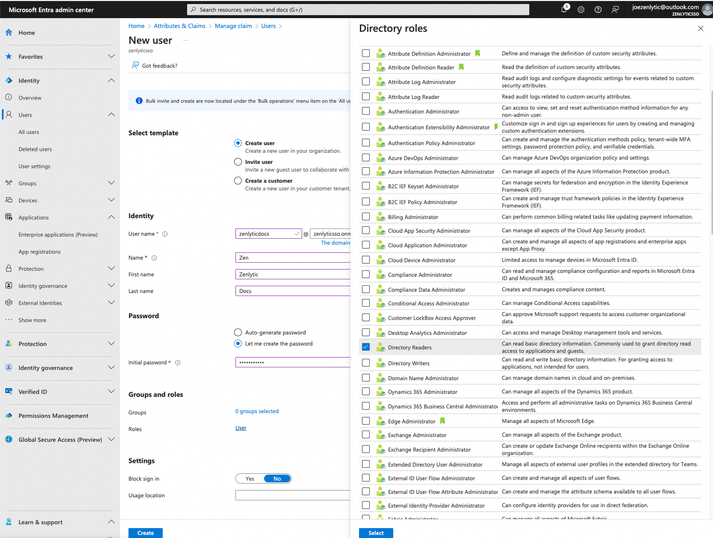

If you're seeing an error saying that `email` is a required value in the claim mapping, make sure your user has a valid email in the `Contact Information` section for that user.

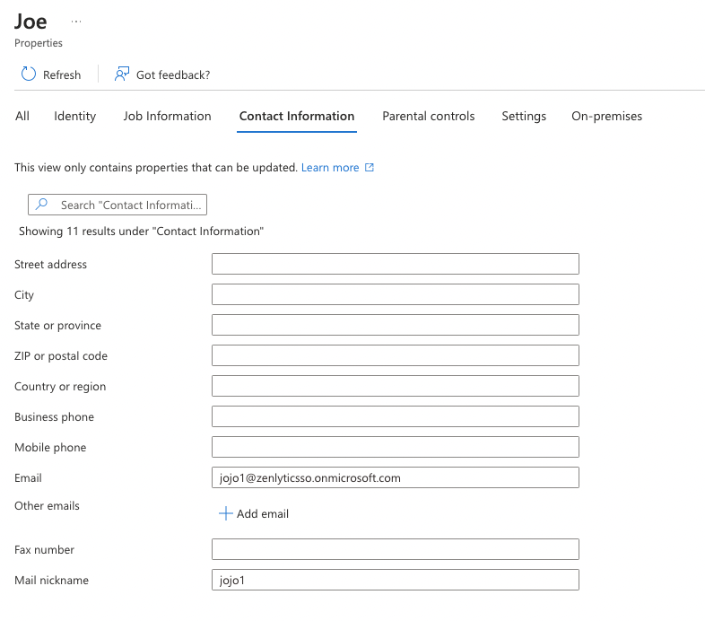

If your company does not provide a value for that field, please make sure to map the field you do use in the Attributes and Claims section.
