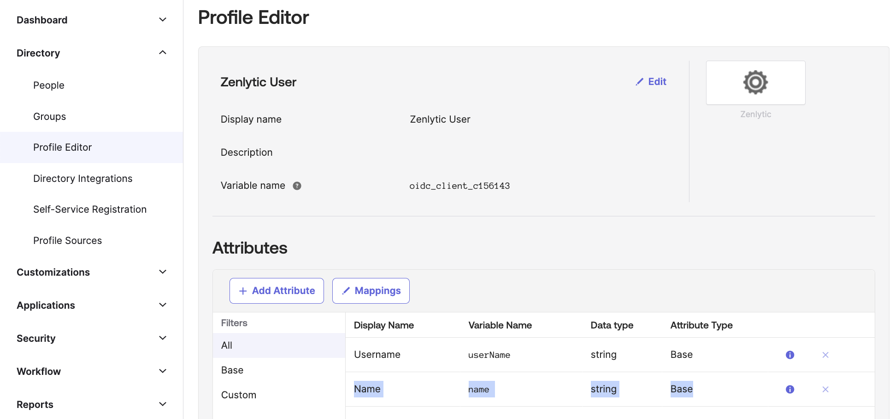
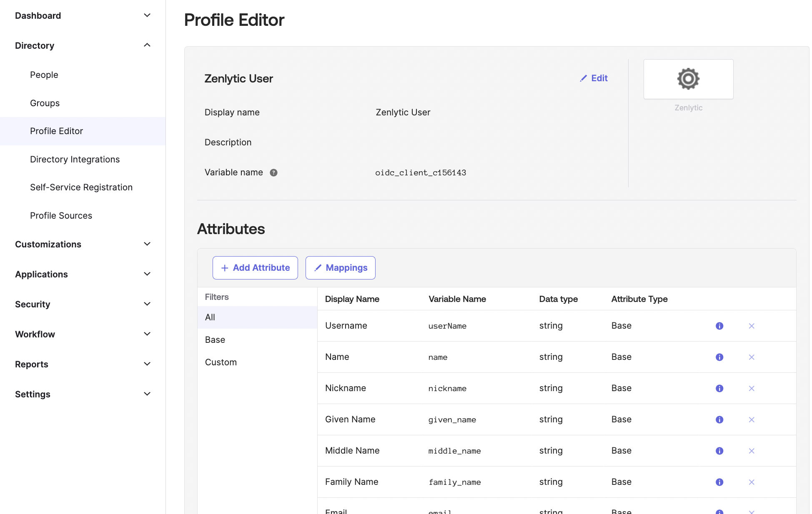

# Okta Zenlytic

## Zenlytic: Single Sign-On with Okta

1. Key Features
2. Prerequisites
3. Guided Setup
4. Upon Completion
5. Debugging

## Supported Feature

With the Zenlytic integration, leverage the power of Okta's Single Sign-On capabilities, and enjoy the following:

* Service Provider (SP)-Initiated Authentication (SSO) Flow
  * This authentication flow occurs when the user attempts to log in to the application from Zenlytic.
* Automatic account creation in Zenlytic on initial SSO.

## Prerequisites

Before getting started make sure to:

* Have the Zenlytic application installed in your Okta instance.
* Be aware that the Okta Single Sign-On integration is exclusively available for Workspaces on the Enterprise plan.
* Discuss with your Zenlytic contact to create a unique `Company ID` for your company, for example, company.zenlytic.com.
* Ensure the email addresses of Workspace members align perfectly with their Okta accounts.

Ready to dive in? Follow the steps below.

## Guided Setup

Once the Zenlytic application is installed, gather the necessary information to share with Zenlytic and tweak one of the App-settings as directed below.

**Recording Values**

1. Go to the Okta admin page, click on the Zenlytic application, and select the Sign On tab.
2. Make note of the values of Client ID and Client secret. You can click on the eye button to reveal these values.
3. Spot a section with a link titled 'OpenID Provider Metadata'? Click on it. In the JSON document that appears, search for a key named “issuer” and record the corresponding URL.

**Attribute Mapping**

Zenlytic requires the following attribute mappings:

1. email
2. family\_name
3. given\_name
4. name

Optionally, you may choose to set values for:

1.  zenlytic\_role

    a. When your user signs in for the first time, they will be granted the specified access level\
    b. Values include:\
    \- admin\
    \- develop\
    \- develop\_without\_deploy\
    \- explore\
    \- view
2. zenlytic\_user\_attributes\
   a. Allows you to manually control access to data.\
   b. Read about how user attributes work [here in the Zenlytic Docs](../3_zenlytic_ui/user_attributes/).\
   c. Must be a valid array of key-value pairs\
   d. Ex: `[{\"department\": \"Engineering\"}]`\
   These may already be set up, but make sure those are showing up in the Okta Profile Editor.\
   ​

## Configuration

As a prerequisite, you should have received your company's unique `Company ID`.

In Okta, under the Zenlytic app, just make sure that you set the field labeled `Company ID` to your company's unique ID.

Deliver the Information to Zenlytic

Got all the information at hand (outlined below)? Fabulous! Now, email it to [**support@zenlytic.com**](mailto:support@zenlytic.com).

* Client ID
* Client Secret
* Issuer URL
* `Company ID`

Relax and let Zenlytic's support team take over from here. They will handle your request and reach out once the integration is configured.

## Upon Completion

Once the setup process is complete, you will be provided with your company's Zenlytic login url.

For example, if your `Company ID` is "mycompany", then your login url will be `https://mycompany.zenlytic.com/login`.

Your Zenlytic contact will have added you as the admin to your Zenlytic Workspace.

As the admin, you are responsible for manually adding your team members to your Zenlytic Workspace.

This can be done via `Workspace Settings -> Team Members -> Invite Member`.

Once added, the user may use the `Sign In with Okta` functionality.

When you go to your company's custom login url, you'll see the `Sign In With Okta` button. Click that, and you'll be ready to go!

Reach out to [**support@zenlytic.com**](mailto:support@zenlytic.com) if you want to add or remove other sign in options for your users, like email/password, Google, etc.

## Debugging

If you're having issues logging into Zenlytic, make sure you have the `Name` value set up in your `Attribute Mapping`. This may automatically already be set up in your Okta instance:

​

<figure><figcaption></figcaption></figure>
