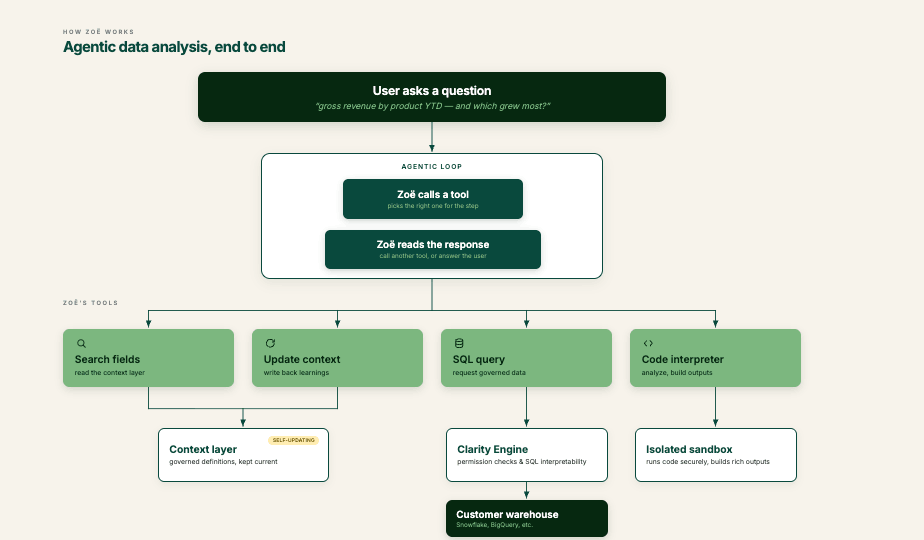

# How Zoë Works

Zoë answers data questions by writing and running SQL against your warehouse in real time. Every query is grounded in **governed, verified field definitions** from your semantic model rather than free-form generation, so answers stay accurate, auditable, and consistent. The output isn't just numbers — she can deliver rich documents, spreadsheets, presentations, and interactive dashboards as [Artifacts](../zenlytic-ui/artifacts.md) using the data she pulls.

This page walks through the architecture: the agentic loop she runs on every question, the tools she has access to, and why the result is trustworthy.

## The agentic loop

Zoë operates with an **agentic architecture**. At each step of answering a question, she chooses between calling a tool from her toolset and responding directly to the user.

When Zoë calls a tool, Zenlytic runs the tool and returns the result to her. She then makes a new decision — call another tool, or respond. The loop continues until she responds directly.

<figure><figcaption>
Zoë's end-to-end question-answering architecture. The agentic loop runs until Zoë decides to respond directly.
</figcaption></figure>

Three things keep this loop trustworthy:

* **Field definitions are governed.** Every measure, dimension, and join Zoë uses comes from your semantic model — the **Context layer** — not from improvisation.
* **SQL goes through the [Clarity Engine](../zenlytic-ui/clarity_engine.md).** Every query Zoë writes is validated against your model and your row- and column-level security rules before it ever reaches the warehouse.
* **Every step is visible.** You can see which tools Zoë called, the SQL she ran, and the fields she referenced. Citations on her output link back to the underlying definitions.

## Zoë's tools

The toolset Zoë chooses from on every step. The four shown in the diagram cover most question-answering work:

* **`search fields`** — reads the Context layer to find measures, dimensions, and joins relevant to the question. Returns SQL definitions and metadata so Zoë can build a correct query rather than guess at field names.
* **`update context`** — writes back to the Context layer. When Zoë learns something new — a better synonym, a clearer description, a new measure that should exist — she can persist it so future questions benefit. See [Ask Zoë for Data Model Recommendations](../data-modeling/asking-zoe-for-recommendations.md) for the user-facing workflow this powers.
* **`sql query`** — sends a SQL request to the warehouse. The query is routed through the [Clarity Engine](../zenlytic-ui/clarity_engine.md), which enforces permissions and validates against the semantic model before execution.
* **`code interpreter`** — runs Python in an isolated sandbox. This is what builds the rich, interactive outputs that get delivered to you as [Artifacts](../zenlytic-ui/artifacts.md) (dashboards, documents, spreadsheets, presentations).

Other tools exist for searching workspace content, web search, and similar — but the four above are the load-bearing ones for analytical questions.

### The Context layer is self-updating

The Context layer holds your governed field definitions, descriptions, synonyms, skills, and system prompt rules. It's read by `search fields` on every question and written to by `update context` when Zoë (with permission) saves a learning. Over time the model keeps current with your business without requiring a separate "training" pass.

## A worked example

Take a non-trivial question:

> *"Can you show me gross revenue by product YTD and tell me which product had the highest growth from last YTD to this YTD?"*

Here's the loop Zoë runs end to end:

1. **Zoë reads the question** and decides she needs to find the relevant fields. She calls `search fields` with search terms `"gross revenue"`, `"ytd"`, `"product"`.
2. **The tool returns matches** like `order_lines.total_gross_revenue`, `order_lines.order_date`, and `products.product_title`, along with their metadata and SQL definitions.
3. **Zoë constructs SQL** referencing those field definitions and calls `sql query`.
4. **The Clarity Engine checks the SQL** for permissions, validates it against the semantic model, and produces a step-by-step breakdown so business users can see exactly what was queried.
5. **The query runs** on the customer warehouse (Snowflake, BigQuery, Redshift, etc.) and the result is returned to Zoë.
6. **Zoë decides to visualize the result.** She writes Python code that builds an interactive dashboard and passes it to `code interpreter`.
7. **The sandbox runs the code** in isolation, builds the rich output, and Zenlytic delivers it to you as an [Artifact](../zenlytic-ui/artifacts.md).
8. **Zoë writes a text summary** of what she found, decides she's done, and responds — ending the loop.

Throughout, you can inspect every tool call, every SQL query, and every field reference. Nothing about Zoë's reasoning is hidden.

## Why this architecture matters

The agentic loop gives Zoë **flexibility** — she can decompose complex questions and pick the right tool for each piece, in any order, as many times as needed. The governance layer keeps her **grounded** — every answer ties back to definitions your data team has reviewed, and every query passes through the same row- and column-level security rules that govern the rest of the platform. Together they're what make Zoë both useful for ad-hoc analytical questions and safe to deploy across an organization.

## Related

* [Clarity Engine](../zenlytic-ui/clarity_engine.md) — the SQL interpretation and validation layer
* [Context Surfaces](context-surfaces.md) — what context Zoë uses and where it lives
* [Ask Zoë for Data Model Recommendations](../data-modeling/asking-zoe-for-recommendations.md) — how to ask Zoë to update the Context layer
* [Artifacts](../zenlytic-ui/artifacts.md) — the rich outputs Zoë produces
* [Fixing Zoë's Mistakes](fixing-zoes-mistakes.md) — diagnostic flow when an answer isn't right
