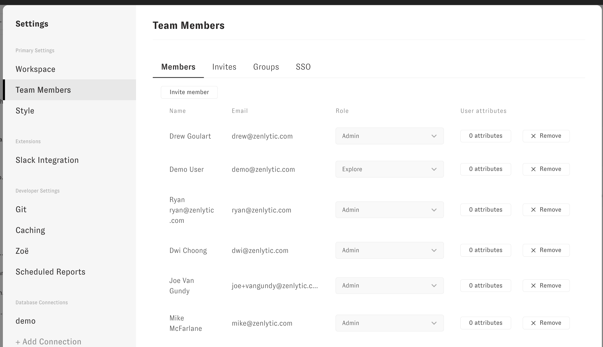

# Access Grants

Access control is managed in Zenlytic through two concepts.

1. [Access grants](access_grants.md#access-grants) cover _column-based_ access control
2. [Access filters](access_grants.md#access-filters) cover _row-based_ access control

## Access grants

Access grants are restrictions for certain users on the ability to see various fields and query them in the Zenlytic interface. These access restrictions are based on access to _columns_ and _views_. For row-based access control look at [access filters](access_grants.md#access-filters).

They are specified in [model](model.md) files, like the following example:

```yaml
access_grants:
  - name: financial_grant
    user_attribute: department
    allowed_values: ["finance", "executive"]
  - name: pii_grant
    user_attribute: department
    allowed_values: ["finance", "customer_support"]
```

## Properties

`name`: (Required) The name of the access grants. If you reference this access grant elsewhere this is the name you will use. Like all names, it follows [Zenlytic naming conventions](data_modeling.md#naming-conventions).

`user_attribute`: This is the name of the user attribute to access for comparison with `allowed_values`. If you defined a user attribute in the Zenlytic UI named `department` it might have values like `finance`, `marketing, finance`, or `ops` each assigned to an individual user. E.g. John Doe has a user attribute `department` which is `marketing, finance` and Jane Doe has a user attribute `department` which is `finance`. For more information, check out [user attributes](access_grants.md#user-attributes) below.

`allowed_values`: This is a list of values which, if any are equal to the requesting person's user attribute given in the property above, will grant them access to the data being restricted by the access grant. For example, John Doe has a user attribute `department` which is `marketing`. If `user_attribute` (the property above) is set to `department` and `allowed_values` is `["marketing", "finance"]` John _will_ have access to the data. However, in the same scenario, if `allowed_values` is `["finance", "ops"]` he will not have access, and will not be able to even see the fields in his interface.

## Examples

Access grants are defined and applied as follows. They're defined in models, and can be applied to any view or field using the `required_access_grants` property. If you specify multiple access grants in that property they must _all_ be true for that user to have access.

```yaml
version: 1
type: model
name: demo

# This defines the access grant
access_grants:
  - name: restrict_dept
    user_attribute: department
    allowed_values: ["Marketing", "Exec"]
  - name: exec_only
    user_attribute: department
    allowed_values: ["Exec"]
```

This is the view file that applies the `restrict_dept` access grant to restrict access to the entire view (every field in the view) to only people with the department "Marketing" or "Exec".

Additionally, it defines the `exec_only` access grant (used below) to ensure _only_ users with the department "Exec" have access to the `email` field.

As a result, a user with the department "Finance" won't be able to access any field in this view, a user with the department "Marketing" will access every field except for the `email` field, and a user with the "Exec" department will access every field in the view, including the `email` field.

```yaml
version: 1
type: view
name: sample_view
model_name: demo
required_access_grants: [restrict_dept]


fields:
  - name: number_of_orders
    field_type: measure
    type: count_distinct
    sql: ${TABLE}.order_id

  - name: email
    required_access_grants: [exec_only]
    field_type: dimension
    type: string
    sql: ${TABLE}.email
  
```

## Access filters

Access filters are restrictions for certain users on the ability to see various rows and query them in the Zenlytic interface. These access filters protect data access based on access to _rows_ in a view. For column-based access control look at [access grants](access_grants.md#access-grants).

They are specified in [view](view.md) files and apply to all queries that reference that view.

## Properties

`field`: (Required) The fully qualified name of the field used in the access filter. For example, if you're in the view `orders` just putting `product` for the `field` property will not work, you have to specify `orders.product`, the fully qualified name.

`user_attribute`: (Required) This is the name of the user attribute to access for comparison with `allowed_values`. If you defined a user attribute in the Zenlytic UI named `department` it might have values like `finance`, `marketing, finance`, or `ops` each assigned to an individual user. E.g. John Doe has a user attribute `department` which is `marketing, finance` and Jane Doe has a user attribute `department` which is `finance`. For more information, check out [user attributes](access_grants.md#user-attributes) below.

## Examples

Access filters are defined and applied as follows. They're defined in view, and apply to the view in which they're defined. If you specify multiple access filters they must _all_ be true for that user to have access.

This is the view file that corresponds with a access filter using the `products` user attribute.

In this example, the user has a user attribute named `products` with the value `Blue Pants, White Shoes`. In the following access filter with this user attribute this user will have the where filter clause `orders.product is in ('Blue Pants', 'White Shoes')` force-added to all queries this user issues that include this view. If the user attribute's value was instead `Green shirt`, the where filter clause would be `orders.product = 'Green shirt'`.

Note: You have to fully qualify the `field` property for the access filter. In this example, just putting `product` for the `field` property will not work, you have to specify `orders.product`, the fully qualified name.

```yaml
version: 1
type: view
name: orders
model_name: demo

access_filters:
  - field: orders.product
    user_attribute: 'products'

fields:
  - name: product
    field_type: dimension
    type: string
    sql: ${TABLE}.product

```

## User attributes

You can set user attributes by going to the "Team Members" section of the workspace settings and adding user attributes there under the "User Attributes" header, for each team member.



User attributes are strings that can handle [filter syntax](field_filter.md) for specifying complex comparisons or inclusions in either access grants (column level security) or access filters (row level security).
