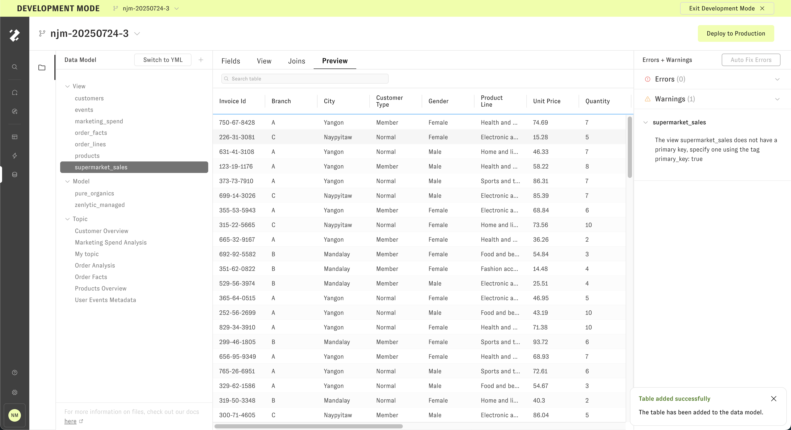

# Adding a New Table

## 1. Go to the data model editor

Using the left-hand navigation, go to the data model editor.

## 2. Click the "Add new table" button 

Tables can be added by clicking the **"Add new table"** button in the Data Model Editor.

Clicking the button will bring up the Add New Table modal. 

## 3. Add a table from data warehouse or upload a CSV

The default tab is "Data Warehouse", which lets you select tables from existing database connections.

Alternatively, file upload is supported for CSVs. Only one table can be selected at a time, and only CSVs can be uploaded. CSV headers
must only use alphanumeric characters, spaces, and underscores.

## 4. Configure table metadata

After selecting a table or CSV to upload, table metadata like column data types, topic, and primary key can be selected.

## 5. Add any joins (optional)

If the table joins to other existing tables in the data model, click **"Add Joins"** to add joins prior to adding the table. Joins can also be set up later. 

## 6. Add table

After clicking **"Add Joins"** from the join form or **"Add Table"** from the data preview form, the table is added to the data model.

