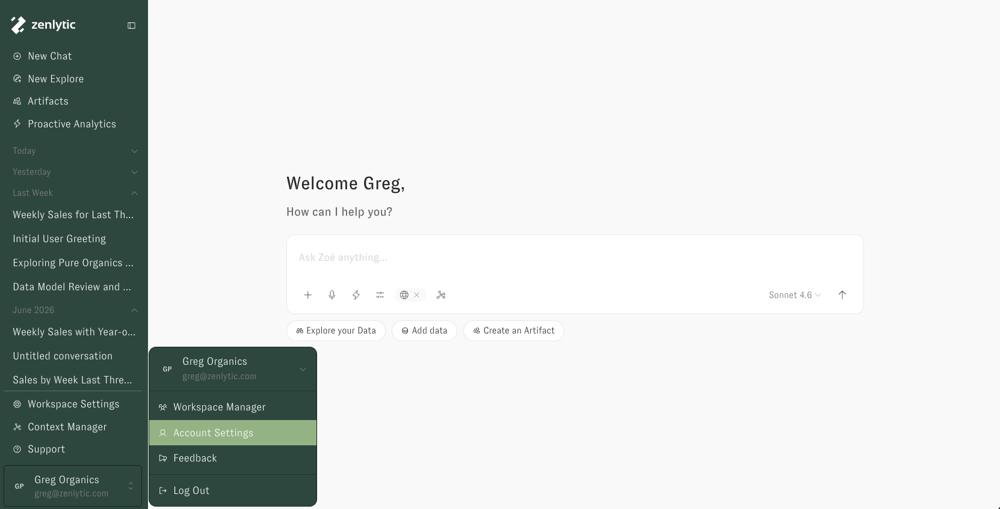
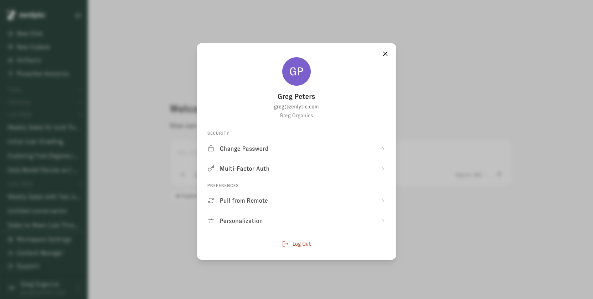

# Cache Refresh

Zenlytic caches your data model to keep responses fast. When you edit the model through [Context Manager](../zenlytic-ui/context_manager.md) in the UI, the cache is invalidated automatically. When changes are pushed **directly to the underlying git repository** — bypassing the UI — the cache does not know about them.

If you or a teammate pushed changes straight to git and Zoë still appears to be using the old data model, use **Pull from Remote** to rebuild the cache from the current state of the repo.

## How to pull from remote

1. Click your workspace name in the lower left of the screen.
2. In the menu that opens, click **Account Settings**.
3. In the panel that opens, under **Preferences**, click **Pull from Remote**.

<figure><figcaption>
Step 1–2: open the workspace menu and select Account Settings.
</figcaption></figure>

<figure><figcaption>
Step 3: Pull from Remote lives under Preferences in Account Settings.
</figcaption></figure>

After the pull completes, Zoë will pick up your latest changes on the next question.

## When you need to pull from remote

* A pull request was merged directly to the production branch in git.
* A teammate pushed model changes through an IDE or command line instead of the Zenlytic UI.
* You're integrating Zenlytic with a CI pipeline that commits model files automatically.

## When you don't need to pull from remote

* You edited the model in Context Manager and used **Deploy to production**.
* You switched branches in the UI (the UI already refreshes the cache for branch switches).
