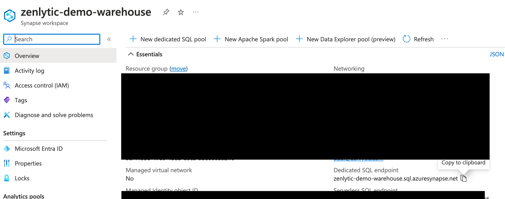

---
layout:
  title:
    visible: true
  description:
    visible: false
  tableOfContents:
    visible: true
  outline:
    visible: true
  pagination:
    visible: true
---

# Azure Synapse Setup

To connect Zenlytic to Azure Synapse Analytics, you'll need to configure the connection with your database credentials. Here's how to do it:

## Step 1: Gather Connection Information

You'll need the following information from your Azure Synapse workspace:

* **Server**: Your Azure Synapse server name
* **Database**: The database name
* **Username**: A database user with appropriate permissions
* **Password**: The password for the user
* **Port**: Usually 1433 (default SQL Server port)

## Step 2: Create a Database User (if needed)

If you don't have a dedicated user for Zenlytic, create one:

```sql
CREATE USER zenlytic_user WITH PASSWORD = 'your_secure_password';
GRANT CONNECT TO zenlytic_user;
GRANT SELECT ON SCHEMA::dbo TO zenlytic_user;
```

## Step 3: Add the Connection in Zenlytic

1. In Zenlytic, go to Settings > Data Sources
2. Click "Add Data Source"
3. Select "Azure Synapse" from the list
4. Enter the connection details:
   * **Server**: Your Azure Synapse server name
   * **Database**: Your database name
   * **Username**: Your database username
   * **Password**: Your database password
   * **Port**: 1433 (or your custom port)



## Step 4: Configure Firewall Rules

Make sure your Azure Synapse firewall allows connections from Zenlytic's IP addresses:

* **184.73.175.163**
* **18.209.132.30**

## Step 5: Test Your Connection

1. Click "Test Connection" to verify it works
2. If successful, click "Save"
3. You should now be able to see your Azure Synapse tables in Zenlytic

## Troubleshooting

If you encounter connection issues:

1. Verify the server name is correct
2. Check that the firewall allows connections from Zenlytic's IPs
3. Ensure the user has the necessary permissions
4. Verify the database name and credentials are correct
5. Check that Azure Synapse is running and accessible
