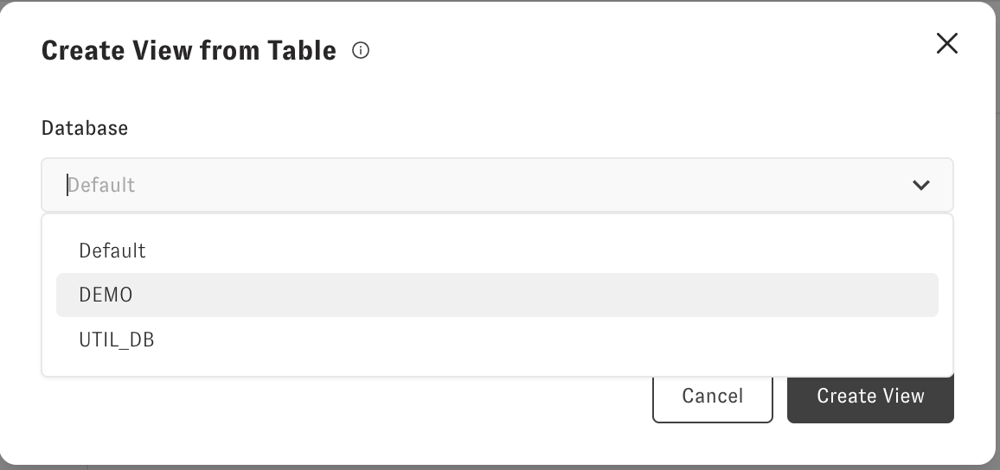
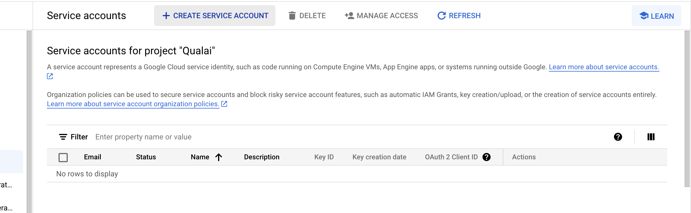
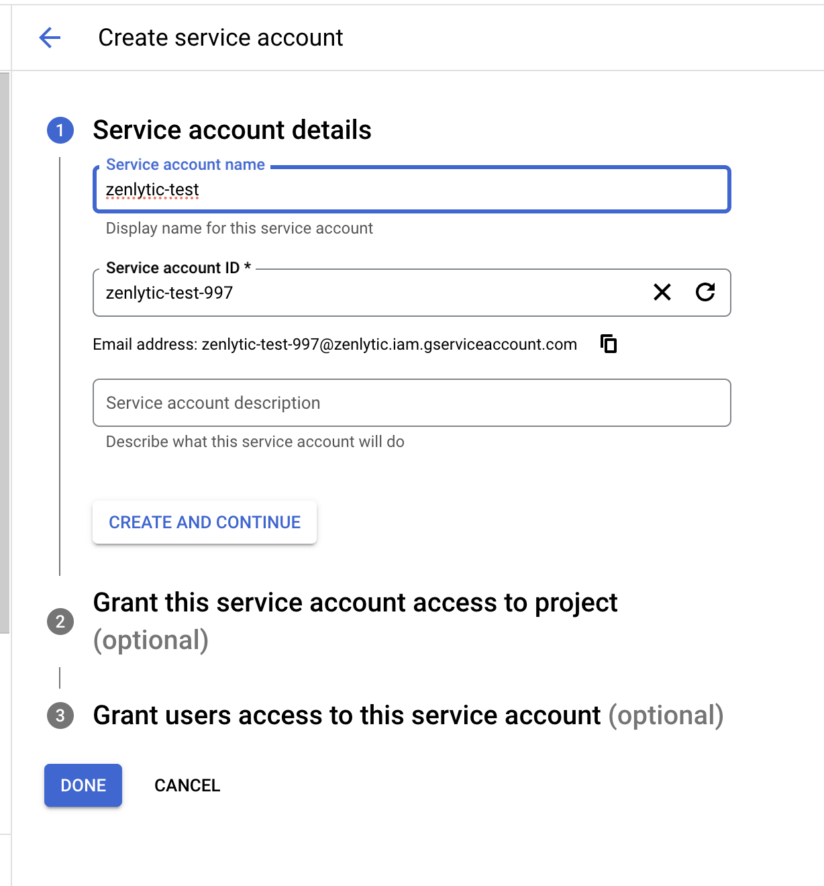
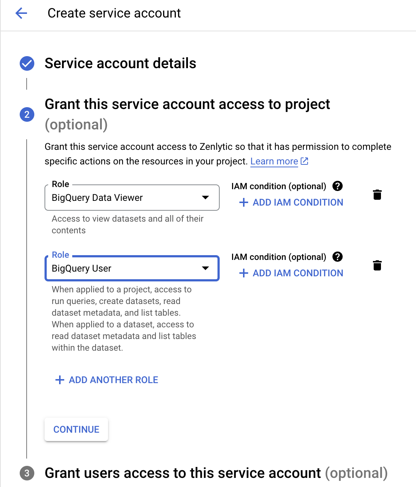
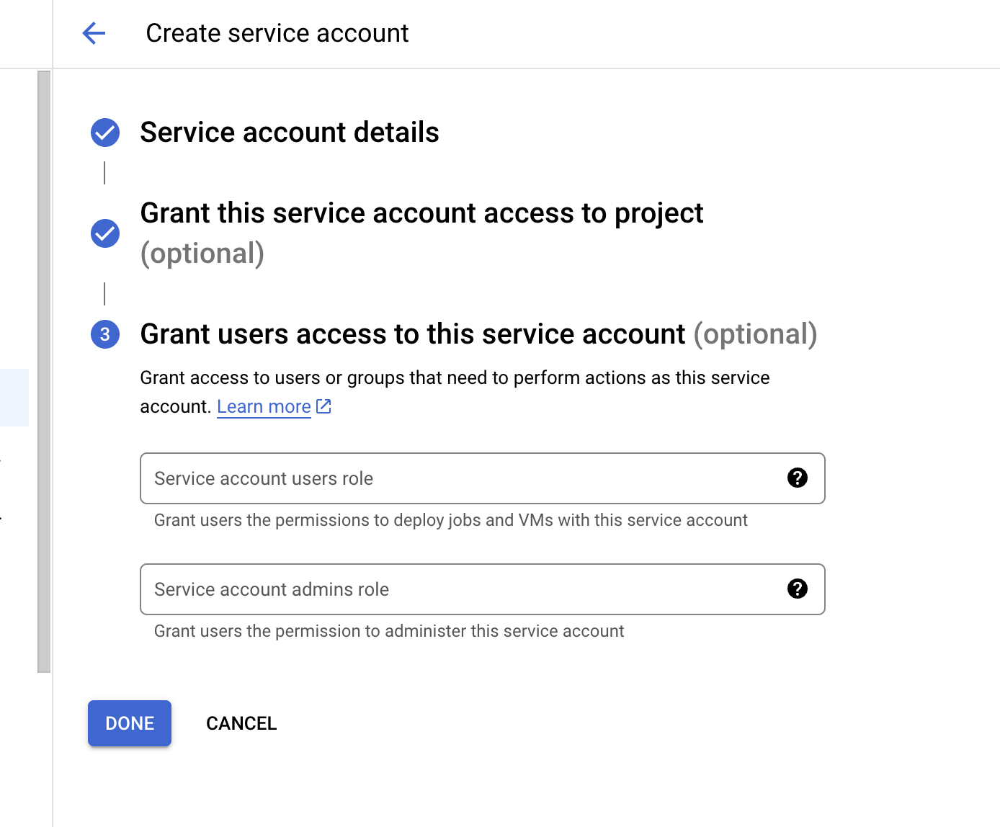
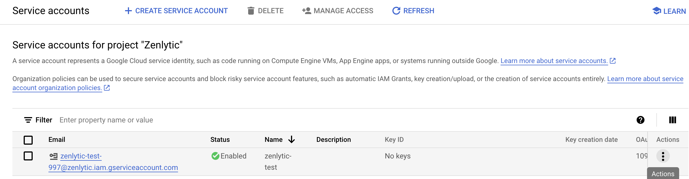
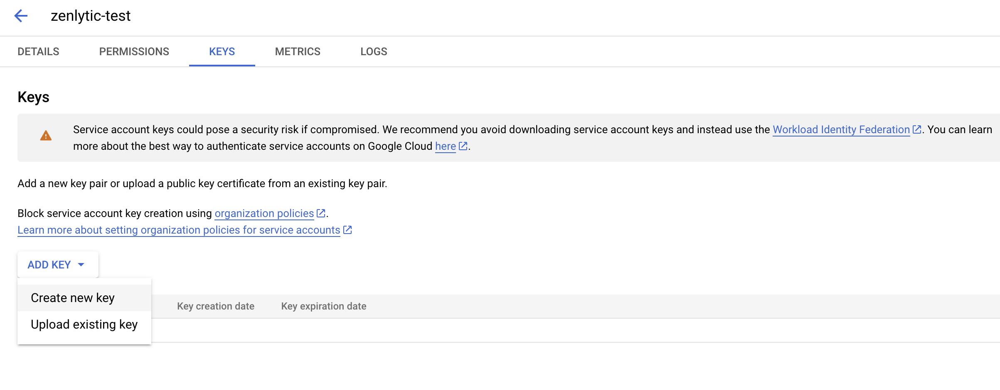
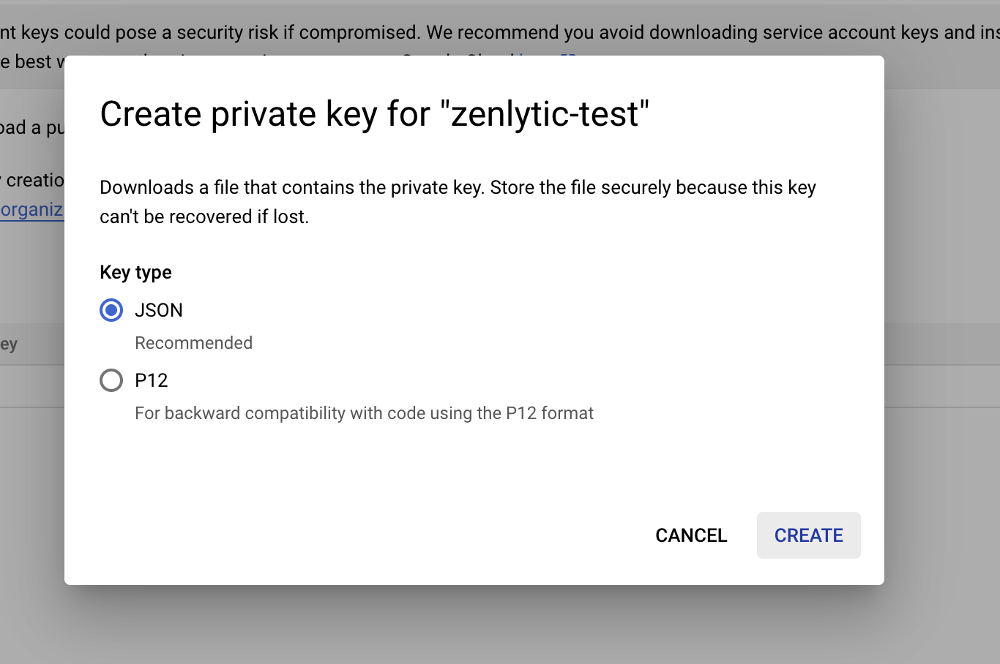

# Bigquery Setup

> **Note:** Alternatively to creating a service account, you can use [Workload Identity Federation to connect to BigQuery](../authentication-and-security/google_workload_identity_federation.md).

To connect Zenlytic to BigQuery, you'll need to create a service account and download the JSON key file. Here's how to do it:

## Step 1: Create a Service Account

1. Go to the [Google Cloud Console](https://console.cloud.google.com/)
2. Navigate to "IAM & Admin" > "Service Accounts"
3. Click "Create Service Account"
4. Give it a name (e.g., "zenlytic-service-account")
5. Click "Create and Continue"
6. For the role, select "BigQuery Admin" (or a more restrictive role if needed)
7. Click "Continue" and then "Done"

## Step 2: Create and Download the Key

1. Find your service account in the list and click on it
2. Go to the "Keys" tab
3. Click "Add Key" > "Create New Key"
4. Choose "JSON" format
5. Click "Create" - this will download the JSON key file

## Step 3: Add the Connection in Zenlytic

1. In Zenlytic, go to Settings > Data Sources
2. Click "Add Data Source"
3. Select "BigQuery" from the list
4. Enter a name for your connection
5. Upload the JSON key file you downloaded
6. Click "Test Connection" to verify it works
7. Click "Save"

## Step 4: Configure Permissions

Make sure your service account has the necessary permissions:

* **BigQuery Admin** or **BigQuery Data Viewer** role
* Access to the datasets you want to query
* If using a custom project, ensure the service account has access to that project

## Step 5: Test Your Connection

Once connected, you can test by:

1. Going to the Explore section
2. Selecting your BigQuery connection
3. Browsing available datasets and tables
4. Running a simple query to verify everything works

