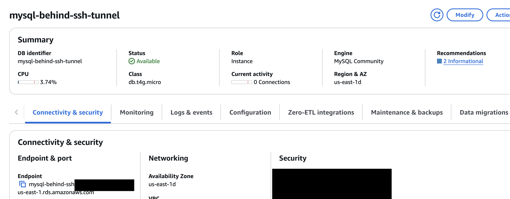

---
layout:
  title:
    visible: true
  description:
    visible: false
  tableOfContents:
    visible: true
  outline:
    visible: true
  pagination:
    visible: true
---

# Mysql Setup

To connect Zenlytic to MySQL, you'll need to configure the connection with your database credentials. Here's how to do it:

## Step 1: Gather Connection Information

You'll need the following information from your MySQL database:

* **Host**: Your MySQL server hostname or IP address
* **Port**: Usually 3306 (default MySQL port)
* **Database**: The database name
* **Username**: A database user with appropriate permissions
* **Password**: The password for the user

## Step 2: Create a Database User (if needed)

If you don't have a dedicated user for Zenlytic, create one:

```sql
CREATE USER 'zenlytic_user'@'%' IDENTIFIED BY 'your_secure_password';
GRANT SELECT ON your_database.* TO 'zenlytic_user'@'%';
FLUSH PRIVILEGES;
```

## Step 3: Add the Connection in Zenlytic

1. In Zenlytic, go to Settings > Data Sources
2. Click "Add Data Source"
3. Select "MySQL" from the list
4. Enter the connection details:
   * **Host**: Your MySQL server hostname
   * **Port**: 3306 (or your custom port)
   * **Database**: Your database name
   * **Username**: Your database username
   * **Password**: Your database password



## Step 4: Configure Firewall/Security

Make sure your MySQL server allows connections from Zenlytic's IP addresses:

* **184.73.175.163**
* **18.209.132.30**

## Step 5: Test Your Connection

1. Click "Test Connection" to verify it works
2. If successful, click "Save"
3. You should now be able to see your MySQL tables in Zenlytic

## Troubleshooting

If you encounter connection issues:

1. Verify the host and port are correct
2. Check that the firewall allows connections from Zenlytic's IPs
3. Ensure the user has the necessary permissions
4. Verify the database name and credentials are correct
5. Check that MySQL is configured to accept remote connections
6. Ensure the user is allowed to connect from any host (`'%'`)
