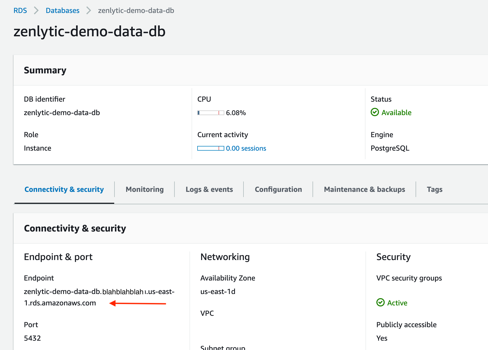

---
layout:
  title:
    visible: true
  description:
    visible: false
  tableOfContents:
    visible: true
  outline:
    visible: true
  pagination:
    visible: true
---

# Postgres Setup

To connect Zenlytic to PostgreSQL, you'll need to configure the connection with your database credentials. Here's how to do it:

## Step 1: Gather Connection Information

You'll need the following information from your PostgreSQL database:

* **Host**: Your PostgreSQL server hostname or IP address
* **Port**: Usually 5432 (default PostgreSQL port)
* **Database**: The database name
* **Username**: A database user with appropriate permissions
* **Password**: The password for the user

## Step 2: Create a Database User (if needed)

If you don't have a dedicated user for Zenlytic, create one:

```sql
CREATE USER zenlytic_user WITH PASSWORD 'your_secure_password';
GRANT CONNECT ON DATABASE your_database TO zenlytic_user;
GRANT USAGE ON SCHEMA public TO zenlytic_user;
GRANT SELECT ON ALL TABLES IN SCHEMA public TO zenlytic_user;
```

## Step 3: Add the Connection in Zenlytic

1. In Zenlytic, go to Settings > Data Sources
2. Click "Add Data Source"
3. Select "PostgreSQL" from the list
4. Enter the connection details:
   * **Host**: Your PostgreSQL server hostname
   * **Port**: 5432 (or your custom port)
   * **Database**: Your database name
   * **Username**: Your database username
   * **Password**: Your database password



## Step 4: Configure Firewall/Security

Make sure your PostgreSQL server allows connections from Zenlytic's IP addresses:

* **184.73.175.163**
* **18.209.132.30**

## Step 5: Test Your Connection

1. Click "Test Connection" to verify it works
2. If successful, click "Save"
3. You should now be able to see your PostgreSQL tables in Zenlytic

## Troubleshooting

If you encounter connection issues:

1. Verify the host and port are correct
2. Check that the firewall allows connections from Zenlytic's IPs
3. Ensure the user has the necessary permissions
4. Verify the database name and credentials are correct
5. Check that PostgreSQL is configured to accept remote connections
