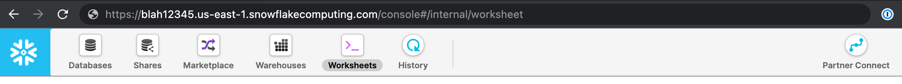
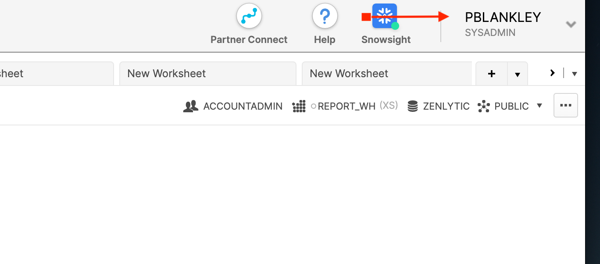
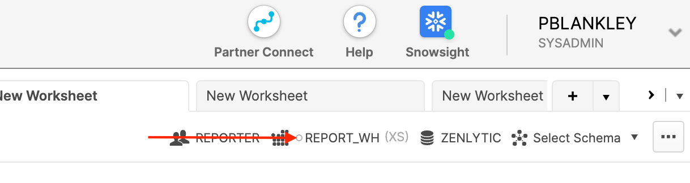

# Snowflake Setup

> Connect your Snowflake data warehouse to Zenlytic

This document will help you connect your Snowflake data warehouse to Zenlytic to access modern, LLM-powered business intelligence.

## Connection Name

First, you'll name your connection. This name is how Zenlytic's [model](../5_data_modeling/model/) connects the credentials you'll enter in the next step to your data warehouse. You can name the credential whatever you want, but we usually recommend naming it something like `my_company_name` to keep things simple.

## Account

The account in Snowflake is how we know which Snowflake warehouse to connect to. To get this value look at the URL for your Snowflake (e.g. `https://blah12345.us-east-1.snowflakecomputing.com/console`) and take the part after `https://` and before `snowflakecomputing.com`.



In this example, you'd enter `blah12345.us-east-1` for your account.

## Username

This is the username of your user in Snowflake. This can be found in the upper right hand of the page when you're logged in.



In this example, the username is `pblankley`

## Password

This is the password associated with the user you logged in with. Enter the value in the input.

## Warehouse

Warehouses in Snowflake are units of compute, not a place to store data. The default warehouse is `COMPUTE_WH`, but you can use whichever warehouse you want. To see warehouse options for your role, select from the drop-down in the Snowflake UI.



In this example, we'll use the `REPORT_WH` warehouse.

## Database

Here you'll select the snowflake database you want to use as a default in Zenlytic. You can always use data from other databases. This one just acts as a default. You can also see database options in the drop-down in the Snowflake UI.


In this example, we're using the `ZENLYTIC` database.

## Role (optional)

The role in Snowflake is the set of permissions you want your user to have. This field is optional, and if you leave it blank, Snowflake will use your user's default role. You can find roles your user has access to in the upper right of the Snowflake UI.


In this example, we're using the `REPORTER` role. Note: if the role you select doesn't have access to certain data in your warehouse, Zenlytic will be unable to access that data as well.

## Schema (optional)

This is the schema you want to use as a default. This field is optional and is usually left blank.

## SSH Key Pair Connection

We also offer the ability to connect with an ssh key pair in addition to username / password as shown above. To connect, contact your Zenlytic rep to get the public key to use when creating the access in Snowflake.

## IP Whitelisting

If you use IP whitelisting in your data warehouse, whitelist the following IP addresses:

```
184.73.175.163 
18.209.132.30
```

## I need to create a user for Zenlytic

Look at this section if you need to create a new user for Zenlytic to use when accessing Snowflake.

### Step 1: Create a Snowflake User

1. Log into your Snowflake account as an admin
2. Go to "Users" in the admin panel
3. Click "Create User"
4. Set a username (e.g., "zenlytic\_user")
5. Set a secure password
6. Assign appropriate roles (typically "PUBLIC" and any custom roles needed)

### Step 2: Grant Permissions

Run the following SQL commands to grant necessary permissions:

```sql
-- Grant usage on warehouse
GRANT USAGE ON WAREHOUSE <your_warehouse_name> TO ROLE <your_role_name>;

-- Grant usage on database
GRANT USAGE ON DATABASE <your_database_name> TO ROLE <your_role_name>;

-- Grant usage on schema
GRANT USAGE ON SCHEMA <your_database_name>.<your_schema_name> TO ROLE <your_role_name>;

-- Grant select on all tables in schema
GRANT SELECT ON ALL TABLES IN SCHEMA <your_database_name>.<your_schema_name> TO ROLE <your_role_name>;
```

## Advanced Settings

_You can ignore this section if you're not using a Snowflake Share directly._

Advanced settings in Snowflake deal with situations where you're running analysis directly on data you've received via a Snowflake Share.

**Zenlytic Database Name**

Create a database and enter that database name (e.g. `zenlytic_database`)

**Zenlytic Schema Name**

Create a schema and enter that schema name (e.g. `zenlytic_schema`)
