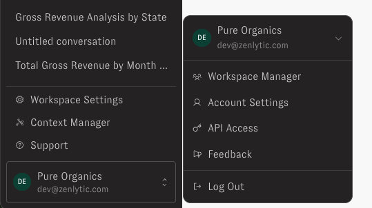
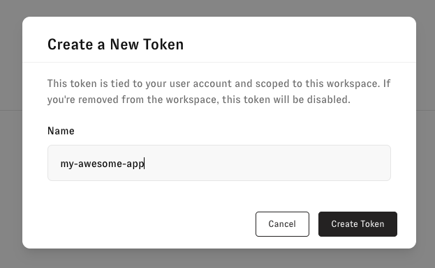

# Authentication

Personal access tokens (PATs) authenticate API requests to Zenlytic on behalf of your user account, without requiring an interactive login for each request. Use a PAT for scripts, CI pipelines, BI tool integrations, and other automated access to the Zenlytic API.

## Discovering your token's scope

A PAT's reach — a single workspace or your entire organization — isn't visible from the token itself or from anything in your request. Before building against a new token, call `GET /me` to see what it can actually do:

```bash
curl -H "Authorization: Bearer <your_personal_access_token>" \
  https://api-external.zenlytic.com/v2/me
```

It returns the calling token's organization and the workspaces it can see — one workspace for an admin-scoped token, or every workspace in the organization for an org admin token. `/me` only accepts PAT authentication; it isn't reachable using an interactive session login.

| Scope | Endpoints | Access |
| --- | --- | --- |
| **Admin** | `/workspaces/{workspace_id}/...`, `/me` | Tied to the workspace that was active when you created the token. Has the same permissions as your user account within that workspace. |
| **Org admin** | `GET /workspaces`, `POST /workspaces`, `DELETE /workspaces/{workspace_id}`, `/workspaces/{workspace_id}/...`, `/me` | Org-wide. Authenticates requests across every workspace in your organization; the organization is derived from the token, never from anything you pass in. Has the same permissions as your user account, which requires the Org Admin role for these endpoints. Since org admins also have admin permissions in every workspace, this token can additionally call the admin endpoints (`/workspaces/{workspace_id}/...`) to manage groups and user attributes in any workspace. |

## Creating a personal access token

A token's scope is fixed at creation time, based on your role in the workspace you're creating it from — it has nothing to do with which endpoint you later call. If you hold the Org Admin role there, the token you create is org-wide; otherwise it's scoped to that workspace only. Two tokens can look identical — same format, same header — while one reaches your whole organization and the other reaches a single workspace, so confirm your role before creating a token, or call `GET /me` afterward to check what you actually got.

1. Click your user avatar/name in the bottom-left corner of the navigation bar.
2. Select **API Access** from the user menu.

   

3. On the Personal Access Tokens page, click **Create Token**.

4. Enter a descriptive name for the token so you can identify its purpose later.

   

5. Click **Create**. Your new token displays once.
6. Copy the token immediately and store it somewhere secure, such as a secrets manager or password manager. Zenlytic does not store the raw token, and you cannot view it again after closing this dialog.

## Using your token

Include the token as a bearer token in the `Authorization` header of your API requests:

```
Authorization: Bearer <your_personal_access_token>
```

Zenlytic runs separate API hosts per region: `https://api-external.zenlytic.com` (US) and `https://euapi-external.zenlytic.com` (EU). Use the host matching where your organization is hosted.

Example calling an admin endpoint using `curl`:

```bash
curl -H "Authorization: Bearer <your_personal_access_token>" \
  https://api-external.zenlytic.com/v2/workspaces/<workspace_id>/...
```

Example listing workspaces in your organization using `curl`:

```bash
curl -H "Authorization: Bearer <your_personal_access_token>" \
  https://api-external.zenlytic.com/v2/workspaces
```

Example archiving a workspace using `curl`:

```bash
curl -X DELETE -H "Authorization: Bearer <your_personal_access_token>" \
  https://api-external.zenlytic.com/v2/workspaces/<workspace_id>
```

## Managing existing tokens

The Personal Access Tokens page lists all tokens associated with your account, including their name and creation date.

Tokens are identified only by name and metadata. The raw token value is never shown again after creation, so keep your own record of which token is used where.

## Revoking a token

1. Go to **API Access**
2. Find the token to revoke in the list and click the delete (trash) icon.
3. Confirm the deletion in the dialog.

This action is immediate and permanent. Once deleted:

- The token can no longer authenticate; future API requests using it are rejected.
- You cannot view or restore the token.

## FAQ
**What permissions does my token have?**

The same permissions your user account has, scoped to either the workspace (admin token) or the organization (org admin token). A PAT does not grant elevated access beyond what you can already do when logged in.
