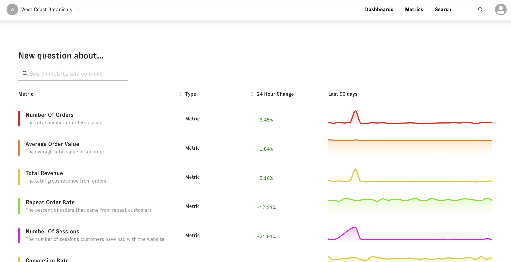

# Using Zenlytic

Zenlytic is a modern analytics tool that helps you understand the "Why" behind your data.  There are several different "question types" you can ask and answer in Zenlytic.

### Question Types

* [Explore](./2_exploring.md)
    * The explore question is a general purpose question where you can answer the "What" questions that lead into the "Why" questions. For example, you could look at number of customers by acquisition channel who have spent more than $200 in the last 3 months in this question type. You can [slice](./2_exploring.md#slicing) and [filter](./2_exploring.md#filtering) key metrics easily.

* [Explain Change](./3_explain_change.md)
    * The explain change question lets you answer the question "Why did this metric change?" You can change to this question at any time, or drag / click on the plot to ask a explain change follow up question to figure out why your metric is spiking.

* [Compare](./4_compare.md)
    * The compare question lets you compare a group (e.g. orders from paid ads) to the rest of your data (e.g. orders NOT from paid ads). This question will highlight  the differences in the two groups by looking at how they vary by your companies metrics. For example, orders from paid ads might have higher average order value that organic orders but a lower repurchase rate.

* [User Journey](./5_user_journey.md)
    * The user journey question lets you look across a series of events for your metrics. For example, you could look at how customers move from page to page on your site as they navigate content to see which pieces of content are more educational vs drive to a sale.

* [Analyze Baskets](./6_basket_mix.md)
    * The analyze baskets question lets you easily look at baskets of goods customers purchase from you. For example, you could figure out which two products your customers most often buy together, to better inform how you promote bundles of products or organize your online store.

### Search 

You can also access your data via a natural language search that takes you directly to your question in your data. To access the search page click on the search option in the top navigation bar.

You can then use the search bar like you'd use Google search.

### Metrics

You can also access your data via a list of your company's metrics.  To get to this page click the Metrics option on the top navigation bar. To then go to any of the metrics, just click on the metric itself.

### Dashboards

You can also access saved views of your data using dashboards. To get to the list of your company's dashboards, you can click on the Dashboards option in the top navigation bar. Then to go to a dashboard, click on it's name.

When you're on a dashboard page, you can click the three dots on any of the plots to go into an interactive interface to ask follow up questions about the plot. 

### Command Palette

At any time when using Zenlytic you can activate the command palette by pressing `cmd-k` or by clicking on the search / computer icon in the top right of the navigation bar. Type commands into the command palette to streamline your workflows.

