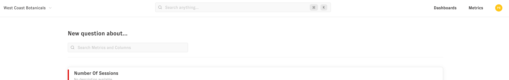
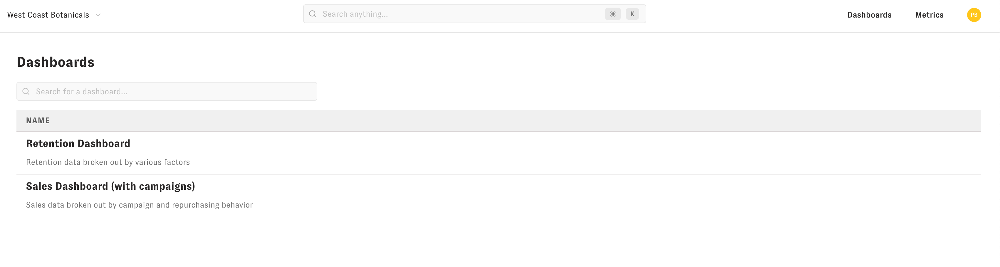
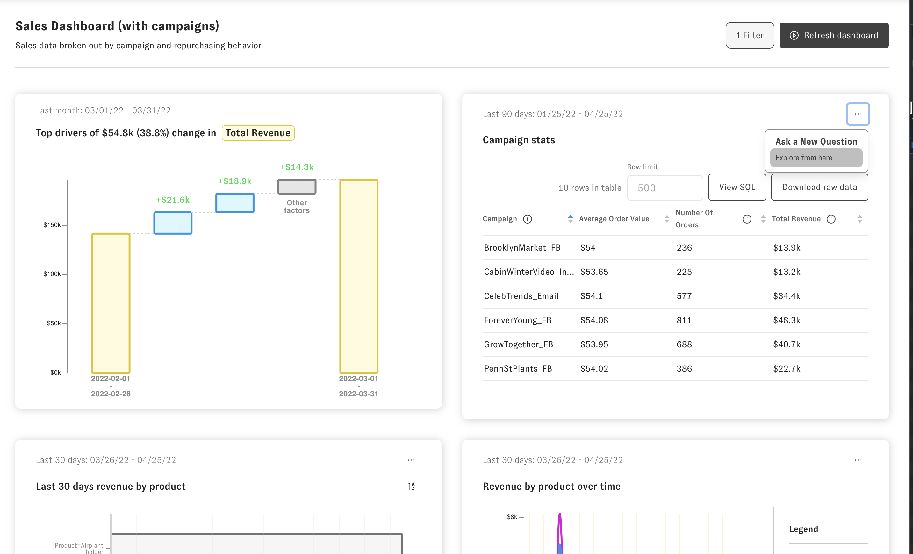
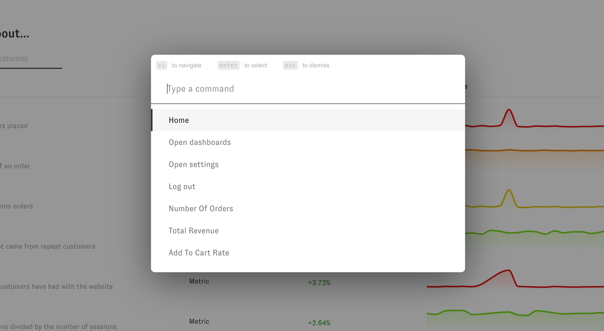

# Using Zenlytic

Zenlytic is a LLM-powered business intelligence platform that makes self-serve analytics possible.  There are several different "question types" you can ask and answer in Zenlytic.

### Question Types

* [Zoë](./zoe.md)
    * Zoë is an AI data analyst who uses your cognitive layer to answer questions about your data for you. She can answer questions about anything you can query using the [explore](./2_exploring.md) interface, create and add plots to a dashboard, use a code interpreter to answer complex data science questions, and integrates with both Slack and Microsoft Teams.

* [Explore](./2_exploring.md)
    * The explore question is a general purpose question where you can answer the "What" questions that lead into the "Why" questions. For example, you could look at number of customers by acquisition channel who have spent more than $200 in the last 3 months in this question type. You can [slice](./2_exploring.md#slicing) and [filter](./2_exploring.md#filtering) key metrics easily.

* [Explain Change](./3_explain_change.md)
    * The explain change question lets you answer the question "Why did this metric change?" You can change to this question at any time, or drag / click on the plot to ask a explain change follow up question to figure out why your metric is spiking.

* [Analyze Baskets](./6_basket_mix.md)
    * The analyze baskets question lets you easily look at baskets of goods customers purchase from you. For example, you could figure out which two products your customers most often buy together, to better inform how you promote bundles of products or organize your online store.

* [Funnel](./7_funnel.md)
    * The funnel question lets you quickly look at sequences of customer interactions. This can be anything in your database like individual clicks on your site, marketing/sales touch points, or orders. For example, you could figure out how many customers after making an order through a paid channel come back and make another order from any channel.

### Search 

You can also access your data via a natural language search that takes you directly to your question in your data. Search is always available in the top navigation bar and by clicking `cmd-k` at any time.

### Dashboards

You can also access saved views of your data using dashboards. To get to the list of your company's dashboards, you can click on the Dashboards option in the top navigation bar. Then to go to a dashboard, click on it's name.

When you're on a dashboard page, you can click the three dots on any of the plots to go into an interactive interface to ask follow up questions about the plot. 

### Command Palette

At any time when using Zenlytic you can activate the command palette by pressing `cmd-k` or by clicking on the search / computer icon in the navigation bar. Type commands into the command palette to streamline your workflows.

