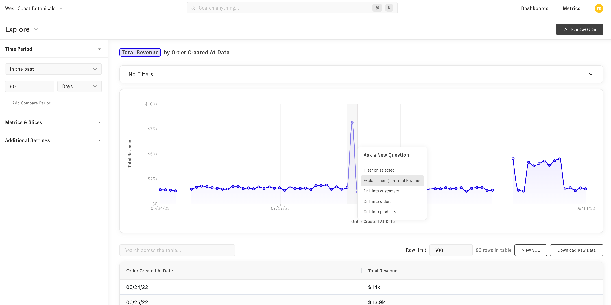
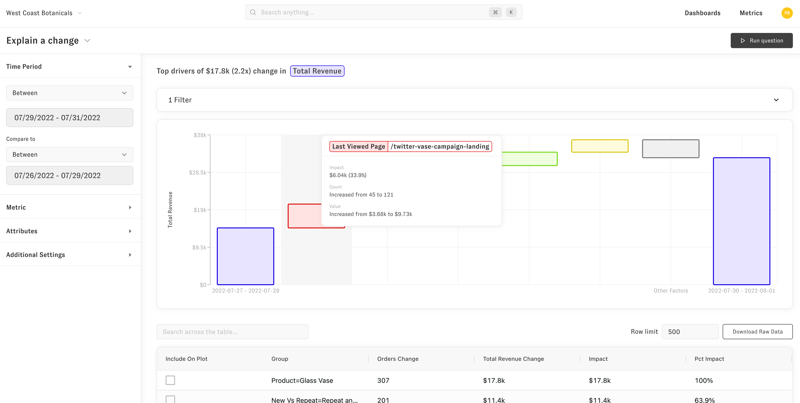
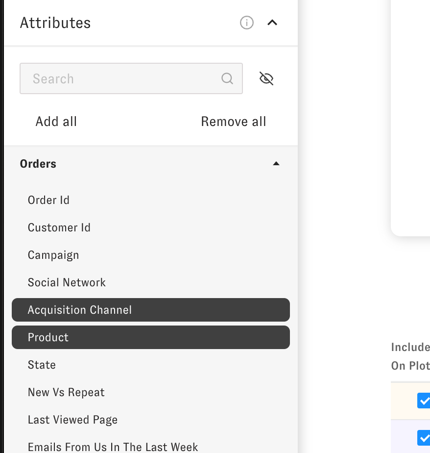

# Explain Change

The explain change question lets you dig into the "Why" behind your changing metrics. You can get to an explain change question by dragging over a plot or by changing the question type to be "Explain change."

To get to the question by dragging over the plot, click or drag on the plot over the area you want to ask about. Once you to that you'll see a follow up question menu that looks like this.

Click on the "Explain change" follow up question and you'll be launched into an explain change question in a new tab. The results of the explain change look like this. You can filter or sort the results and dynamically change which groups are on the plot, using the "Include on plot" check in the table below.

You can also specify which attributes / slices you'd like Zenlytic to search over. You can use the "Attributes" menu on the left hand side to tell it explicitly which slices to look at when answering the "Why" question.

