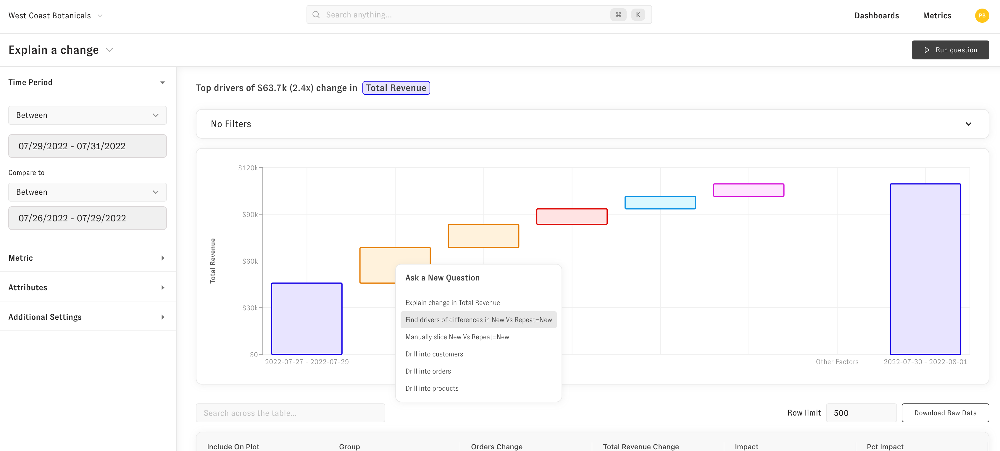
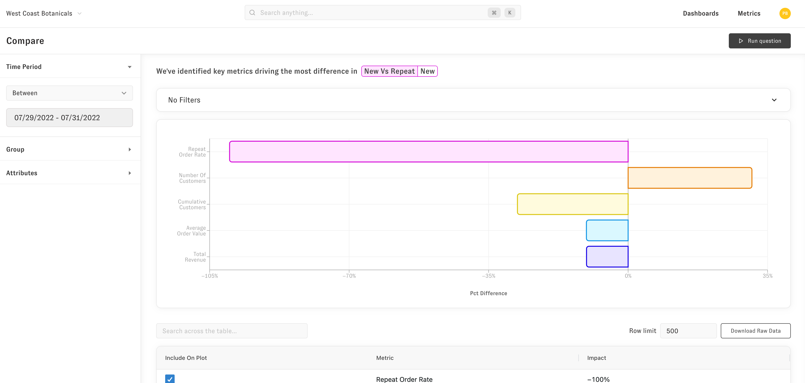

# Compare

Compare questions tell you what's different about a certain group compared to the rest of your data (e.g. what's different in orders I get from paid ads vs orders I get elsewhere).  You can access this question after an explain change or from an explore plot by clicking on the group you'd like to analyze. 

To get to the compare question, click on the "Find what makes X distinctive" follow up question.

Then you'll see a result like this. The attributes, like in the explain change, let you select which metrics to include in your question.

