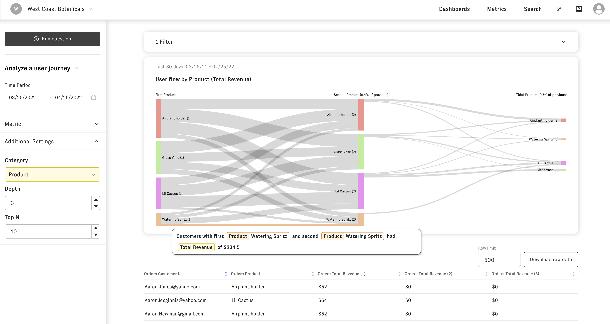

# User Journey

The user journey question lets you look across a series of events for your metrics. For example, you could look at how customers move from page to page on your site as they navigate content to see which pieces of content are more educational vs drive to a sale.

To get to the User journey question you can open an explore question of the metric you are interested in and change the question type drop down in the upper part of the left hand side menu bar to "User Journey" 

Then run the question and you'll see the flow by the default category. You can change the default category in the drop down under "Additional settings" along with the number of actions and the top categories shown. 

