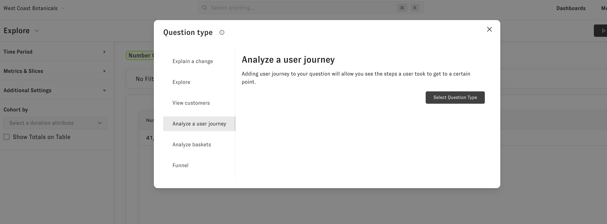

# Analyze Baskets

The analyze baskets question lets you quickly look at baskets of goods customers purchase from you. For example, you could figure out which two products your customers most often buy together to better inform how you promote bundles of products or organize your online store.

To get to the Analyze Baskets question you can open an explore question of the metric you are interested in and change the question type drop down in the upper part of the left hand side menu bar to "Analyze Baskets" 

Then run the question and you'll see the basket combinations along with a few metrics. You can change the number of combinations in he baskets using the drop down under "Additional settings."

