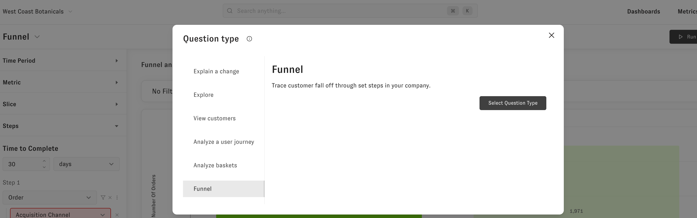
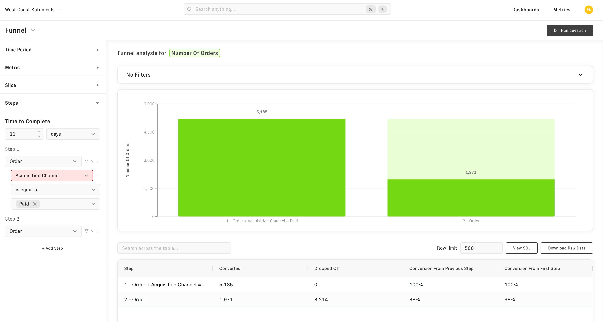
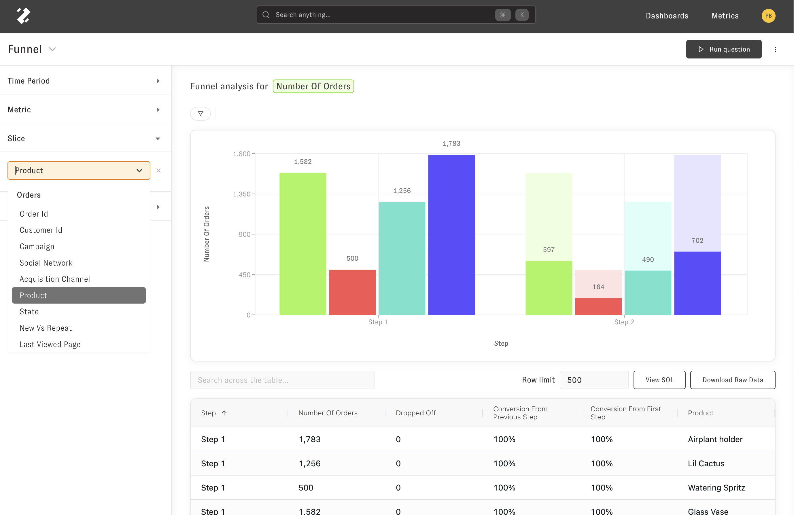

# Funnel

The funnel question lets you quickly look at sequences of customer interactions. This can be anything in your database like individual clicks on your site, marketing/sales touch points, or orders. For example, you could figure out how many customers after making an order through a paid channel come back and make another order from any channel.

To get to the Funnel question you can open an explore question of the metric you are interested in and change the question type drop down in the upper part of the left hand side menu bar to "Funnel" 

Then you'll need to define the "steps" of the funnel. For example, the funnel here is for customers who came in for an order through a paid channel then made another order through any channel. As you see here, you can apply filters to steps individually or the funnel as a whole.

You can also slice the funnel to see how the funnel breaks down by any dimensions in your data model.

