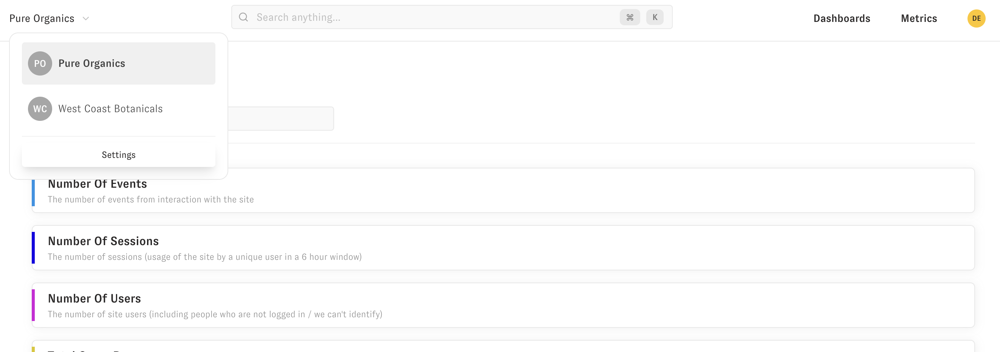
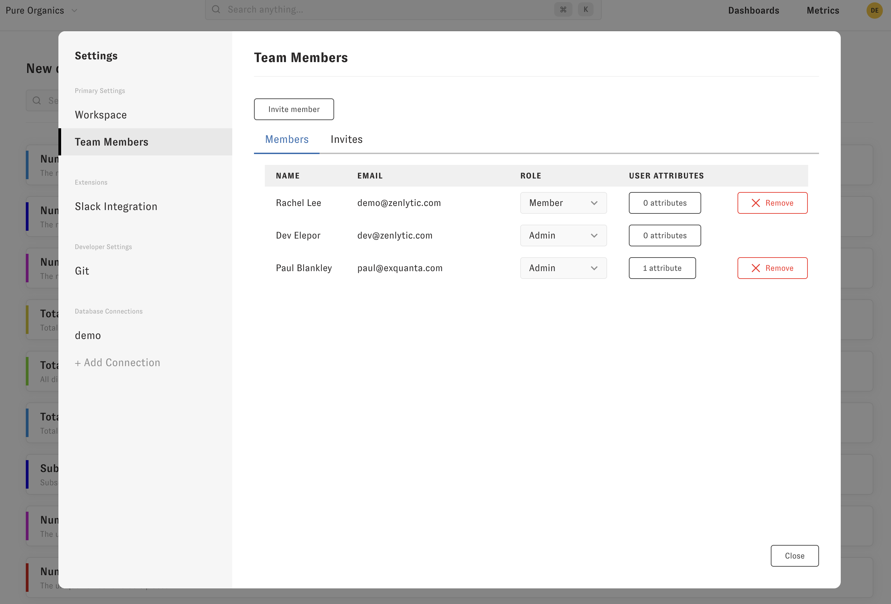
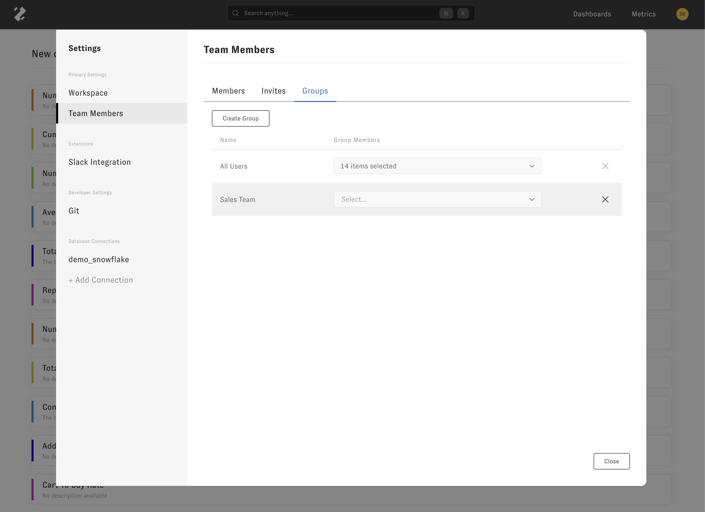

# Settings

This section covers basic admin operations in Zenlytic. To get to your workspace's settings, you'll go to settings in the upper right of your page. Note: If you don't see settings as pictured below, you'll need to ask your workspace admin to give you admin permissions.

To add additional team members or change team member permissions go to the "Team Members" tab. From here you can add, remove or update user's permissions and user attributes. User attributes can be used for connection to Slack if emails are mismatched between Slack and Zenlytic. They are also used for advanced permissions using [access grants](../5_data_modeling/8_access_grants.md).

You can also add "User Groups" so you can give access to dashboards to users based on their membership in certain groups.

