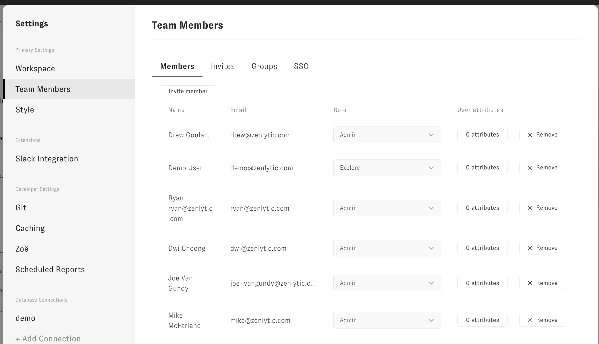
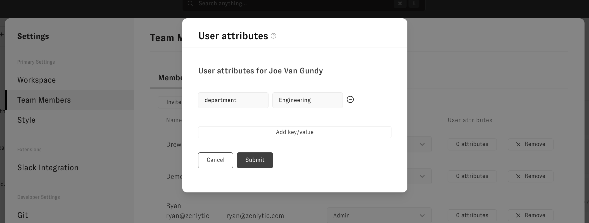
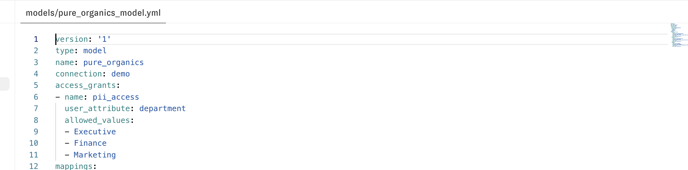
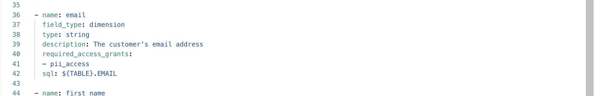

# User Attributes

This section covers how to set user attributes. User attributes are how users are assigned permissions that control their access to data (using [access controls](../4_data_modeling/8_access_grants.md)).

To set a user attribute on a user, go to Workspace Settings, then go to Team Members

To set a user attribute, click on User Attributes, and set the attribute on the user. This example sets the user attribute `department` to `Engineering` on this user.

Now that this user's `department` attribute is set, their permissions will be determined by that (and any other attributes) set on that user.

For example, since the user's attribute for `department` has been set to `Engineering`, not one of the allowed options (`Executive`, `Finance`, `Marketing`) this user will not have access to anything restricted by this access grant.

For example, this user will *not* have access to this `email` field because the field has the `pii_access` access grant as one of the `required_access_grant` selections.

For more information on how to apply access grants and filters, look at the documentation on [access controls](../4_data_modeling/8_access_grants.md).

