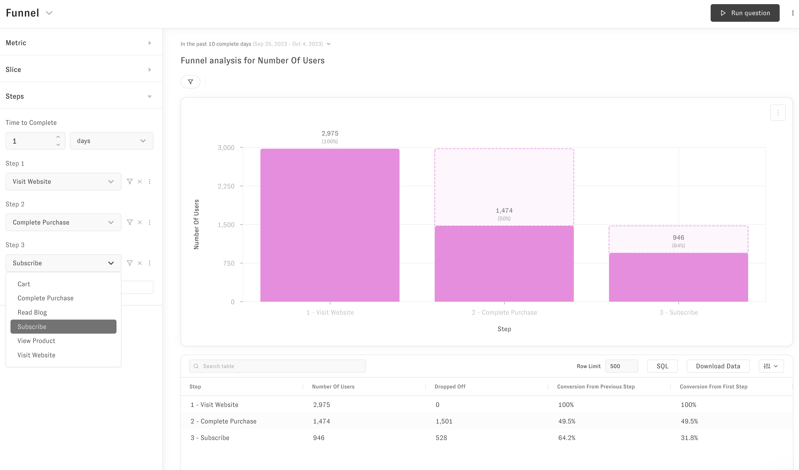
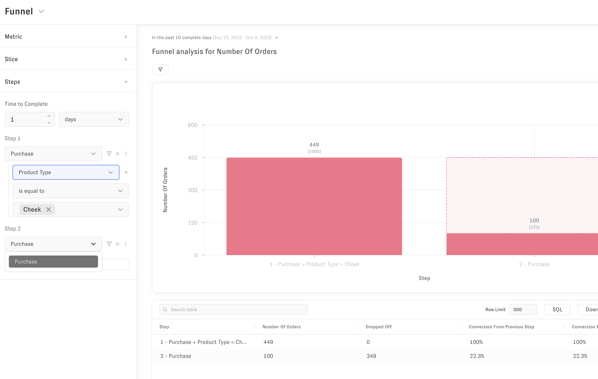

# Views

Views reference exactly one table in the database. They can be joined together using `identifiers` but always reference the same table in the database.

Views, like all files in Zenlytic, are YAML text files.

---

### Properties

`type`: (Required) The type of the file. For these view files is should always be `view`.

`name`: (Required) The name of the view. If you reference this view elsewhere this is the name you will use. Like all names, it follows [Zenlytic naming conventions](1_data_modeling.md#naming-conventions)

`model_name`: (Required) The name of the [model](./2_model.md) (e.g. database connection) the view references.

`label`: The label of the view is what shows up to the end users of your data model. If not specified it defaults to the name of the view.

`description`: The description of the view. This can help business users understand what the view represents and how it is created.

`sql_table_name`: This is the table name in the database that the view references. For example, `prod.customers` would be a valid `sql_table_name`.

`derived_table`: This is a property that you can use to define transformed tables using a SQL statement. This SQL statement is run and is considered to be the "base" of the view. Note, we generally prefer using [dbt](https://getdbt.com) over derived tables for better testing and maintainability. This property has a nested property `sql` inside of the `derived_table` property that you use to define the SQL statement.
```
...
name: my_view
derived_table: 
  sql: "select *, row_number() over (partition by customer_id order by order_date) as order_number from myschema.mytable"
...
```
Note: The filters in `always_filter` *will not* be applied if you are using this property to define the data for the view to sit on top of. 

`default_date`: This is the default date [dimension group](92_dimension_group.md) without a time frame chosen for it. For example, if your dimension group is named `order` you would use the value `order` here, not `order_month` or `order_week` like you would reference elsewhere.

`row_label`: This is the text label of what a row in this table logically represents (e.g. a table of customers, would have a logical row label of "Customer").

`sets`: This is a list of [sets](7_set.md) that are defined in this view. Example syntax of the definition is below.
```
  - name: set_name
    fields: [field_or_set, field_or_set]
```

`always_filter`: This is an optional list of filters which use the usual [field filter selection syntax](./94_field_filter.md) and will *always* be applied to the query. These filters are applied to the entire query, not just a metric or dimension, and if it is not possible to reference or join in the field needed for the filter it will result in an error. 

Note: This set of filters *will not* be applied if you are using a derived table mentioned above instead of `sql_table_name`. 

Example below:

Here are two filters that will be applied to *all* queries that reference this view. One field `context_os` is present in the view, and does not need to specify its view name. The other field `is_churned` is *not* present in this view and must specify its view name. It will be joined in dynamically whenever this view is referenced to apply the filter.

```
always_filter:
- field: customers.is_churned
  value: FALSE
- field: context_os
  value: -NULL
```

`access_filters`: This is an optional list of [access filters](./8_access_grants.md#access-filters) to apply to the view when it is queried.

`required_access_grants`: This is a list of [access grant](8_access_grants.md#access-grants) names that are required to access this view. The grant names are always an `OR` condition. For example, if you listed `human_resources` and `executive` under this parameter, users who qualified for `human_resources`, `executive` or both would all be able to access data in this view. Note, these access grants will *always* be applied for this view in any join sequence.

`event_dimension`: To enable funnels in Zenlytic you will have to set either this property or `event_name` (funnels are disabled by default). Set this property if you have an event table and that table has more than one event type in it. The event dimension will be used to determine the unique values possible to select when picking 'steps' in a funnel like this:



If you do not have more than one event, use `event_name` and enter the name of the type of event (e.g. for an orders table you might enter "Order" or "Purchase").

NOTE: To use funnels, you must tag at least one column in the table or joinable to the table with `tags: ['customer']` to tell the compiler which field to use to follow someone through the funnel (e.g. the field linking steps in the funnel).

`event_name`: To enable funnels in Zenlytic you will have to set either this property or `event_dimension` (funnels are disabled by default). Set this property if you have an event table and that table has exactly one event type in it. The event name value possible to select when picking 'steps' in a funnel like this:



If you do have more than one event type, use `event_dimension` and enter the name of the field that denotes the event (e.g. for an events table  table you might have a column named `event_label`).

NOTE: To use funnels, you must tag at least one column in the table or joinable to the table with `tags: ['customer']` to tell the compiler which field to use to follow someone through the funnel (e.g. the field linking steps in the funnel).


`identifiers`: This is a list of [fields](9_field.md) with additional information defining what kind of key (primary, foreign) they are to the table the view references. An example 
```
- name: order_key
  type: primary
  sql: ${order_id}
```
Identifiers will be used to form the join graph for your database. By default, Zenlytic will not allow fan-out or chasm joins, but if you specify views in the `allow_fanouts` parameter those will be joined and calculated accurately using [symmetric aggregates](./96_symmetric_aggregates.md).


`fields`: This is a list of [fields](9_field.md). Each field must have all required parameters included.


### Identifiers 

Identifiers will be used to form the joins in your database. You will specify the primary and foreign keys using the syntax below and Zenlytic will automatically make the possible joins available to you through any queries you run.

### Examples

This is a basic view with just 2 dimensions and 1 measure, that explicitly references the `prod.order_lines` table. This view also defines it's primary key as an identifier and a foreign key as an identifier.

This view defines the average price measure on the order lines view and allows a join using the `customer_id` identifier.


```
version: 1
type: view
name: order_lines
model_name: demo_model

sql_table_name: prod.order_lines
default_date: order
row_label: Order Line

identifiers:
- name: order_line_id
  type: primary
  sql: ${order_line_id}
- name: customer_id
  type: foreign
  sql: ${customer_email}

fields:
- name: order_line_id
  field_type: dimension
  type: string
  sql: ${TABLE}.order_line_id
  primary_key: yes
  hidden: yes

- name: customer_email
  field_type: dimension
  type: string
  sql: ${TABLE}.email

- name: price
  field_type: dimension
  type: number
  sql: ${TABLE}.item_price

- name: avg_price
  field_type: measure
  type: average
  # This references the "price" dimension above to calculate the average
  sql: ${price} 
```