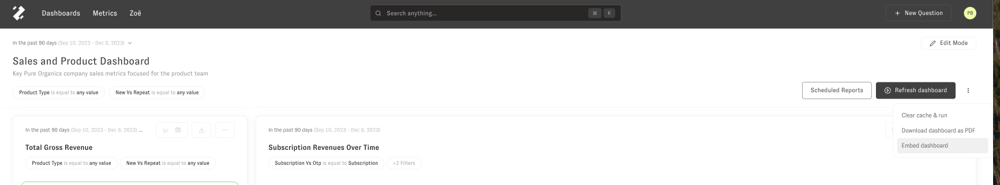
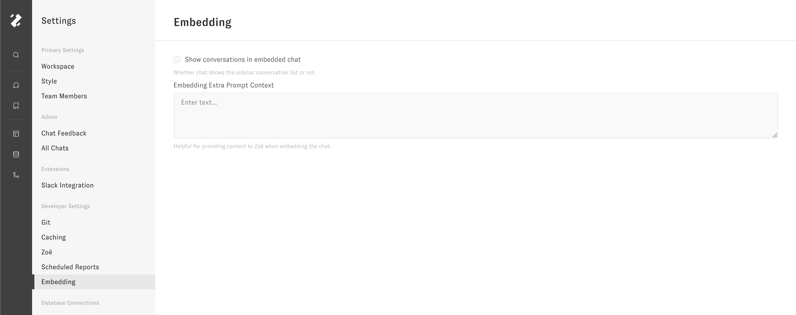

# Private Embedding


Private embedding enables the integration of Zenlytic content directly into your application using an iframe. This method is designed for scenarios where analytics are embedded within a controlled, authenticated environment. It leverages Zenlytic's existing authentication mechanism to ensure that only authorized users with Zenlytic accounts can access the embedded analytics.

If you require a more advanced or customizable embedded solution, check out our [signed embedding](./3_signed_embedding.md) documentation page.

### **Use Cases**

Private embedding is ideal for:

- Internal dashboards within enterprise applications.
- Analytics in customer portals where users have Zenlytic accounts.
- Situations where embedding needs to be straightforward and secure within Zenlytic's existing authentication framework.


### **Implementation Guide**


Step 1: Set up the iframe

Create an iframe within your application's user interface and ensure the iframe is sized appropriately for the analytics content.


Step 2: Application Authentication

The embedded analytics will employ the user's authentication from their Zenlytic account. Any row-based or column-based access controls you have assigned to that user will apply. If the user is not already signed into Zenlytic, they will see a login screen on the iframe, which they can use to sign in.


Step 3: Embedding Analytics Content

Point the iframe's src attribute to the URL of the analytics content. You can copy the whole iframe by going to the three dot menu on the dashboard you want to embed.



URL's add the `/embed` segement to the url for the embedded view. You can add this to the url in your browser to preview how the embedded dashboard will appear to your embedded user. Here is an example iframe and the URL for embedding a certain dashboard:

```
<iframe src="https://app.zenlytic.com/embed/dashboards/73b64533-c027-43b8-b8a8-606345212343" style="height:700px;width:100%;border:none;" title="Dashboard" description="Zenlytic Dashboard"></iframe>
```

Similarly, if you want to embed a chat window, you can use the iframe 

```
<iframe src="https://app.zenlytic.com/embed/chat" style="height:700px;width:100%;border:none;" title="Data Chat" description="Zenlytic Chat"></iframe>
```

### Embedded UI Settings

You can additionally set some other settings and system prompt context for Zoë in the Embedded settings page in the UI. These settings will apply to all of your tenants.



You can also change the name of Zoë to any name you would like using the Chat Agent Name setting.
