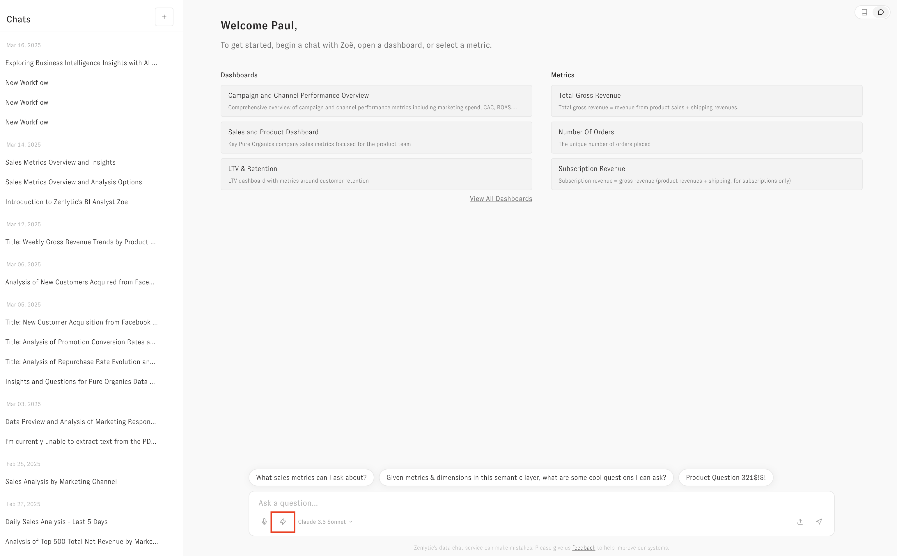

# Tasks in Embedding (beta)

You can add Tasks to the embedding experience by creating the Tasks in the UI, and then sharing those Tasks with "all users" as Viewer (which only gives the ability to _run_ the Task).

Once you have those Tasks created and shared, you will see the lightning bolt option in the embedded UI to run the Task.

:::tip Use the right role

Only the `embedded_with_scheduling` role has access to Tasks, so you will not see the option to run Tasks if you only use the `embed` role.

:::

In the chat UI, that will look like this

### Running automatically

To run Tasks without making the user pick which workflow they want to run, you will pass query parameters to select the workflow you want to use. 

You can get the Task ID from the 3 dot menu or the URL from the Task Builder page. You will pass query parameters like this to run a Task

`https://app.zenlytic.com/chat?workflowId=<my-workflow-id>`

That will kick off the run of the Task. If the Task requires inputs, it will open a modal asking the user for the inputs. If it does not require inputs, the workflow will start running immediately.

Note: you can also run a normal chat question via query parameters as well. To do that you will pass query parameters in the URL like this:

`https://app.zenlytic.com/chat?q=hello`

This will initiate the conversation with the user's question `"hello"`.
