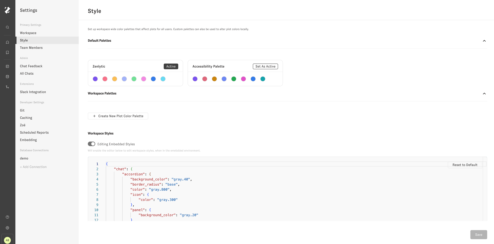
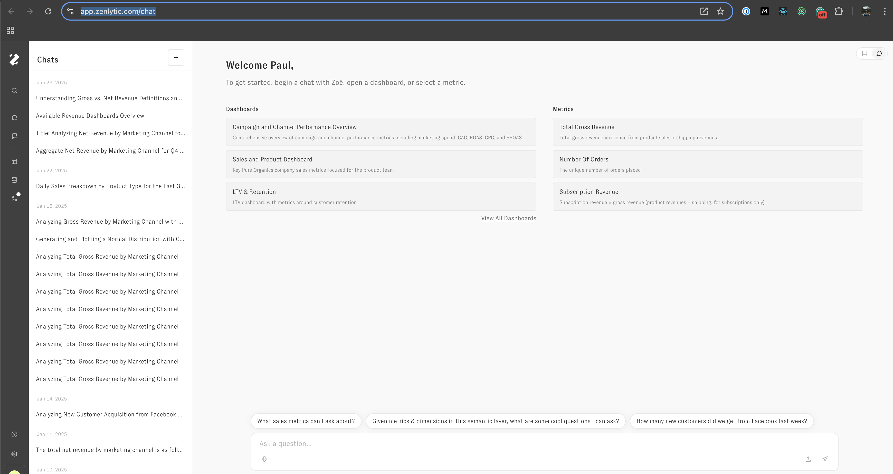
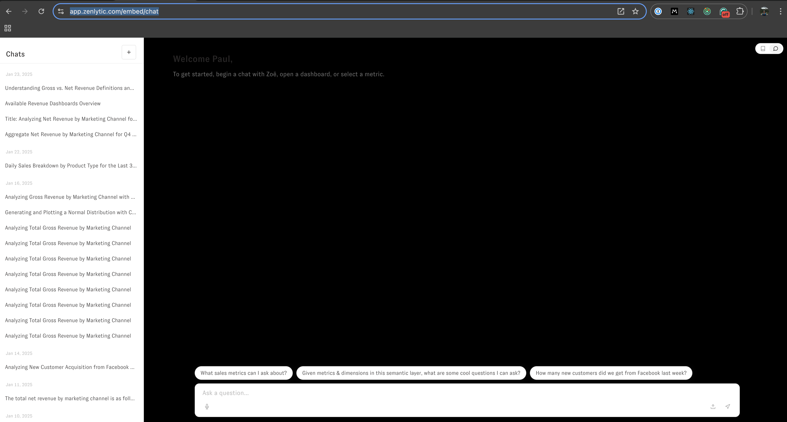

# Workflows in Embedding (beta)


[todo]
You can control UI customization in Zenlytic's embedded environment via a JSON that maps to CSS styles in the Zenlytic embedded product.

:::tip Embedded styles ONLY apply in embedding

The styles you define here will *ONLY* be visible in the embedded application itself. You won't see the chat UI change, unless you are looking at the embedded version of the chat UI.

:::

### Defining styles

You will find the JSON input for defining styles in the Style section of the workspace settings. Only admins in the workspace will have access to this section. 



To start, you'll see a json that is structured like this:

```
{
	"avatar": {
		"background_color": "brand.90",
		"color": "gray.800"
	},
	"chat": {
		"accordion": {
			"background_color": "gray.40",
			"border_radius": "base",
			"color": "gray.800",
			"icon": {
				"color": "gray.300"
			},
			"panel": {
				"background_color": "gray.20"
			}
		},
		"background_color": "gray.20",
		"chat_agent_avatar": {
			"background": "transparent",
			"src": "<link>"
		},
		"chatbox": {
			"background_color": "white",
			"border_color": "gray.60",
			"border_radius": "lg",
			"disabled": {
				"background_color": "gray.20"
			},
			"icon": {
				"color": "gray.300"
			}
		},
		"color": "gray.800",
		"explore_chat_toggle": {
			"background_color": "white",
			"border_color": "gray.60",
			"border_radius": "full",
			"icon": {
				"active": {
					"background_color": "gray.40",
					"color": "gray.800"
				},
				"color": "gray.400"
			}
		},
		"feedback": {
			"menu": {
				"background_color": "white",
				"color": "gray.800",
				"secondary_color": "gray.500",
				"submit_button": {
					"background_color": "white",
					"border_color": "gray.60",
					"color": "gray.800",
					"hover": {
						"background_color": "gray.30"
					}
				},
				"textarea": {
					"background_color": "gray.20",
					"border_color": "gray.60",
					"border_radius": "base",
					"color": "gray.800"
				}
			},
			"response_text": {
				"color": "gray.700"
			},
			"submission_buttons": {
				"active": {
					"color": "gray.700"
				},
				"color": "gray.300",
				"hover": {
					"background_color": "gray.50"
				}
			}
		},
		"loading_indicator": {
			"color": "gray.30",
			"secondary_color": "gray.300"
		},
		"message": {
			"background_color": "white",
			"border_radius": "lg"
		},
		"secondary_color": "gray.300",
		"suggestion": {
			"background_color": "white",
			"border_color": "gray.60",
			"border_radius": "full",
			"color": "gray.800"
		},
		"welcome_text": {
			"color": "gray.500"
		}
	},
	"embed_menu": {
		"background_color": "white",
		"border_color": "gray.60",
		"color": "gray.800",
		"icon": {
			"color": "gray.300"
		}
	},
	"nav": {
		"background_color": "gray.700",
		"border_color": "gray.600",
		"color": "gray.100",
		"hover": {
			"color": "gray.600"
		},
		"icon": {
			"color": "gray.200"
		},
		"logo_image": {
			"rectangle": "<link>/zenlyticLogoWhiteTransparent.svg",
			"square": "<link>/zenlyticLogoMarkWhiteTransparent.png"
		},
		"search_buttons": {
			"background_color": "gray.700"
		},
		"search_input": {
			"background_color": "gray.800",
			"color": "gray.300",
			"placeholder_color": "gray.500"
		},
		"search_panel": {
			"background_color": "gray.700",
			"color": "gray.300"
		},
		"search_result": {
			"description": {
				"color": "gray.300"
			},
			"hover": {
				"background_color": "gray.600"
			},
			"title": {
				"color": "white"
			}
		},
		"secondary_color": "gray.300"
	}
}
```

Each key in the JSON corresponds to the associated styles in that portion of the application. For example, if you change the key `"chat" -> "background_color"` from `"gray.20"` to `"#000000"`, you'll see the background color of the chat interface change from a light gray to black.

Since, the styles are only changed in the embedding environment, you'll have to change the url for chat that you are looking at to see the the styles applied. 

For example, if I make that change, and then go to the `/chat` route, I will not see the change in style applied. 



However, if I emulate the embedded environment by going to the `/embed/chat` route instead, I will see the styles applied as I expect.



To develop and test changes, you should have one tab open to the workspace settings, where you can make changes to the JSON object that governs the styles, and another tab open to `/embed/chat` where you can refresh the page after making changes to the JSON to see how those changes impact the embedded UI. 
