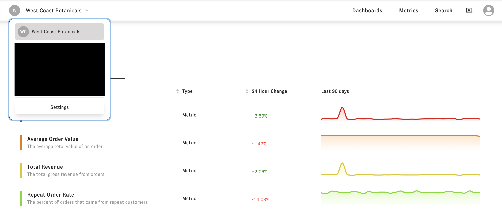
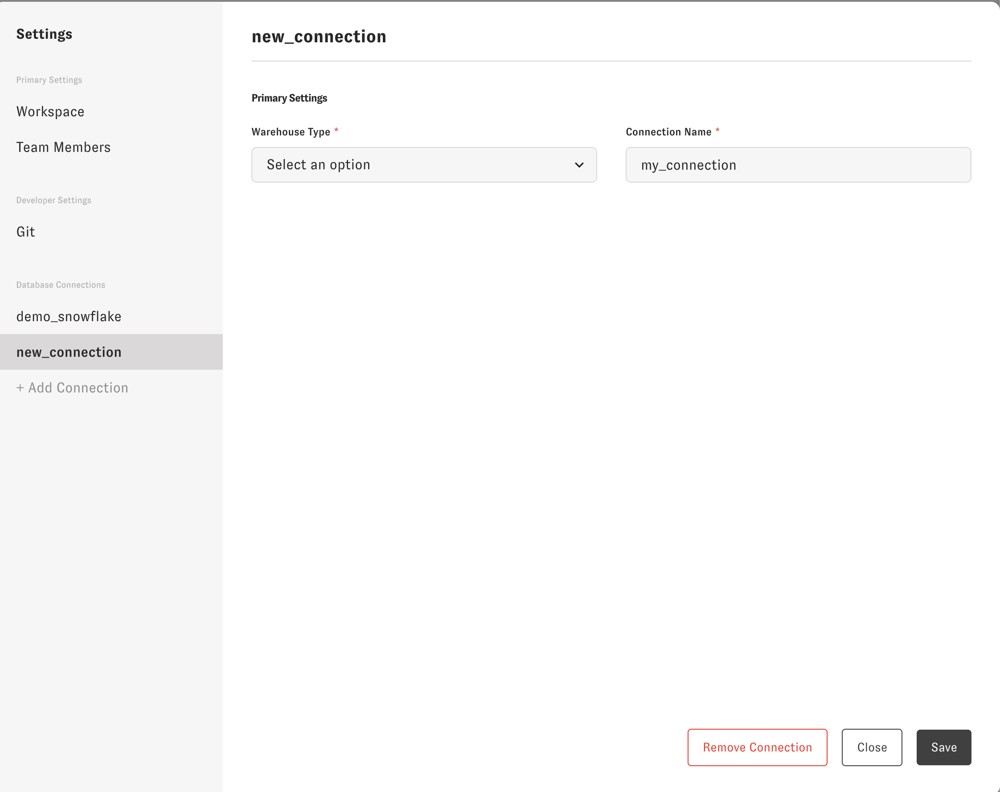
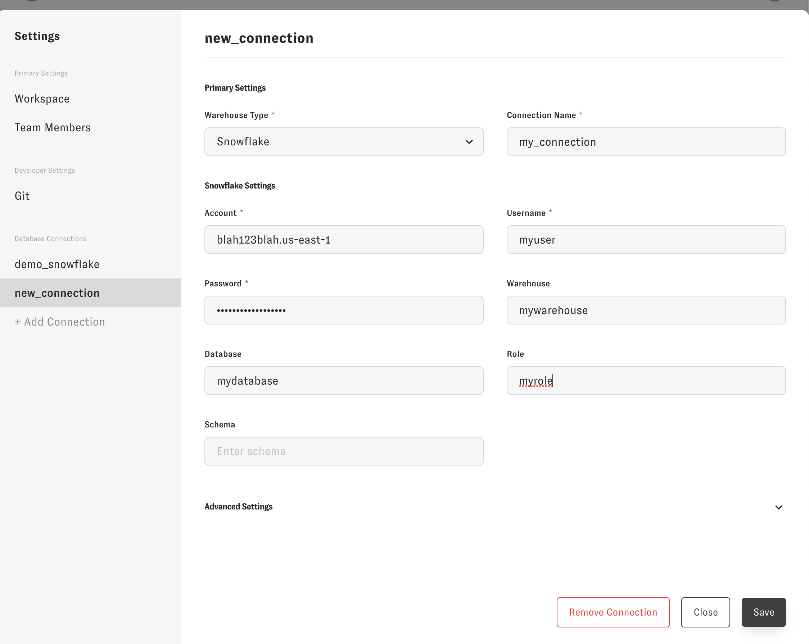

# Database connections

There are two ways to connect to your data warehouse. One through Zenlytic for your official reporting, and one locally in the same way that you connect with dbt (if you use dbt).


### Zenlytic connection

To set up your database connection in Zenlytic you'll go to your workspace settings




Then you'll click on the "+ Add Connection" button under the connections tab.




You'll fill out your connection information, making sure you set the `Connection Name` to the name you'll reference in your [data model's model file](../4_data_modeling/2_model.md).




### Local connection

To set up your local connection you'll follow the same setup that you follow for [dbt profiles](https://docs.getdbt.com/dbt-cli/configure-your-profile)

You'll create a `profiles.yml` file in a directory called `.dbt` in your home directory (where your terminal opens to), if you don't already use dbt. If you use dbt, this file already exists and you can connect to whichever profiles you have currently set up.

A fully set up `profiles.yml` would look like this:

```
my_dbt_profile: # This is the name referenced in the zenlytic_project.yml file
  target: dev
  outputs:
    dev:
      type: snowflake
      account: blah1234blah.us-east-1
      user: myuser
      password: 1234extremelysecurepassword
      role: myrole
      warehouse: mywarehouse
      database: mydatabase
      schema: myschema
```

