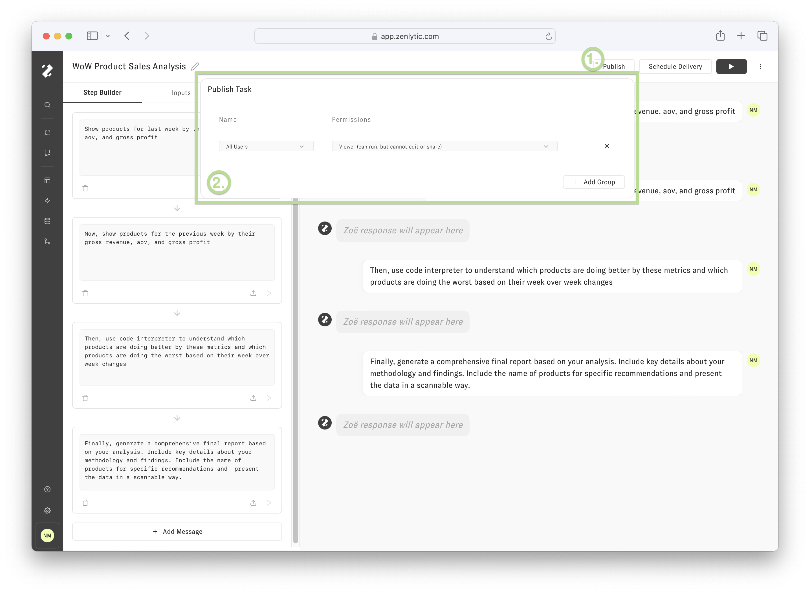

# Publish a Task to your Workspace

By default, Tasks are private to you, however we can allow others in our organization to run and extend our Tasks when they are ready. The following image shows the “Publish Task" popover that appears after clicking “Publish” in the Task Builder Header. 

After pressing “+ Add Group”, we can select a workspace “group” and give the group an “access level” of Viewer, Editor, and Owner. For example, I’ve given all users in my workspace the ability to View the following Task. See the table below for more detail on Task access levels.

| **Access Level** | **Description** |
| --- | --- |
| OWNER | can run, edit, and share the Task |
| EDITOR | can run and edit the Task, but not share |
| VIEWER | can run the Task, but cannot edit or share |

