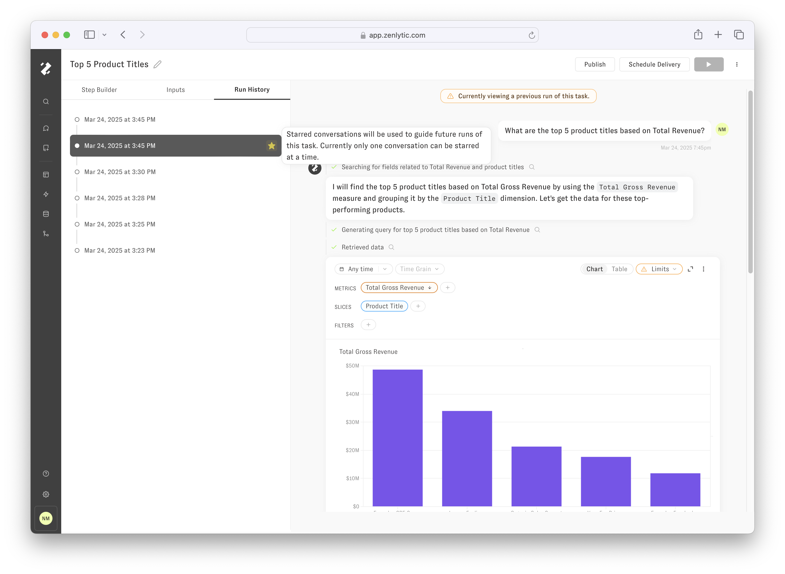

# Viewing Run History

The *Run* *History* tab provides a list of previous runs of the currently selected Task. By clicking on a run on the left-hand side, the conversation preview on the right-hand side will change to show that previous run’s conversation history.

## Reinforcing a previous run

The *Star* icon button represents the option for marking a previous Task run as an ideal response that should be used to guide future responses. Starring a previous run of the Task is an important mechanism to increase the consistency of Zoe's response between runs. The starred conversation will only be added to Zoe’s context when the Task is run from a new chat, i.e. the starred conversation will be ignored when running the Task from the Task Builder. At this time only one conversation can be starred at a time.

