# Getting Started

Intelligent Workflows allow us to build and run entire conversations with Zoe, and then enable others in the organization to re-run those conversations easily. With this feature, Zoe is more programmable and reusable for solving task-specific workflows than ever before.

Workflows can be used to automate repetitive data processes, iterate on better Zoe prompts, and much more. Some examples include:  

- Building narrative-based weekly business reviews that can be re-run periodically
- Automating a tedious manual process of reconciling CSVs against database data
- Demonstrating chains of thought and other Zoe prompting techniques to new users
- Saving exceptional conversational outputs from Zoe so that the reasoning steps can be reproduced and refined
- Getting lists of products or customers and then having Zoe produce personalized long form promotional content for each one

Workflows are ideal for implementing tasks where you need one or all of the following characteristics:

- You need precise control over the exact sequencing of analytical reasoning steps
- You need to query and transform data across multiple conceptual steps
- You need structured, predictable outputs and consistent, formatted results
- The task involves conditional logic -- different behaviors should be taken based on intermediate results
- You need to combine AI capabilities and traditional programming techniques 

## Navigating to Workflows

1. To view your workflows and create new ones, from the left-hand navigational sidebar, click on ⚡Workflows

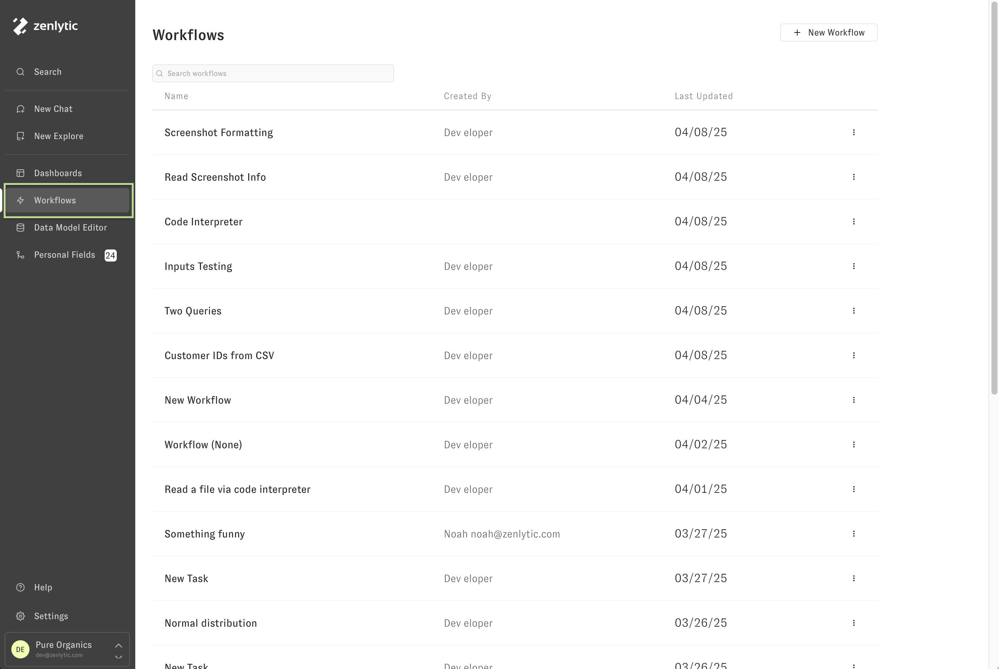

2. To run Workflows from chat, click the ⚡ *Lightning* icon button in the chat input:

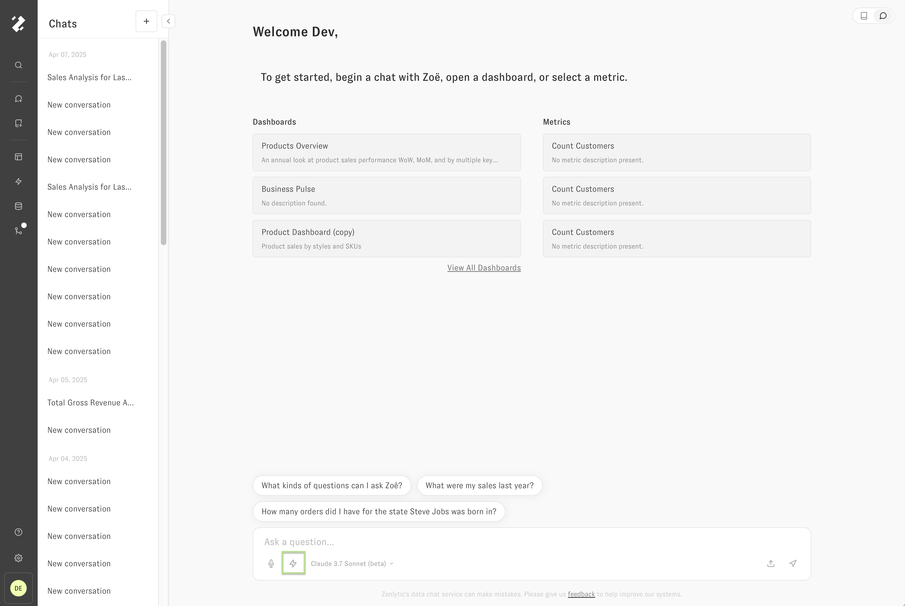

## Running Workflows

After clicking on the ⚡ *Lightning* icon button, the following modal will appear. Search workflows by name, creator, and creation date. Click a Workflow name and press “Submit” to run it. If a Workflow requires user input before it can run, click the "Next" button to provide the required input values first. More on inputs in the [Requiring User Inputs](/docs/workflows/inputs) section.

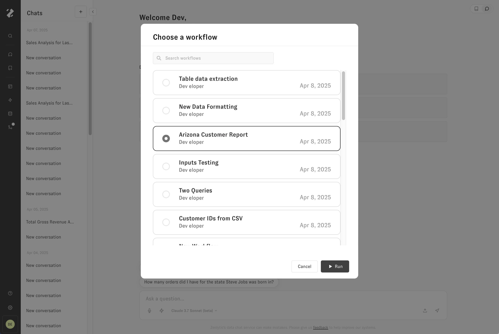

While the Workflow runs, the chat input for the Workflow's conversation will display "Workflow in progress…” Feel free to navigate away from the Workflow's conversation to other chats or browser tabs while the Workflow is running. Workflows were designed with long-running operations in mind; the Workflow's conversation will update with responses whenever they are available.

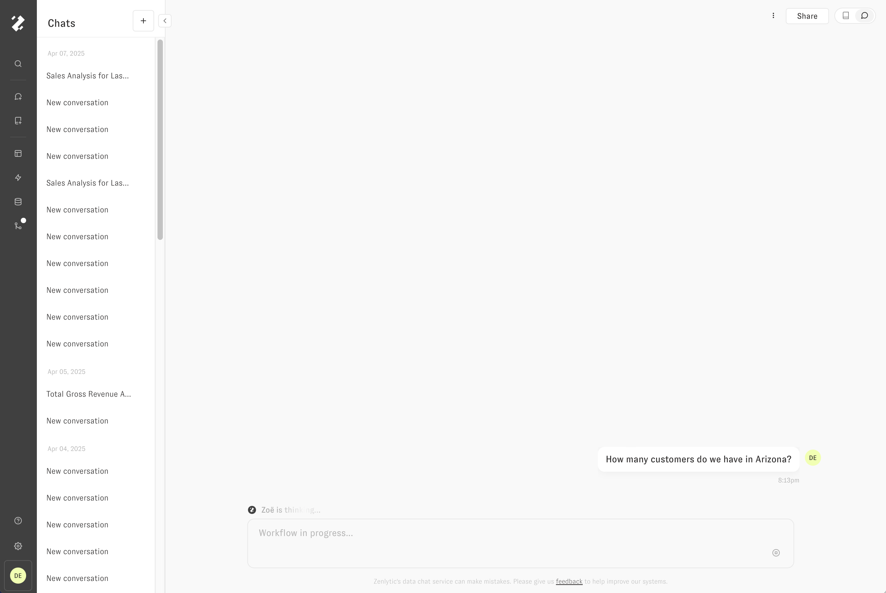

## Continuing the Workflow Conversation

That’s it! After the Workflow is completed, the chat input will become available again and we can send follow up messages to continue our analysis with Zoe from wherever the Workflow completed.

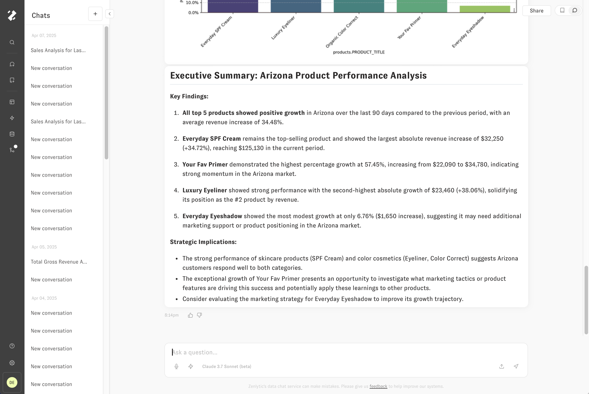

## Viewing Workflows

By navigating to https://app.zenlytic.com/tasks or clicking the *Workflows* option in the left-hand navigational sidebar, you will see a list of Workflows that have been created in your workspace. The three-dot menu reveals options to run, duplicate, or delete a Workflow. When you click on a Workflow name or highlighted row, you will be navigated to the Workflow Builder.

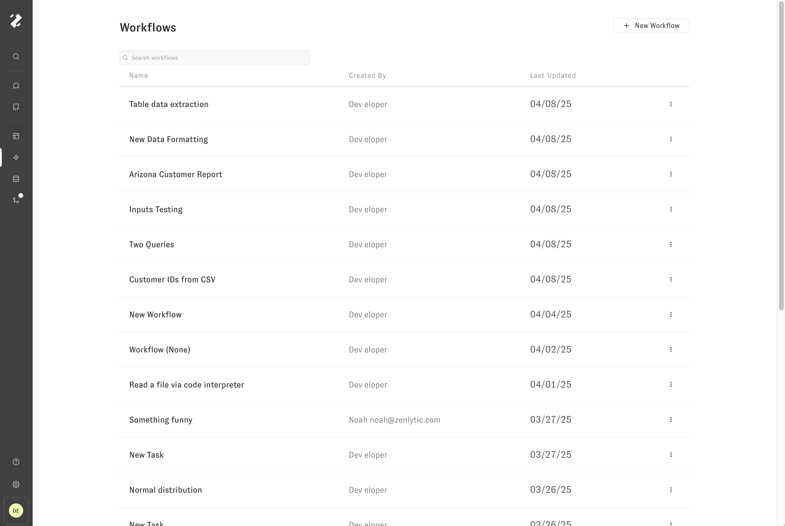

## Creating Workflows

In the upper right-hand side of the screen, you can create new Workflows by pressing *New Workflow*. This button will then navigate you to your new Workflow in the Workflow Builder.

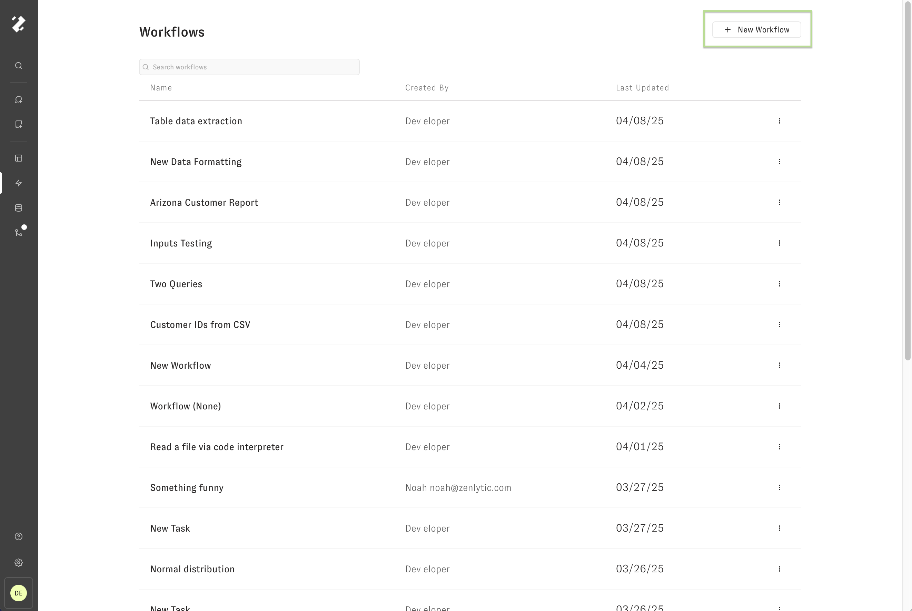

## Editing Workflows

By default, the newly created Workflow will be titled “New Workflow" and contain no messages. We can click the Workflow title and type to change the title. The new name will be saved with an outside click or "Enter" keypress. 

Workflows allow us to define an entire "script" of messages that will be added to a conversation and run in sequence. Let’s click on  the *Add Message* button in the *Step Builder* tab to get started.

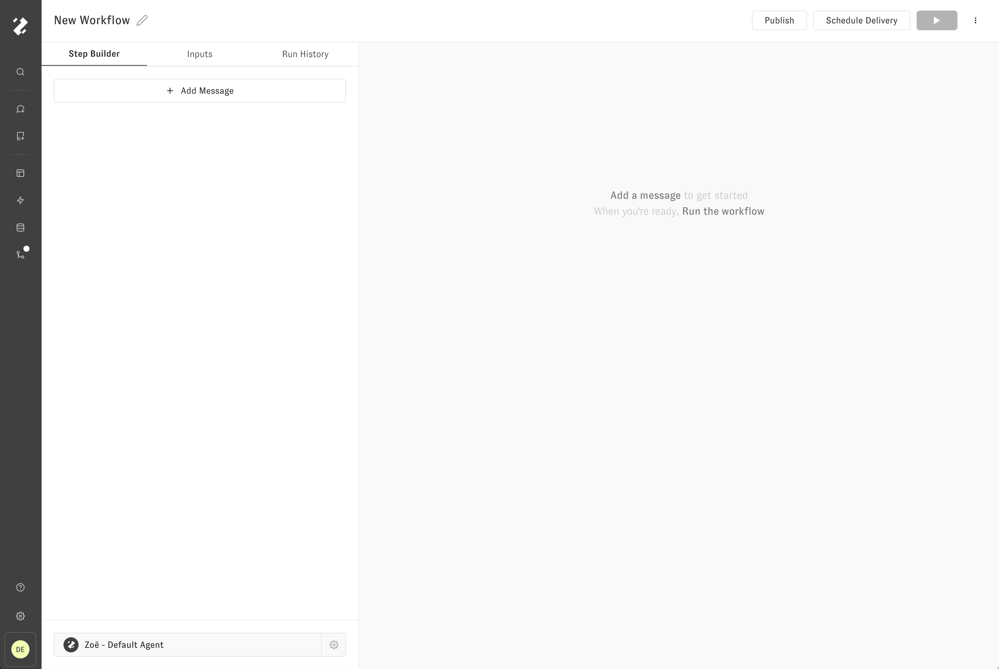

After adding the first message to the Workflow, check the preview on the right to see how that message will be added to the conversation when run. Because we haven't added any message content yet, the Workflow preview is showing placeholder text.

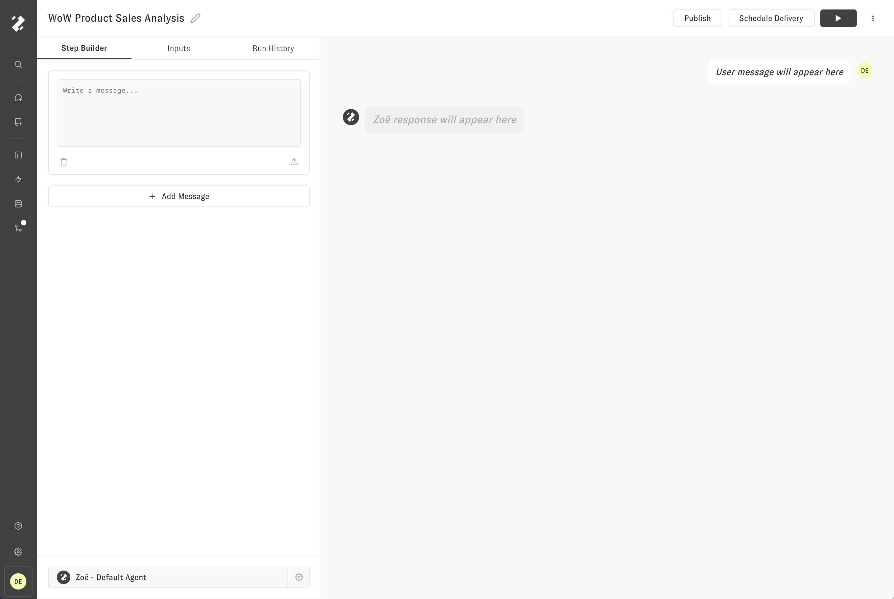

Click the textarea labeled “Write a message…” to edit the first message in the Workflow. Type the new prompt, then click outside the textarea or hit *Enter on your keyboard* to save the changes. Once saved, the text content of the message in the *Step Builder* tab on the left-hand side should correspond with the text content of the first user message in the Workflow conversation preview on the right-hand side.

Click on the *Play* button in the upper right-hand section to preview a Run of our single-message Workflow.

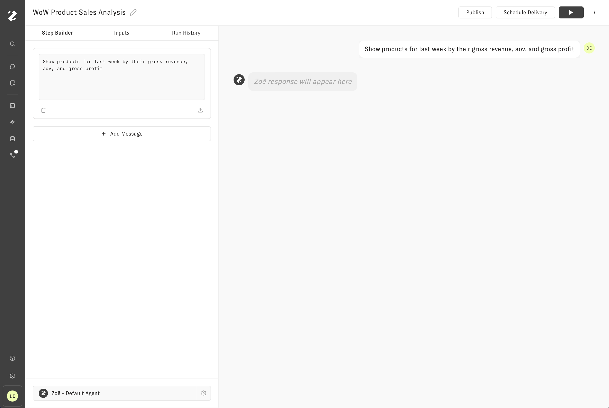

When running, the Workflow messages will temporarily be unavailable to edit. The Workflow run can be cancelled at any time by pressing the *Pause* button in the upper right-hand section. The current Workflow message being run will be distinguished by a pulsing black outline. The respective message in the Workflow conversation preview will read “Zoe is generating a response…” until it is available.

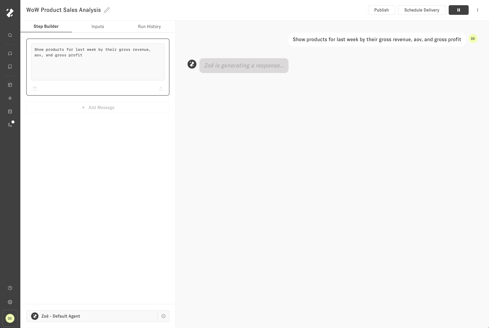

When the Workflow conversation preview has completed its run, we can inspect its output, run it again, or we can modify the Workflow before running again. The *Trash* icon button will remove the message from the Workflow. The *Upload* icon button will allow you to attach files to the Workflow message. 

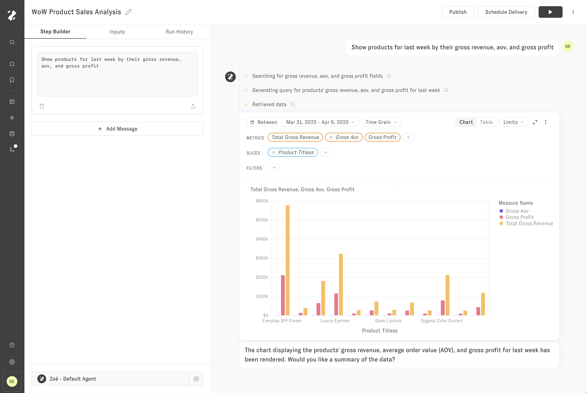

## Building more advanced Workflows

In the following example,  three additional messages have been added to the Workflow we previously ran, and this is represented by the Workflow conversation preview on the right-hand side by three placeholder responses following each message that hasn't been run yet. 

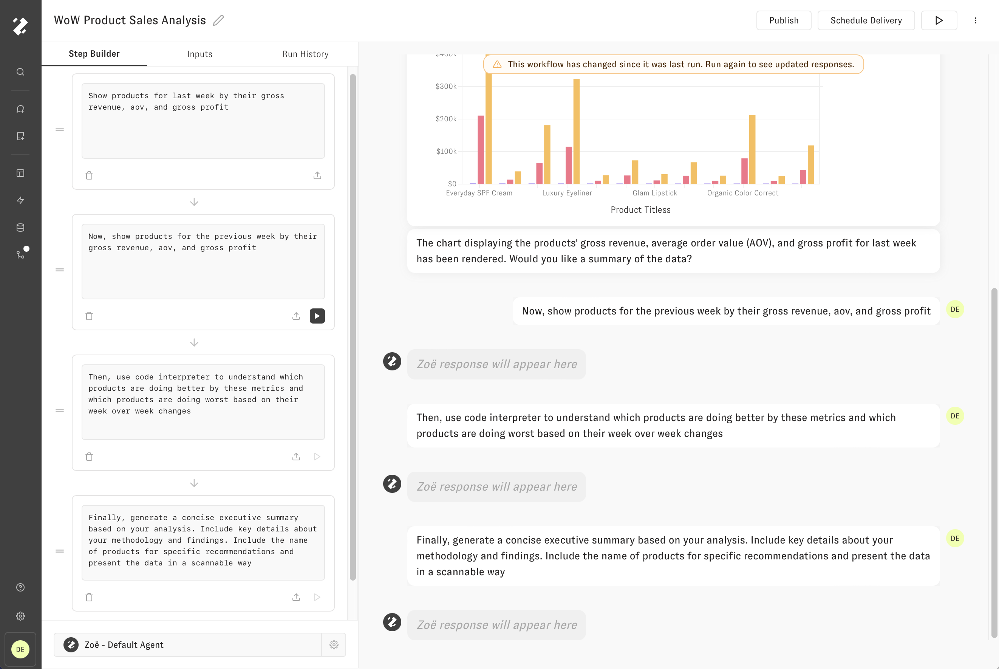

When  the Play button is clicked in the upper right header, the Workflow starts running from the beginning, and responses are generated for the newly added messages. The image below shows the updated, completed Workflow.

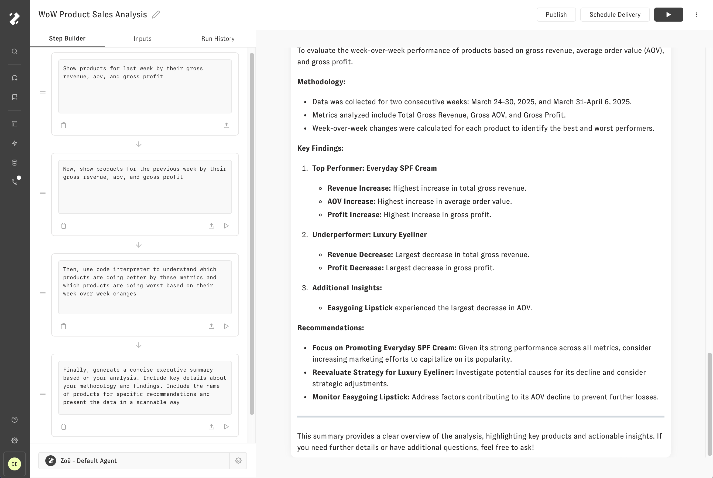

## Run from Here

When writing new Workflows, you may find yourself making small changes to messages and often re-running the conversation preview. In the previous section, the last Workflow message prompted Zoe to generate a "concise executive summary". If we wanted to run the Workflow again, but this time generating a "comprehensive final report", We can modify the text of the message we want to change, and then use the *Run from Here* button to run the Workflow from that point. The most recent run of the conversation preview will be re-used for all messages from before the new starting point.

When making changes to the Workflow messages, you may find yourself using a combination of running from the start and running from a point as you hone into the perfect message prompts.

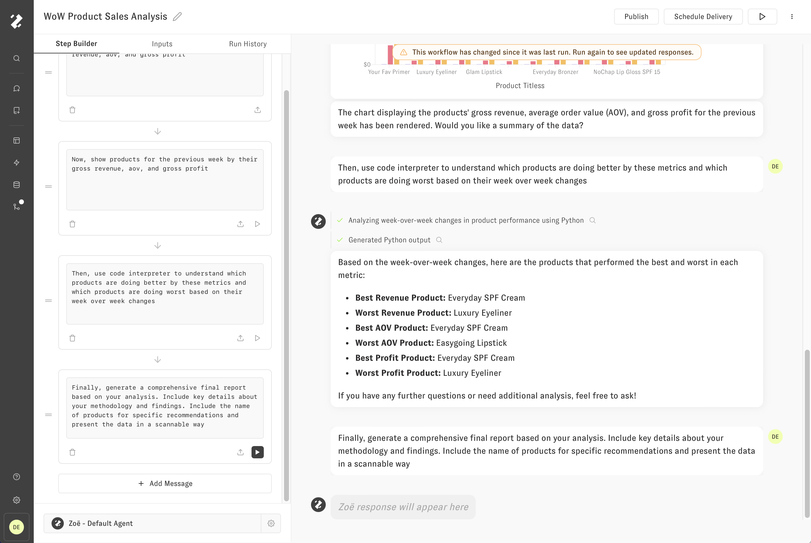

## File Attachments

Files can be added to Workflow messages by pressing the *File Upload* icon button in the message card. When the Workflow has `file attachment` type Inputs available, the Upload icon button will appear as a Plus icon and open a detail menu including the option to attach an uploaded file or require one from the user. Once a file attachment or input is selected, the conversation preview on the right side will add the attachment above the text content. The Upload/Plus icon button within the message card will change to a Chip and indicate that a File is attached or an Input is required.

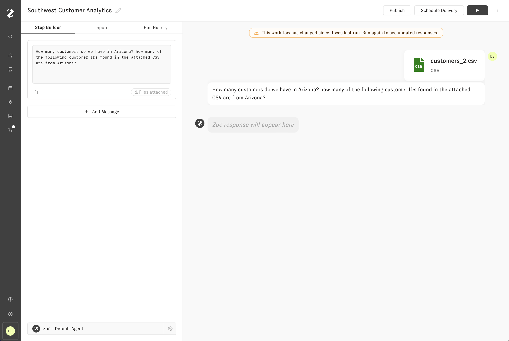

## Create Workflow from an existing Conversation

From an existing chat, we can click the “Save as Workflow” button in the three-dot dropdown menu to create a new workflow from the outline of an existing chat. It will be saved in the Workflows tab, and you can navigate to it in the future by hovering over the left-hand navigation side bar and clicking on 'Workflows'. You can also run the new workflow immediately by clicking the Lightning icon button in the Chat inputbox and selecting the latest workflow.

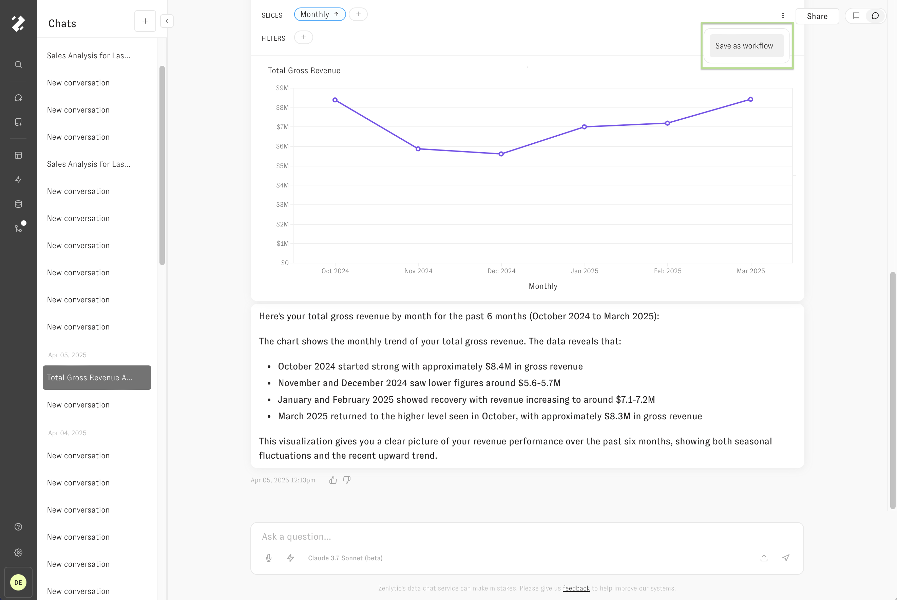

