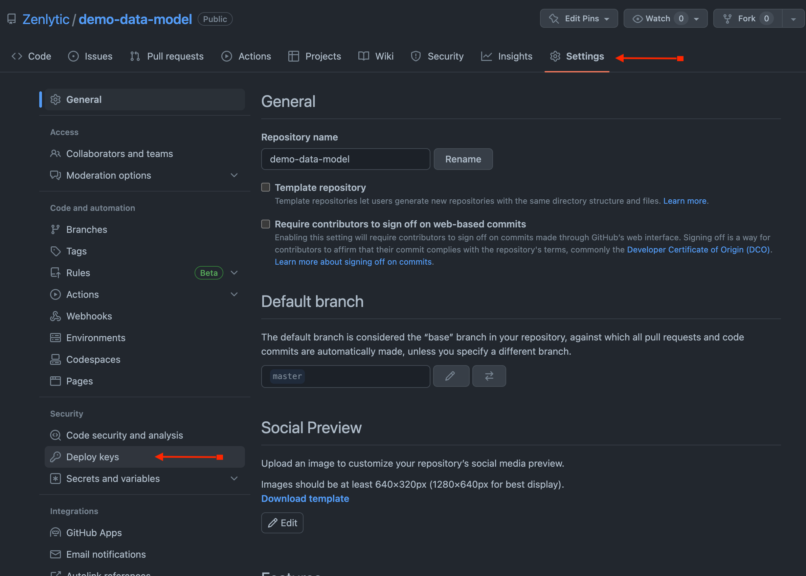
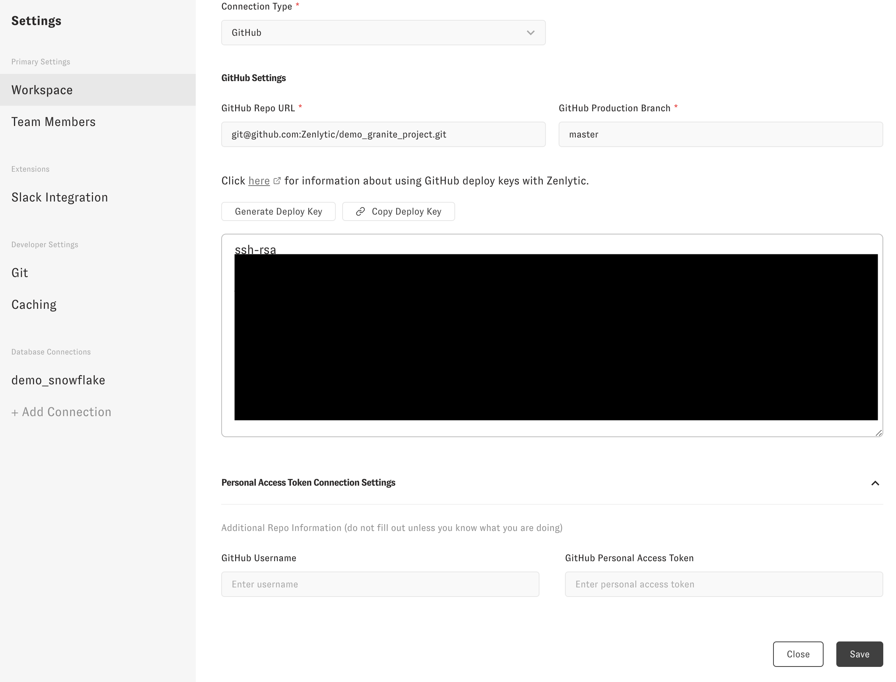

# Git (version control)

To start with your Zenlytic data model, you'll need a [GitHub](https://github.com) repo (or any git repo that can use SSH as a connection method). If you don't already have one, you can create an account and a repo with [GitHub](https://github.com). If you already use dbt, you'll have a GitHub repo already set up, and you can add your Zenlytic data model to that repo.

To create a repo, follow the [instructions on GitHub](https://docs.github.com/en/get-started/quickstart/create-a-repo).

Next, you'll go to the Zenlytic UI and go to the settings page

Once in the settings menu, you'll click "Generate Deploy Key" then copy the deploy key. This will connect to your Git repo via SSH. This is the recommended way of connecting and it's the most secure way possible.

Next, go to Github and add the deploy key to your repo, pasting in the SSH key you copied in the previous step.

:::tip Deploy Keys

Make sure to give your deploy key write access to the repo if you want to use Zenlytic's data model editor

:::

---

You can also connect to your Github repo with a Personal Access Token if you do not want to connect via ssh. This method is not optimal compared to ssh, but you can do it if you prefer. 

First, you'll need to [create a personal access token](https://docs.github.com/en/enterprise-server@3.4/authentication/keeping-your-account-and-data-secure/creating-a-personal-access-token). Then, in workspace settings, scroll down to advanced settings, and enter your username and personal access token there.

