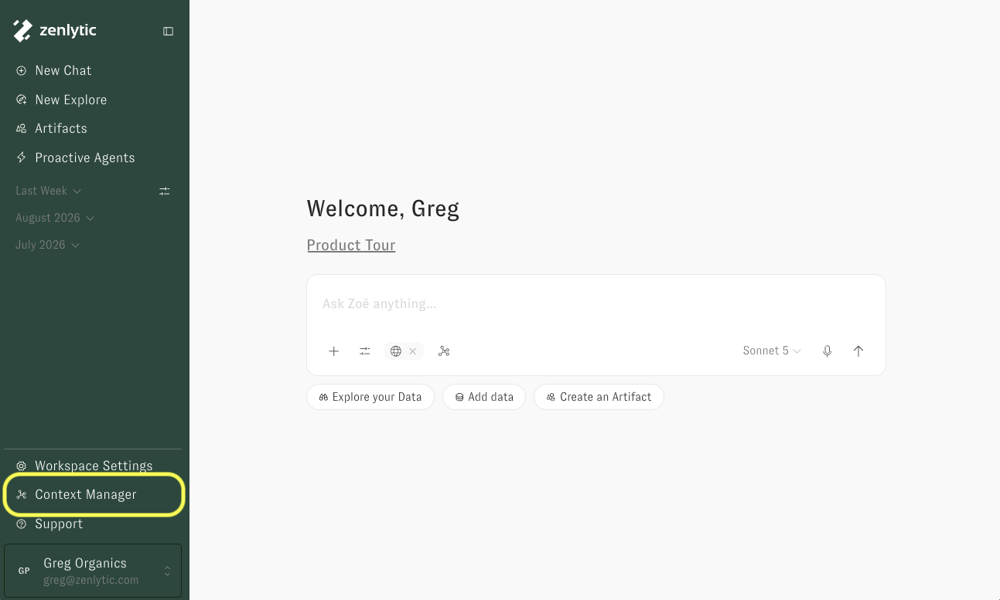
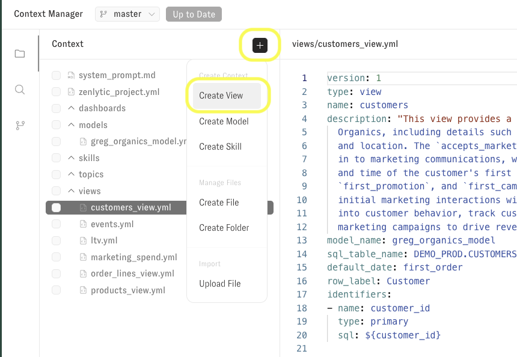
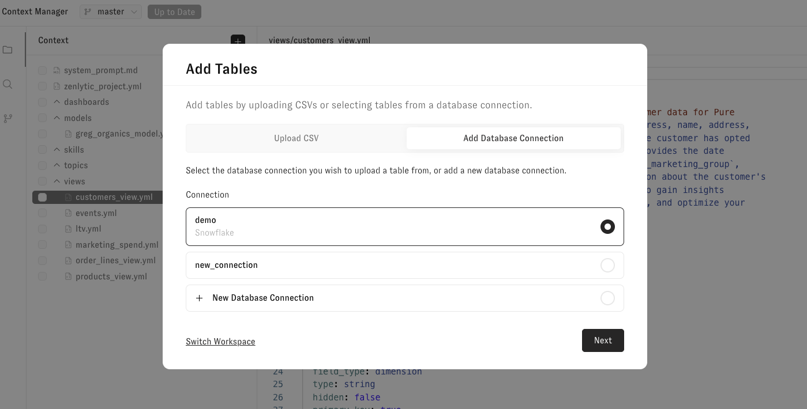
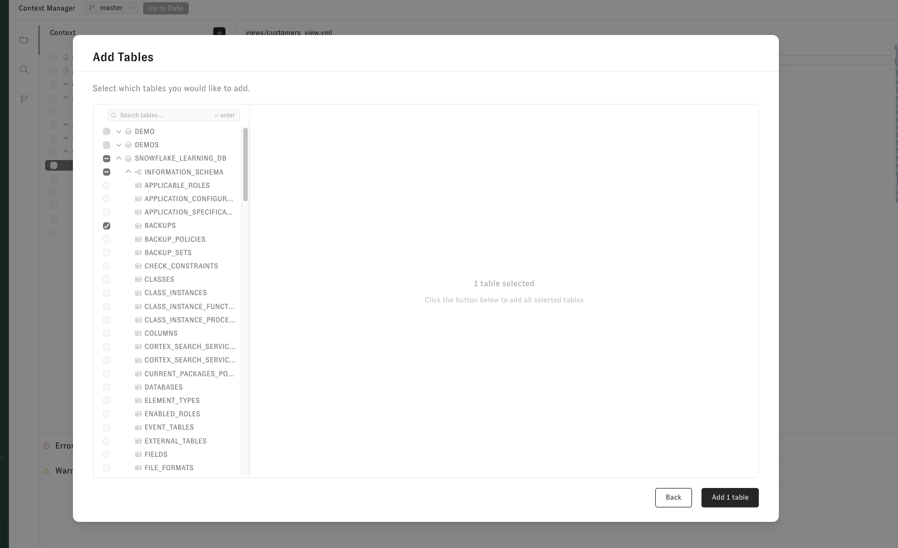
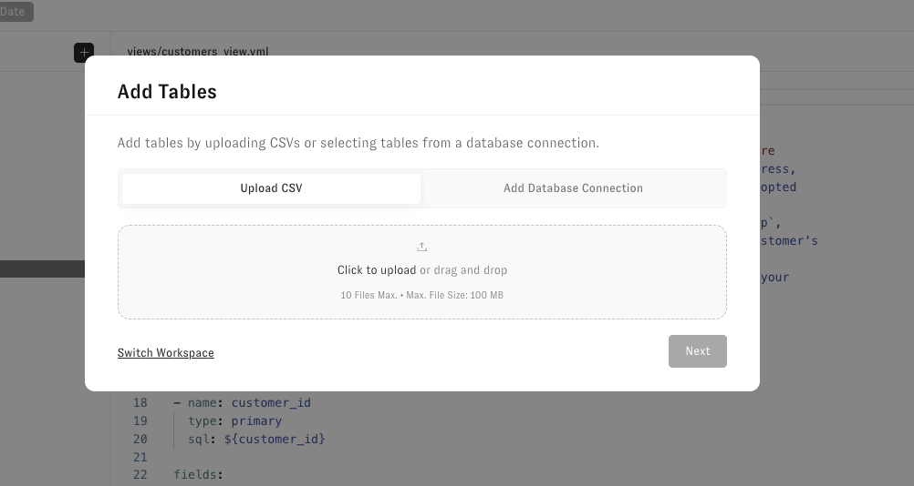

# Adding a New Table

## Adding new tables to your workspace can be done two ways.&#x20;

1. Just ask Zoë - she can now find tables in your house by asking her in chat (depends on the service account permissions she is using)
2. Manually by the steps outlined below

## Step 1 - Go to Context Manager

Using the left-hand navigation, go to [Context Manager](../zenlytic-ui/context_manager.md).

## Step 2 - Click the "+" button

Views can be added by clicking the "+" button and selecting "Create View" in Context Manager.

<figure><figcaption></figcaption></figure>

Clicking the "+" button will bring up the Add Tables modal which lets you add tables from your warehouse or upload a CSV.

## Step 3 - Add a table from your data warehouse or upload a CSV

Selecting a warehouse connection will open the Add Tables selector modal. Select one or several tables then click "Add x table" to add them to context manager.

<figure><figcaption></figcaption></figure>

Alternatively, upload a CSV. CSV headers must only use alphanumeric characters, spaces, and underscores.

