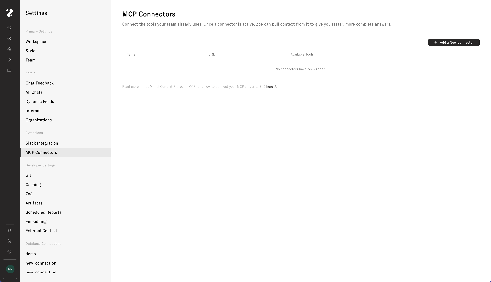
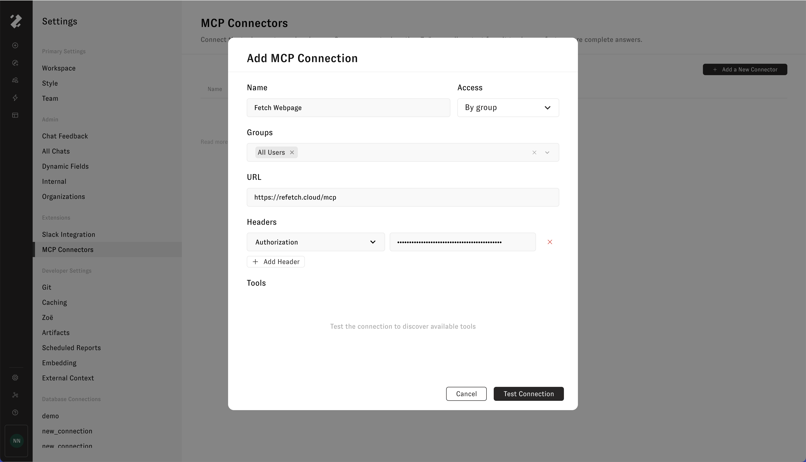
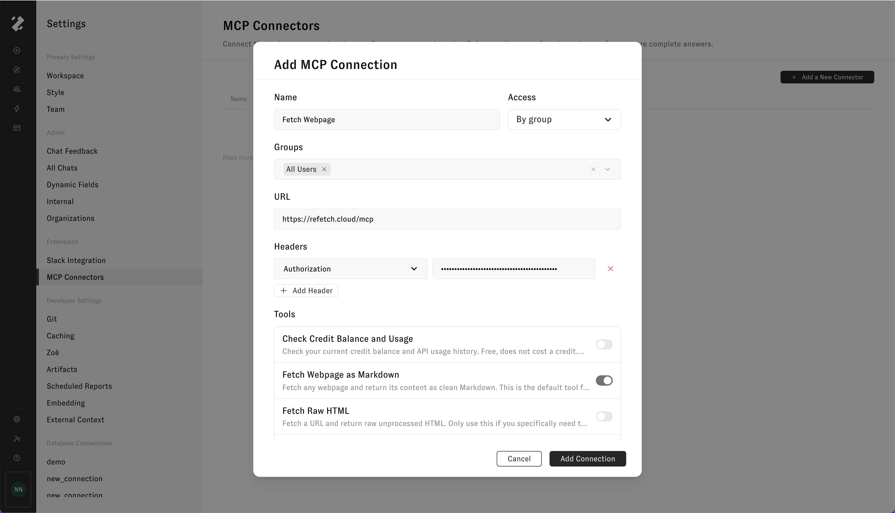
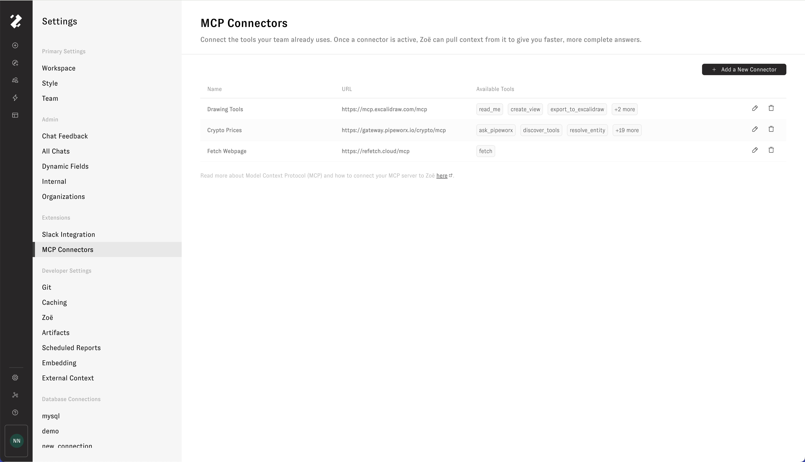

# MCP Client

> Looking to connect an AI tool like Claude.ai, Claude Code, or Cursor _to_ Zenlytic instead? See [MCP Server](../connecting-to-zenlytic/) — that page covers the reverse direction, where Zenlytic is the server.

Zenlytic acts as an **MCP client**: point Zoë at a compatible remote MCP server, and the tools that server advertises become available alongside Zoë's native ones. When enabled, Zoë can then pull data and trigger workflows from external systems directly from the Zenlytic chat experience.

## What you can do with MCP Connectors

* Pull live metadata, schemas, and lineage from your data warehouse or transformation layer.
* Read workbook, dataset, and report context from your BI tools so Zoë can ground answers in published assets.
* Expose internal APIs and operational workflows to Zoë through your own MCP server, with per-tool control over what she can call.
* Mix and match connections per conversation, so different chats can pull from different combinations of systems.

## How MCP works in Zenlytic

To set up a connection, register it in workspace settings, choose which of the discovered tools Zoë can access, and toggle the connection on per-conversation from the chat tool menu. When Zoë invokes one of your tools, Zenlytic forwards a `tools/call` request to the server, captures the response, and feeds the result back into the conversation.

Zenlytic supports two kinds of MCP connector:

| Method     | How it authenticates                                                                                                                                         | Who it runs as                                                                | Available for                                                                                            |
| ---------- | ------------------------------------------------------------------------------------------------------------------------------------------------------------ | ----------------------------------------------------------------------------- | -------------------------------------------------------------------------------------------------------- |
| **Custom** | You enter the server's HTTPS endpoint and any static authentication headers (for example, a bearer token or API key).                                        | One shared credential. Every user in the workspace calls tools as that identity. | Any MCP server that implements the streamable HTTP transport.                                            |
| **OAuth**  | Zenlytic supplies the server URL, OAuth endpoints, and scopes for a supported provider. You supply only the provider-specific details Zenlytic cannot know. | Each user. Users sign in with their own account before they can use the connector. | [Google Workspace](google-workspace.md) (Drive, Docs, Sheets, Slides). |

### OAuth connectors

OAuth connectors behave differently from custom connections in a few ways:

* **Each user connects their own account.** Creating the connector does not authorize anyone. In the chat tool menu, an OAuth connector appears as a **Connect** row until the user signs in with the provider in a popup. After that it becomes a normal toggle. Zoë calls tools with that user's token, so she sees exactly what the user can see.
* **Credentials are fixed at creation.** Client credentials and tenant IDs cannot be edited. To rotate them, delete the connector and create it again. Name, access grants, and the enabled-by-default setting remain editable.
* **Enabled by default applies only to connected users.** A user who has not connected their account must connect before the connector turns on in their chats.

## Before you begin

To connect any MCP server, confirm the following:

| Requirement              | Detail                                                                                                                                                                         |
| ------------------------ | ------------------------------------------------------------------------------------------------------------------------------------------------------------------------------ |
| **Feature flag**         | The `mcp-client` flag must be enabled for your workspace. If you don't see an **MCP** entry under **Workspace Settings → Extensions**, ask your Zenlytic contact to enable it. |
| **OAuth feature flag**   | For Google Workspace, the `mcp-oauth` flag must also be enabled. If you don't see **OAuth** as a method when adding a connector, ask your Zenlytic contact.      |
| **Workspace permission** | You need `admin` role to view, add, edit, delete, or refresh connections from Workspace Settings.                                                                              |
| **A reachable server**   | For custom connections, your server (or the vendor's) must be publicly reachable over HTTPS from Zenlytic's infrastructure.                                                    |

## Get started

1. Open **Settings → MCP** in Zenlytic.

<figure><figcaption></figcaption></figure>

2. To connect one of the examples listed below, follow the linked setup guide.
3. To connect a custom MCP server, click **Add a New Connector**, fill in the name, Access grant, HTTPS endpoint URL, and any authentication headers, then click **Test Connection**. To connect Google Workspace instead, choose **OAuth** as the method and follow the [Google Workspace](google-workspace.md) guide.

<figure><figcaption></figcaption></figure>

4. Review the discovered tools and toggle off any that Zoë shouldn't be able to call.

<figure><figcaption></figcaption></figure>

5. Click **Add Connection** to save.

<figure><figcaption></figcaption></figure>

Once a connection is active, open any chat, toggle the connection on from the tool menu, and ask Zoë a question that uses it. For OAuth connectors, click **Connect** in the tool menu and sign in with the provider first. Admins can manage access, refresh tools, or delete any MCP connection at any time from the MCP Connectors page in Workspace Settings. Static headers on custom connections can be rotated in place; OAuth connector credentials are fixed, so rotate them by deleting and recreating the connector.

## Example MCP Connectors

Connect Zoë to public MCP servers such as the following by adding connections in **Settings → MCP**:

* **DeepWiki** — `https://mcp.deepwiki.com/mcp` — ask questions, read structure, and pull docs for any public GitHub repo indexed on DeepWiki (no auth)
* **Hugging Face** — `https://huggingface.co/mcp` — search models, datasets, and Spaces on the HF Hub. Optionally pass an `Authorization: Bearer <HF_TOKEN>` header for higher limits and access to gated content
* **Cloudflare Docs** — `https://docs.mcp.cloudflare.com/mcp` — Q\&A over Cloudflare's product docs (no auth)
* **Context7** — `https://mcp.context7.com/mcp` — up-to-date, version-pinned library and framework documentation (Next.js, React, FastAPI, etc.). Requires a `CONTEXT7_API_KEY` header (free tier at [context7.com](https://context7.com))
* **Excalidraw** — `https://mcp.excalidraw.com/mcp` — create and edit Excalidraw diagrams directly from chat (no auth)
* **Fetch Webpage** — `https://refetch.cloud/mcp` — fetch and parse live webpage content into clean Markdown for Zoë to read. Requires an `X-API-Key` header (free tier at [refetch.cloud](https://refetch.cloud))
* **Crypto Prices** — `https://gateway.pipeworx.io/crypto/mcp` — look up live cryptocurrency prices and market data (no auth)

To discover more public servers, browse MCP directories like [PulseMCP](https://www.pulsemcp.com/) and [Remote MCP Servers](https://mcpservers.org/remote-mcp-servers).

### OAuth connectors

These providers use per-user OAuth. Zenlytic supplies the endpoints; you supply the provider-specific details.

* [Google Workspace](google-workspace.md) — search Drive, and read and edit Docs, Sheets, and Slides as the signed-in user.

### Custom connectors

Use the following setup guides to connect Zoë to popular tools via their official MCP servers:

* [Tableau](tableau.md) — read workbook, view, and data source metadata.
* [Power BI](powerbi.md) — connect to workspaces, datasets, and reports.
* [Google](google.md) — query BigQuery tables and inspect schemas directly.
* [Looker](looker.md) - query semantic models and dashboards.
* [dbt](dbt.md) — explore models, metrics, exposures, and lineage.
* [Atlan](atlan.md) — explore models, metrics, assets, and data glossaries.
* [Snowflake](snowflake.md) — query Cortex Analyst, Cortex Search, Cortex Agents, SQL, and your own UDFs.
* [Reltio](reltio.md) — search entities, traverse relationships, and invoke AgentFlow tools.
* [GitHub](github.md) — browse repositories, triage issues and pull requests, and monitor Actions and security alerts.
* [Jira](jira.md) — search and create Jira issues, run JQL queries, and interact with Confluence and Compass content.

These guides are provided for general reference, be prepared for some details to vary depending on your specific deployment or license. You can also bring your own MCP server. Any server that implements the streamable HTTP transport for protocol version `2025-03-26` and exposes `initialize`, `tools/list`, and `tools/call` endpoints will work.

## Workflow guides

End-to-end walkthroughs that combine an MCP connection with Zoë to solve a specific problem:

* [Audit a semantic layer with a repo MCP](../audit-semantic-layer.md) — point Zoë at the repo that holds your Zenlytic data model so she can read every view at once and recommend the highest-leverage additions. Uses the GitHub MCP for a practical example, with DeepWiki as a read-only alternative for public repos.
