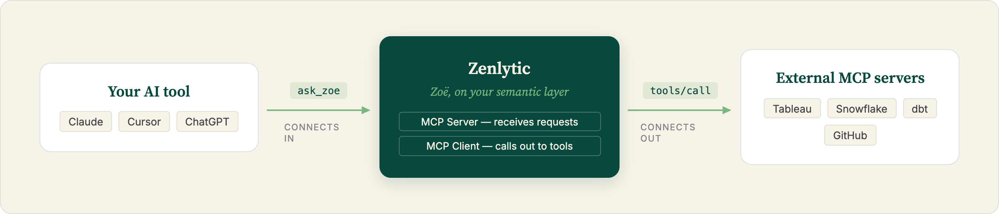
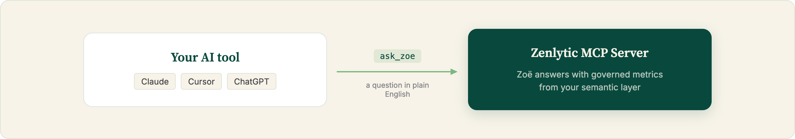
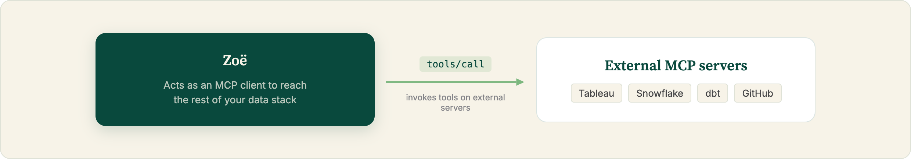

# MCP Overview

The [Model Context Protocol](https://modelcontextprotocol.io) (MCP) is an open standard for exposing tools to LLM-powered agents. Zenlytic supports MCP in both directions, depending on which side you want Zenlytic to play:

<figure><figcaption></figcaption></figure>

## Which one do I need?

* _Want to ask Zoë questions from Claude, Cursor, or ChatGPT?_ → **MCP Server**
* _Want Zoë to reach Tableau, Snowflake, dbt, or GitHub from chat?_ → **MCP Client**

### [**MCP Server**](connecting-to-zenlytic/)

Your own AI tools (Claude.ai, Claude Code, ChatGPT) connect _in_ to Zenlytic's MCP server to ask questions and query your governed business data.

<figure><figcaption></figcaption></figure>

### [**MCP Client**](client/)

Zoë connects _out_ to external MCP servers (Tableau, Snowflake, dbt, GitHub, and more), so she can pull data and trigger workflows from other systems directly from the Zenlytic chat experience.

<figure><figcaption></figcaption></figure>
