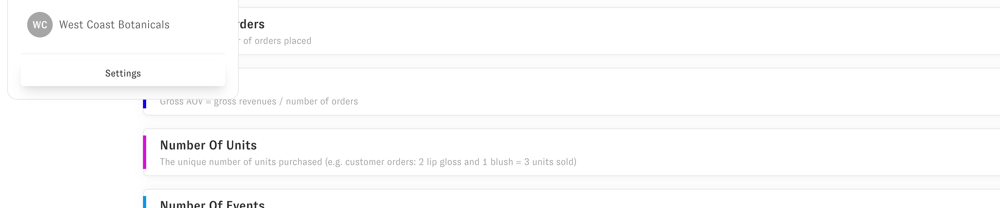
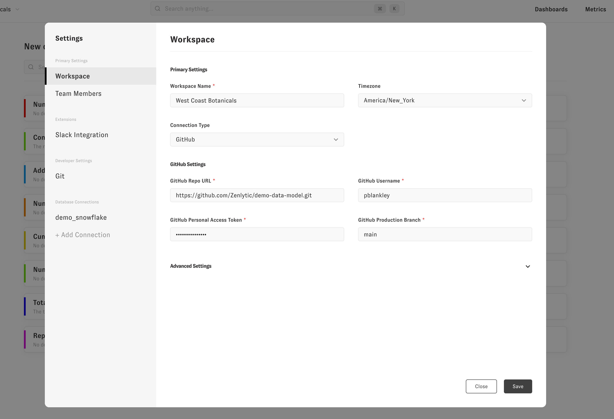
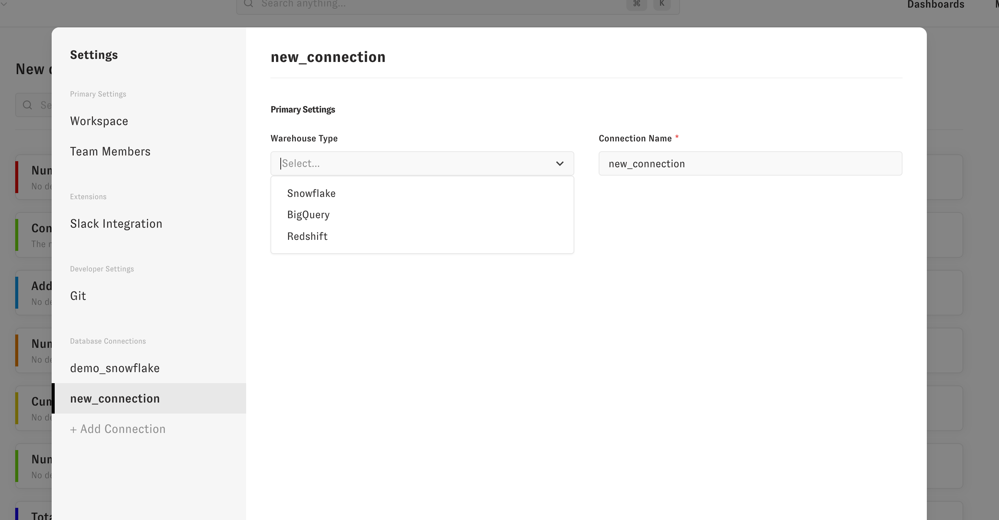

# Start here (setup)

We're going to walk through setting up Zenlytic from scratch. You should have received a login to your workspace to begin the setup process.


## Defining your data model.

Documentation on defining your data model can be found [here](./4_data_modeling/1_data_modeling.md). You'll first need to create a GitHub repo, then in that repo define the [models](./4_data_modeling/2_model.md), [views](./4_data_modeling/5_view.md), and [dashboards](./4_data_modeling/3_dashboard.md) you want. 


:::tip Zenlytic UI

To avoid messing around with your local python, you can use the Zenlytic UI for all tasks listed below. The UI has error tracking built in, so you'll know if somethings isn't right.

:::


Once you create your repo, you can install the most recent version of the metrics layer with the database option of your choice.
```
pip install metrics-layer[snowflake]
``` 

This will install the metrics-layer package with the connector for Snowflake. It will also give you access to the `ml` command line interface, which you'll use throughout the setup process.

Then you'll run the init command to create your project structure. This will create folders and the `zenlytic_project.yml` file. 
```
ml init
```

Then you'll need to define your local connection credentials. You'll do this in exactly the same way as [you would for dbt](https://docs.getdbt.com/dbt-cli/configure-your-profile). Make sure that `profile` in your `zenlytic_project.yml` file is set to the same name as the dbt profile you just created.


Now you can use the seeding capability to make setup of the data model much easier. To seed all view files for a database schema run
```
ml seed --schema <YOUR_SCHEMA_NAME>
``` 
To seed a specific table run 
```
ml seed --schema <YOUR_SCHEMA_NAME> --table <YOUR_TABLE_NAME>
```

To ensure your data model is correct you can run validation in the root of your repo and it will give you any warnings or errors associated with your project.
```
ml validate
```

There are a some example repos to help you as well! Here's one for our [standard yaml](https://github.com/Zenlytic/demo-data-model) syntax.


## Connecting to your GitHub Repo  

You'll go to your workspace and open settings (click on the top left of the homepage).




Then you'll fill in GitHub credentials for the repo you're using to store your data model. To authenticate, enter a personal access token you can create via GitHub UI ([how to create one](https://docs.github.com/en/authentication/keeping-your-account-and-data-secure/creating-a-personal-access-token)). Then click save when you're done.




## Connecting to your data warehouse

Once you've filled in GitHub credentials, you can click "+ Add Connection" under "Database Connections" in the settings menu. You'll first need to select your warehouse type from the drop down, and name your connection. 

The naming of the connection is how Zenlytic links database credentials with your data model. The name of the connection here must be the same as the `connection` property in the [model](./4_data_modeling/2_model.md) or the same as the dbt `profile` if integrating with dbt Metricflow without a model file. 

For example, to connect with this [example repo](https://github.com/Zenlytic/demo-data-model) we'd use the connection name `demo` because that's the value of `connection` in the [model file](https://github.com/Zenlytic/demo-data-model/blob/master/models/pure_organics_model.yml).  




Finally, finish filling out your data warehouse's connection information and click save


## Troubleshooting

**Not seeing metrics in the Zenlytic interface?**
* If you have the `hidden` property set to `true`, you won't see those metrics or dimensions anywhere in the UI. Make sure you remove the hidden property or set it to `false` if you want those metrics to show up in the UI. 

```
# This metric won't show up in the UI because hidden is set to true
- name: number_of_orders
  field_type: measure
  type: count_distinct
  sql: ${order_id}
  description: "The unique number of orders placed"
  value_format_name: decimal_0
  hidden: yes
```


## Where do I go from here?

If you want to learn more about how to use the user interface and the different capabilities is has, check out the [documentation on the user interface](./3_zenlytic_ui/1_using_zenlytic.md)!

If you want to learn about data modeling and how to define your metrics check out the [documentation on the data model](./4_data_modeling/1_data_modeling.md)

If you'd like to learn about how to get everything set up for defining those metric definitions look at the [documentation on your metric development environment](./5_development_environment/1_development_environment.md)

As always, feel free to reach out to your Zenlytic contact if you have questions that aren't answered in the documentation!
