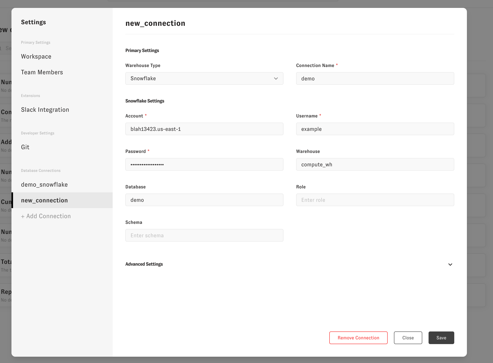

# Start here

We're going to walk through setting up Zenlytic from scratch. You should have received a login to your workspace to begin the setup process.

There are two external connections Zenlytic needs to make to function.
1. Your data warehouse.
2. Git for your data model. 


## Connecting to your data warehouse

You can click "+ Add Connection" under "Database Connections" in the settings menu. You'll first need to select your warehouse type from the drop down, and name your connection. 

The naming of the connection is how Zenlytic links database credentials with your data model. The name of the connection here must be the same as the `connection` property in the [model](./5_data_modeling/2_model.md) or the same as the dbt `profile` if integrating with dbt Metricflow without a model file. 

For example, to connect with this [example repo](https://github.com/Zenlytic/demo-data-model) we'd use the connection name `demo` because that's the value of `connection` in the [model file](https://github.com/Zenlytic/demo-data-model/blob/master/models/pure_organics_model.yml).  


Finally, finish filling out your data warehouse's connection information and click save




## Git 

Git should be already connected. You should continue to default to using Zenlytic's "Managed Repo" setting, which involves no setup. If you want to switch from that to a separate repo, you can contact support or follow [our git documentation](https://intercom.help/zenlytic/en/articles/7992579-git-data-model-setup). 

## Defining your data model

Documentation on defining your data model can be found [here](./5_data_modeling/1_data_modeling.md). In the repo you connected earlier, you'll define the [models](./5_data_modeling/2_model.md) and [views](./5_data_modeling/5_view.md) you want. Here's an example repo for an direct-to-consumer cosmetics brand in our [standard yaml](https://github.com/Zenlytic/demo-data-model) syntax.


To start defining metrics, open the Context Manager in the Zenlytic UI.

You can open Context Manager from:

- Your workspace navigation
- Zoë chat


### Context Manager tabs

Use the tabs across the top of Context Manager to manage how Zoë understands and uses your data:

- **Context:** Edit your data model files, including views and model files
- **Query history:** Let Zoë learn from prior queries to improve speed and accuracy
- **System prompt:** Define behavior, tone, and concepts Zoë should use consistently
- **Skills:** Add repeatable instructions, examples, and task-specific context
- **Memories:** Save successful question patterns so Zoë answers similar questions more consistently


### Add a new view

Create a new view from the **Add View** button in the **Context** tab.

Choose one of these sources:

- Upload a file
- Add from a database connection


### Edit your files and folders

Use the file tree in Context Manager to:

- Create new files and folders
- Open view and model files
- Access actions from the three-dot menu

You can also use the three-dot menu to:

- Show documentation for supported keys and patterns
- Open a file directly


### Preview data for new files

Open database preview for new files to inspect underlying data while you model.


### Work safely with branches

Use the branch selector next to the Context Manager title to choose a branch before you edit.

Configure your workspace to disable editing on the production branch when you want to require development-only edits.


### Review changes

Open diff view to compare your current branch against production and review exactly what changed before deploy.


### Save, validate, and deploy

Save happens automatically while you type.

Fix all YAML or validation errors before deployment. You must resolve errors before you can deploy.

After you commit changes on your development branch, use the action button to deploy to production and merge those updates.


Use this workflow to keep your data model accurate while improving the context Zoë uses to answer questions and generate insights.


## FAQ

**Not seeing metrics in the Zenlytic interface?**
* If you have the `hidden` property set to `true`, you won't see those metrics or dimensions anywhere in the UI. Make sure you remove the hidden property or set it to `false` if you want those metrics to show up in the UI. 

```
# This metric won't show up in the UI because hidden is set to true
- name: number_of_orders
  field_type: measure
  type: count_distinct
  sql: ${order_id}
  description: "The unique number of orders placed"
  value_format_name: decimal_0
  hidden: true
```


## Where do I go from here?

If you want to learn more about how to use the user interface and the different capabilities it has, check out the [documentation on the user interface](./3_zenlytic_ui/1_using_zenlytic.md)!

If you want to learn about data modeling and how to define your metrics check out the [documentation on the data model](./5_data_modeling/1_data_modeling.md)

If you'd like to learn about how to get everything set up for defining those metric definitions look at the [documentation on your metric development environment](./7_development_environment/1_development_environment.md)

As always, feel free to reach out to your Zenlytic contact if you have questions that aren't answered in the documentation!
