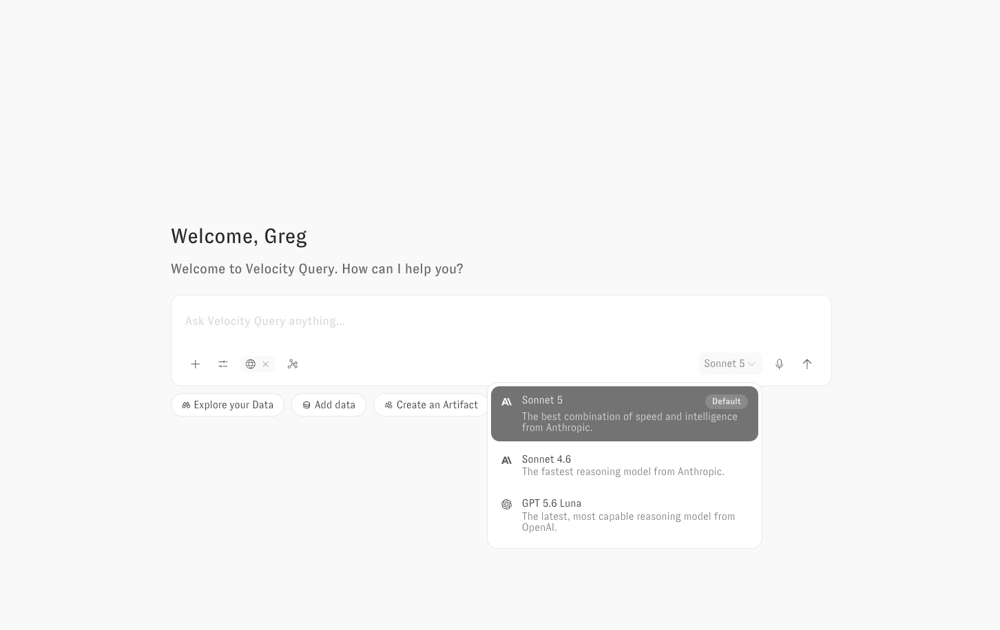

# AI Model Selection Guide

Zoë supports multiple AI models that you can switch between using the model dropdown in the chat interface. Each model has different strengths, and the best choice depends on your data model complexity, the types of questions your team asks, and your preference for speed versus depth.


**Default model:** Claude Sonnet 5 is the default for all workspaces.


<figure><figcaption></figcaption></figure>

## Recommended Models

### **Claude Sonnet 5 (Default)**

The best balance of speed, accuracy, and analytical depth for most workspaces. Sonnet 5 is the default model and the recommended starting point for all users.

Strengths:

* Self-correcting — detects data quality issues mid-query and fixes them automatically without user intervention
* Strong instruction adherence — reliably follows guidance in field descriptions, topic descriptions, and system prompts
* Proactive interpretation — flags data anomalies, provides contextual narratives, and suggests follow-up analysis
* Handles complex multi-step queries including CTEs, window functions, and cross-table comparisons, with improved consistency on longer analytical chains over the previous default

Best for: General-purpose analytics, business reporting, trend analysis, and most day-to-day questions across any data model.

### Claude Sonnet 4.6

The previous default. Sonnet 4.6 is faster than Sonnet 5 on straightforward questions and remains a strong choice for clean, well-structured data models.

**Strengths:**

* Self-correcting — detects data quality issues mid-query and fixes them automatically without user intervention
* Strong instruction adherence — reliably follows guidance in field descriptions, topic descriptions, and system prompts
* Proactive interpretation — flags data anomalies, provides contextual narratives, and suggests follow-up analysis
* Handles complex multi-step queries including CTEs, window functions, and cross-table comparisons

**Best for:** General-purpose analytics, business reporting, trend analysis, and most day-to-day questions across any data model, particularly when speed matters more than depth on longer analytical chains.

## Additional Available Models

### GPT-5.6 Luna

The current OpenAI model in the picker, replacing GPT-5.5. Available for teams that prefer or require an OpenAI model.

**Best for:** Teams with a policy or preference for OpenAI models.

### GPT 5.1

Available for teams that prefer or require an older OpenAI model. We would recommend using GPT-5.6 Luna instead of this model in most scenarios.


**Claude Opus is no longer offered for new chats.** Existing conversations and Proactive Agents pinned to an Opus model continue to work.


## How to Choose

| Scenario                                          | Recommended Model      |
| ------------------------------------------------- | ---------------------- |
| The best combination of speed and intelligence    | **Sonnet 5** (default) |
| Complex data model with many joins                | **Sonnet 5**           |
| Data has known quality issues (nulls, edge cases) | **Sonnet 5**           |
| Speed is the top priority, data model is clean    | **Sonnet 4.6**         |
| Team prefers OpenAI                               | **GPT-5.6 Luna**       |
| Not sure which to pick                            | **Sonnet 5** (default) |
