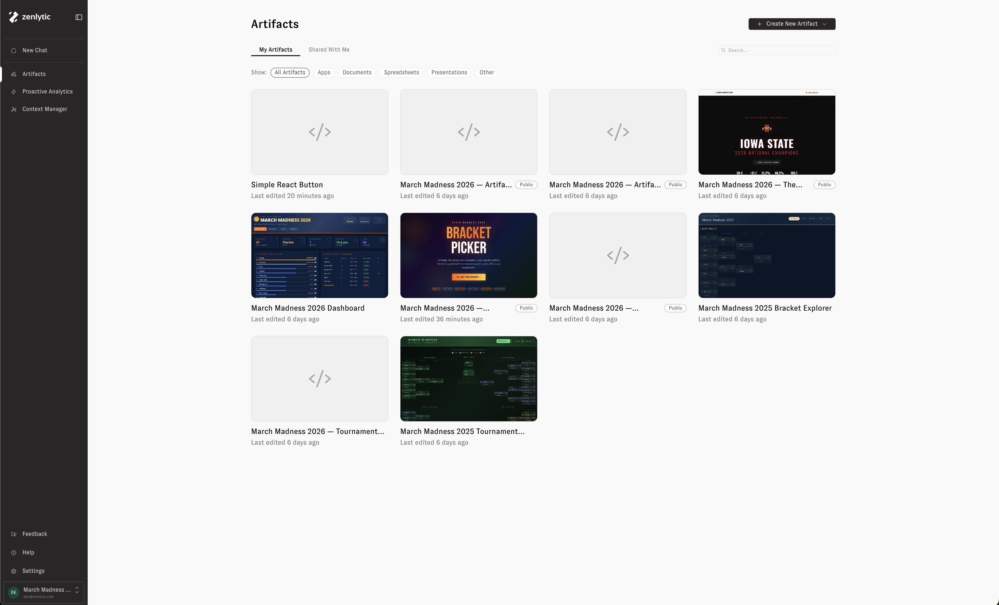

# Artifacts

Artifacts are rich, interactive outputs that Zoë creates for you. They can be a wide variety of types — interactive apps, written documents, data spreadsheets, slide presentations, and more. Use the Artifacts page to organize, revisit, and share everything Zoë has built across your conversations.

## What makes up an artifact

Each artifact bundles together four components:

* **Output file** — The document you see and share (an HTML dashboard, chart, spreadsheet, PDF, or image).
* **Source code** — The code Zoë used to generate it.
* **Data** — The queries an artifact runs to get its data, and any CSVs or uploaded files baked into it.
* **Memory** — An auto-generated summary of the artifact's purpose, context, and change history.

## Live and static artifacts

How an artifact gets its data depends on its output type.

### Live artifacts

Dashboards, charts, and other HTML artifacts are **live**. They don't store their data — they store the queries that produce it, and re-run those queries against your warehouse every time you open the artifact. Open a dashboard Zoë built last month and you see this morning's numbers, with no action on your part.

Anything you do inside a live artifact — changing a filter, picking a different date range — runs a fresh query too.


**Live queries run with your permissions.** When you open a live artifact, its queries run as you, scoped to the data you're allowed to see. Two people can open the same artifact and see different numbers, and you will never see data in an artifact that you couldn't query yourself.


Because live queries only run inside Zenlytic, live artifacts can't be [published to the web](artifacts.md#publishing-to-the-web).

### Static artifacts

Presentations (`.pptx`), spreadsheets (`.xlsx`), PDFs, and images are **static**. Their data is baked in when Zoë builds them, and it stays that way — reopening a presentation next quarter shows the same numbers it showed the day it was created.

To bring a static artifact up to date, use [Auto-Rebuild](artifacts.md#auto-rebuild) to regenerate it on a schedule, or click **Rebuild Now** to regenerate it immediately.

## Viewing your artifacts

Click **Artifacts** in the left-hand navigation sidebar to see all of your saved artifacts. Use the tabs at the top to switch between:

* **My Artifacts** — Artifacts you've created.
* **Shared With Me** — Artifacts others in your organization have shared with you.

Each artifact displays a thumbnail preview, its name, and when it was last edited. Filter by type using the chips below the tabs — **All Artifacts**, **Apps**, **Documents**, **Spreadsheets**, **Presentations**, or **Other** — to quickly narrow down what you're looking for. Use the search bar in the upper right to find a specific artifact by name.

<figure><figcaption></figcaption></figure>

## Organizing artifacts with folders

Artifact folders let teams organize saved artifacts into shared workspace areas. A personal artifact can be shared directly with users or groups; once it is moved into a folder, the folder controls who can access it.

For more on how folders work, see [Artifact Folders](artifact-folders.md). For access levels, direct shares, groups, and troubleshooting, see [Artifact Folder Permissions](artifact-folder-permissions.md).

## Artifacts in chat

Zoë creates artifacts automatically whenever a visual output would be helpful — or when you ask her to build something. Artifacts appear inline in the chat, and you can click on one to expand it in the side drawer.

<figure><figcaption></figcaption></figure>

If an artifact is something you'd like to keep and come back to, click **Save to my artifacts**. The artifact will then appear in your Artifacts gallery alongside everything else you've saved.

<figure><figcaption></figcaption></figure>

## Creating a new artifact

You can also create artifacts directly from the Artifacts page. Click the **+ Create New Artifact** button in the upper right corner. A dropdown lets you choose the type of artifact to create:

* **App** — An interactive application.
* **Document** — A rich text document.
* **Spreadsheet** — A data spreadsheet.
* **Presentation** — A slide presentation.
* **Other** — Any other artifact type.

Selecting a type opens a new chat with Zoë where you can describe what you'd like to create.

<figure><figcaption></figcaption></figure>

## Opening and editing an artifact

Click any artifact on the Artifacts page to open it in a side drawer. From the drawer you can preview the artifact, share it with others in your organization, or schedule it to rebuild automatically.

<figure><figcaption></figcaption></figure>

To edit an artifact, click **Edit in a new chat** from the three-dot menu in the drawer header. This opens a new chat with the artifact attached, so you can tell Zoë what you'd like to change. Zoë will update the artifact and a new version will appear in the [update history](artifacts.md#update-history).

<figure><figcaption></figcaption></figure>

## Visual Editor


**The Visual Editor is only available for HTML-based artifacts.** Use it for artifacts like dashboards, charts, and other custom apps.


Open the **Visual Editor** from the artifact menu bar to make targeted changes directly on the artifact. Move your mouse around the document to see a blue rectangle around the element you are selecting. Click the element you want to change, write a short description of the change, and click **Queue change**.

<figure><figcaption></figcaption></figure>

You can queue up to 20 changes before applying them. Open the queued changes menu to review everything you have queued, edit a change, or remove a change before applying it.

<figure><figcaption></figcaption></figure>

When your queued changes are ready, click **Apply Queued Changes**. Review the updated artifact, then click **Save Changes** if you are happy with the result. Saving creates a new version of the artifact in the [update history](artifacts.md#update-history).

<figure><figcaption></figcaption></figure>

If you do not like the result, queue more changes and apply them again, or close the Visual Editor without saving.

## Update history

Every artifact uses immutable, append-only versioning — nothing is overwritten or deleted. New versions are created when you edit the artifact and save your changes, or when a scheduled [rebuild](artifacts.md#auto-rebuild) runs. A live artifact pulling fresh data does not create a version; only changes to the artifact itself do.

Click the **Updated** timestamp on an artifact to open its update history. The history panel displays every version of the artifact, letting you time-travel through past states. Each version includes an edit message describing what changed.

From the three-dot menu on any version, you can:

* **View Artifact Memory** — See the context Zoë used when creating that version.
* **Download** — Download the artifact as it existed at that point in time.
* **Edit from this version** — Start a new edit based on an older version of the artifact.

<figure><figcaption></figcaption></figure>

## Auto-Rebuild

Auto-Rebuild completely regenerates an artifact on a schedule — Zoë re-runs the analysis, regenerates the sources, and saves a new version.

Use it to keep [static artifacts](artifacts.md#static-artifacts) current, since their data is baked in and won't change on its own. You can also use it on a live artifact when you want Zoë to revisit the analysis itself, not just the numbers. To simply see the latest data in a live artifact, reload the page.

Click the **Auto-Rebuild Off** button in the artifact drawer header to open the Auto-Rebuild settings. Toggle **Enable Auto-Rebuild**, then configure:

* **Frequency** — How often to rebuild (daily, weekly, monthly, or a custom cron expression).
* **Time** — What time of day to run the rebuild, shown in your local timezone.
* **Instructions** — Optional directions for Zoë to follow during each rebuild. For example: "Highlight any outliers in the data and write short blurbs about their trends."

Click **Save** to apply the schedule.

<figure><figcaption></figcaption></figure>

To rebuild immediately without waiting for the next scheduled time, click **Rebuild Now**.

Every rebuild appears in the artifact's [update history](artifacts.md#update-history), so you can see how the artifact has changed over time.

## Delivery

Artifacts can be delivered on a recurring schedule to **email** or **Slack**. A single artifact can have multiple delivery schedules — for example, email to leadership on Mondays and Slack to #data-team daily.

Before each delivery, Zenlytic runs a live artifact's queries and renders it with the results, so recipients get current data. Those queries run as the person who owns the delivery schedule, using that person's permissions — so everyone on the schedule sees the schedule owner's view of the data. Keep that in mind when adding recipients whose own access is narrower.

### Email delivery

* Inline image preview of the artifact. Wide or scrollable content may be cropped in the preview.
* Optional attachment of the artifact’s current output file in its original format. Attachments are not converted; HTML remains HTML, and PDF is attached only when the output is already a PDF. Live artifacts are not attached — see [Delivering live artifacts](artifacts.md#delivering-live-artifacts).
* Optional “View in Zenlytic” link. Recipients must have access to the artifact.

### Slack delivery

* Message with the artifact name and description.
* Optional file upload to the channel.

### Delivering live artifacts

A live artifact's file can't run its queries outside Zenlytic, so deliveries skip the attachment even when **Include attachments** is on. Recipients get the preview image and a **View in Zenlytic** link instead, along with a short note explaining why no file was attached. Opening the artifact from that link runs the queries with the recipient's own permissions.

### Run history

From the **Schedule Artifact Delivery** modal, click the **Run History** tab to review every past delivery run for the artifact. Use the run history to confirm that a scheduled delivery went out, troubleshoot a missed send, or jump back to the chat that produced a particular delivery.

Each row in the table represents a single run and shows:

* **Schedule** — The delivery schedule that triggered the run.
* **Triggered** — When the run started, in your local timezone.
* **Finished** — When the run completed, with the total duration in parentheses. A dash (`—`) means the run is still in progress.
* **Status** — The current state of the run: **Processing** while it is running, **Delivered** once it has been sent, or an error state if it failed. Hover over the "Failed" chip to see technical details about the issue.
* **Chat** — A **View chat** link that opens the Zoë conversation behind the run, so you can inspect what Zoë did to generate and send the delivery.

Use the search bar above the table to filter by schedule name, and use the column headers to sort or filter — for example, sort by **Triggered** to see the most recent runs first, or filter **Status** to show only failed runs.

Run history covers deliveries that rebuild the artifact. Deliveries of a live artifact only re-run its queries and re-render it — there's no Zoë conversation behind them, so they don't appear in the table.

<figure><figcaption>
The Run History tab showing recent delivery runs for an artifact
</figcaption></figure>

## Sharing and permissions

Click the **Share** button in the artifact drawer to share an artifact with others in your organization. From the Share tab, select a user group and assign a permission level. Click **+ Add Group** to grant access to additional groups.

<figure><figcaption></figcaption></figure>

### Access levels

| Role       | Capabilities                                                          |
| ---------- | --------------------------------------------------------------------- |
| **Owner**  | Full control — edit, delete, share, configure Auto-Rebuild and delivery |
| **Editor** | Edit name and description, create new versions                        |
| **Viewer** | Read-only access                                                      |

You can share with workspace groups (including "All Users") or with individual users. Workspace admins always have access.

These access levels control who can open and manage an artifact. They don't widen anyone's data access: when someone opens a [live artifact](artifacts.md#live-artifacts), its queries run with that person's own data permissions, so they only see data they could query themselves.

## Publishing to the web


**You can't publish an artifact that uses live data.** A published artifact is served outside Zenlytic to people who may not have a Zenlytic account, so there is no way to run its queries or apply anyone's data permissions — it would publish as an empty shell. Publishing is disabled for live artifacts, and the **Publish** button explains why when you hover it.

To publish something to the web, ask Zoë for a static version of it, or publish a static output type instead.


To make an artifact publicly accessible, click the **Share** button and open the **Publish** tab. Click **Publish** to generate a unique public URL and an embed script that anyone can use to access the artifact — no Zenlytic account required.

<figure><figcaption></figcaption></figure>

Once published, the artifact displays a **Public** chip on the Artifacts page. A public link and an iframe embed script are provided so you can share the artifact or embed it on another site.

<figure><figcaption></figcaption></figure>

Editing or rebuilding an artifact does not automatically update the published version. When you're ready for the latest version to go live, click **Publish latest version**. To remove public access entirely, click **Unpublish**.

If you edit a published artifact and the new version starts using live data, the existing public link keeps working — it's a snapshot of the version you published — but **Publish latest version** is disabled, because the newer version can't run outside Zenlytic.

<figure><figcaption></figcaption></figure>

## Artifact memory

Every artifact has an artifact memory — a detailed summary of the artifact's purpose, your instructions, version history, and key context. Zoë references this memory whenever you work with the artifact in a chat, so she understands what the artifact is, what you like and dislike about it, and how it has evolved over time.

To view an artifact's memory, click the three-dot menu in the artifact drawer header and select **View Artifact Memory**.

<figure><figcaption></figcaption></figure>

## Sources

Click the **Sources** button in the artifact drawer header to see every data source behind an artifact and how fresh each one is.

<figure><figcaption>
The Sources panel listing an artifact's data sources
</figcaption></figure>

Sources are grouped by how they get their data:

* **Live** — Re-queried every time you open the artifact. Updates automatically, so no manual refresh is needed.
* **Static** — Data captured when the artifact was built, such as query result files, uploaded files, and intermediary files Zoë created. It does not refresh, so it may be outdated.

The panel header shows **Data as of** with the time the live queries last ran. Click the refresh icon to re-run every live query and pull current data without rebuilding the artifact.

### Tracing a source to what it feeds

Each source is tied to the part of the artifact it powers, so you can trace any number back to its query:

* Hover a source in the list to outline the chart, table, or tile it feeds.
* Open a source to spotlight that element — everything else in the artifact dims.
* While the panel is open, each connected element wears a lettered chip matching its source.

Open a source to see the query behind it, how many rows it returned, and how long ago it ran. If a query fails, the source shows the error and a red chip appears on the affected part of the artifact, so a single broken query doesn't take down the rest.

### Editing a source

Click **Edit this data source** on a source to change the query behind it. Describe what you want and click **Queue change**. Source edits queue alongside your other [Visual Editor](artifacts.md#visual-editor) changes, so click **Apply Queued Changes** to run them and **Save Changes** to keep the result.

Use the Sources panel to review where an artifact's data came from, confirm how current it is, and verify the numbers behind any part of the result.

## Supported output types

These are formats Zoë can create as artifact outputs. They are not export or email-conversion options.

| Output type                | Data                                                                    |
| -------------------------- | ----------------------------------------------------------------------- |
| HTML apps and dashboards   | [Live](artifacts.md#live-artifacts) — re-queried every time you open it  |
| Charts and visualizations  | [Live](artifacts.md#live-artifacts) — re-queried every time you open it  |
| Spreadsheets (.xlsx)       | [Static](artifacts.md#static-artifacts) — baked in at build time         |
| Presentations (.pptx)      | [Static](artifacts.md#static-artifacts) — baked in at build time         |
| PDFs                       | [Static](artifacts.md#static-artifacts) — baked in at build time         |
| Images                     | [Static](artifacts.md#static-artifacts) — baked in at build time         |

Scheduled delivery attaches a static artifact's output file as-is. Live artifacts are delivered as a preview and a link instead — see [Delivering live artifacts](artifacts.md#delivering-live-artifacts).

## Limitations

* Artifacts that use live data cannot be published to the web.
* Individual live queries time out after about 2 minutes.
* Rebuild timeout is 1 hour per run.
* Public share links are pinned to a specific version — they do not auto-update when new versions are created.
