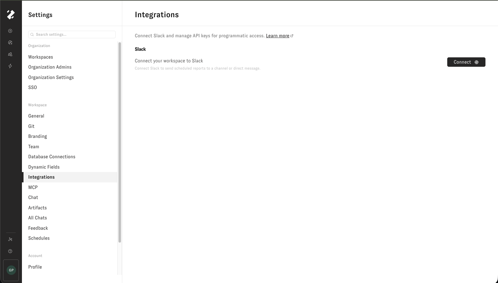
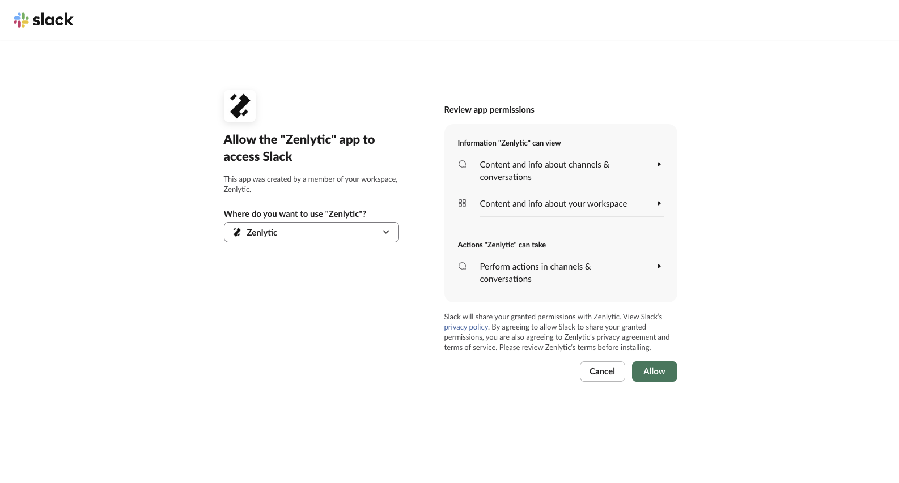
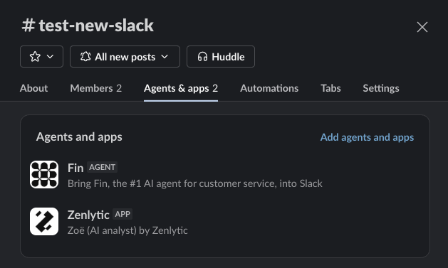
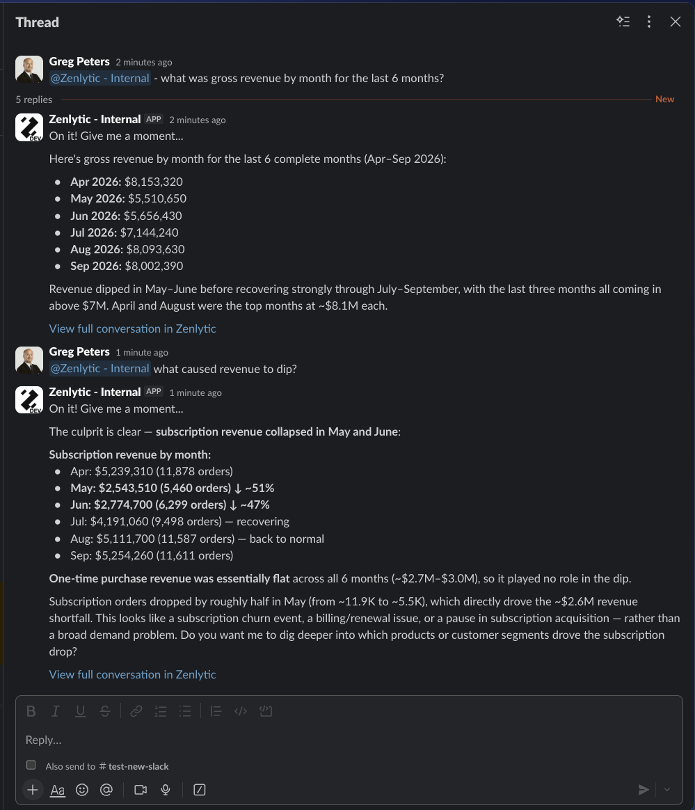

# Installing Zenlytic in Slack

The Zenlytic app brings Zoë into Slack. Your team can ask data questions in a direct message or a channel and get an answer in place, with a link back to the full conversation in Zenlytic.

Connecting Slack is self-serve and takes about a minute. The connection applies to your entire Zenlytic workspace, not to individual users.

## Before you start

* A Zenlytic user who can edit workspace settings — **Admins** and **Organization Admins**. See [User Roles](user_roles.md).
* Permission to install apps in the target Slack workspace, or a Slack admin who can approve the request.
* A Slack workspace that isn't already connected to another Zenlytic workspace. One Slack workspace connects to one active Zenlytic workspace at a time.
* Matching email addresses in Slack and Zenlytic. Zoë identifies a Slack user by their email address, so anyone whose Slack email differs from their Zenlytic account won't be recognized.

## Connect Slack

1. In Zenlytic, open **Settings**.
2. Under **Workspace**, select **Integrations**.
3. In the **Slack** section, click **Connect**.

<figure><figcaption><p>Settings → Integrations, where you connect Slack.</p></figcaption></figure>

4. Zenlytic sends you to Slack. Under **Where do you want to use "Zenlytic"?**, select the Slack workspace you want to connect — check this before continuing if you belong to more than one.
5. Review the app permissions and click **Allow**. If your Slack workspace requires admin approval for new apps, submit the request and wait for a Slack admin to approve it before continuing.

<figure><figcaption><p>Slack's authorization screen. Confirm the workspace, then click Allow.</p></figcaption></figure>

6. Slack returns you to Zenlytic, which shows **Successfully connected Slack**. Click **Go to chat**.

Everyone in the Zenlytic workspace can now use Zoë in Slack.

## Ask Zoë a question

### In a direct message

Open the Zenlytic app in Slack and send Zoë a data question, the same way you'd ask her in the app:

> What was gross revenue by month for the last 6 months?

Zoë acknowledges the request, posts the answer in Slack, and includes a **View full conversation in Zenlytic** link that opens the full conversation with its charts and query results.

### In a channel

First, add the app to the channel. Either:

* Type `/invite @Zenlytic` in the channel, or
* Click the channel name, open the **Agents & apps** tab, click **Add agents and apps**, and select **Zenlytic**

<figure><figcaption><p>The Zenlytic app added to a channel, shown under Agents &#x26; apps.</p></figcaption></figure>

Then ask your question with the mention:

```
@Zenlytic what was gross revenue by month for the last 6 months?
```

Zoë replies in a thread on your message. Keep follow-up questions in that thread so the conversation stays together.

<figure><figcaption><p>A thread conversation. Note that the follow-up question mentions the app again.</p></figcaption></figure>

Private channels need an explicit invite — the app can't see a private channel until someone adds it.

## Mention Zoë in every message


Zoë only receives messages that mention `@Zenlytic`. This applies inside threads as well: a follow-up posted in Zoë's own thread without the mention does not reach her, and she will not reply.


Every question needs the mention, including the second and third questions in a conversation she started. A thread keeps the conversation together and preserves context, but it does not remove the mention requirement.

If the repetition gets tedious for a team that uses Zoë heavily in one channel, Slack's [Workflow Builder](https://slack.com/help/articles/17542172840595-Create-a-new-workflow-in-Slack) can post a message on your behalf, which lets you wrap the mention in a form or an emoji reaction instead of typing it each time.


Test a workflow in a single channel before rolling it out. Whether Zoë receives a mention inside a workflow-posted message depends on how Slack delivers that message, and Zenlytic doesn't test or support Workflow Builder configurations.


## What Zenlytic can access

Slack's authorization screen groups the permissions into what the app can view and what it can do. In practice, Zenlytic uses them to:

* **Read messages that mention the app**, and the conversations those mentions happen in, so Zoë has the context to answer
* **Identify users by email address**, to match a Slack user to their Zenlytic account and apply their permissions
* **Post messages**, to reply to questions and send [scheduled deliveries](../proactive-agents/schedule-delivery.md)
* **Upload files**, to deliver artifacts, charts, and query results
* **List and join channels**, so the app can be added to channels and respond there

Zoë answers with the permissions of the Zenlytic user who asked, so connecting Slack doesn't widen what anyone can see. See [User Roles](user_roles.md) and [Access Grants](../data-modeling/access_grants.md).

## Disconnecting Slack

1. Open **Settings → Integrations**.
2. In the **Slack** section, click **Disconnect**.


Disconnecting affects everyone in the Zenlytic workspace. Zoë stops responding in Slack, and any [scheduled deliveries](../proactive-agents/schedule-delivery.md) addressed to Slack channels stop being sent. Check your delivery schedules before disconnecting.


Disconnect first if you need to move the Slack workspace to a different Zenlytic workspace, since a Slack workspace can only be connected to one at a time.

## Troubleshooting

**Zoë doesn't recognize a user.** The user's Slack email address must match a user in this Zenlytic workspace. Compare the email on their Slack profile against their Zenlytic account, and [invite them](inviting-users.md) to the workspace if they aren't a member.

**Slack workspace is already connected.** A Slack workspace can connect to only one active Zenlytic workspace at a time. Disconnect it from the other Zenlytic workspace first, then connect it here.

**Zoë doesn't reply in a thread.** Check that the message mentions `@Zenlytic`. Messages in a thread without the mention don't reach her.

## Related pages

* [Zoë](zoe.md) — what Zoë can do, in Slack and elsewhere
* [Installing Zenlytic in Microsoft Teams](microsoft_teams_bot.md) — the equivalent Teams setup
* [Schedule Delivery](../proactive-agents/schedule-delivery.md) — sending Proactive Agent results to Slack
* [Inviting and Managing Users](inviting-users.md) — adding the Zenlytic accounts that Slack users are matched to
