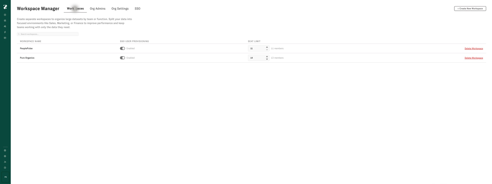
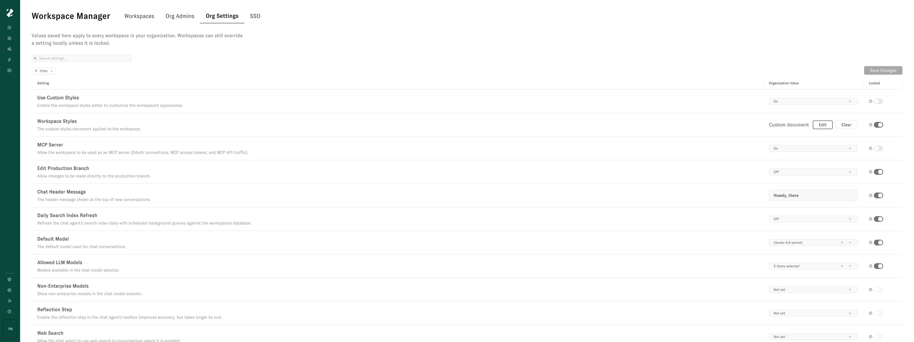

# Workspace Manager

The Workspace Manager lets you manage every workspace in an organization from one place. You can create workspaces, control user provisioning and seat limits, manage Organization Admins, and apply settings across the organization.

***

## Who Can Use It

The Workspace Manager is available to **Organization Admins**, a role that sits above the existing Admin role. To see the Workspace Manager, you must be an Organization Admin in a workspace that belongs to an organization.

### Organization Admin vs. Admin

There are two levels of admin:

* **Organization Admin** — Can manage all workspaces across the organization: create and delete workspaces, copy database connections between them, set workspace seat limits, manage organization-wide settings and SSO requirements, and promote other users to Organization Admin.
* **Admin** (Workspace Admin) — Can manage users and settings within a single workspace. Cannot perform cross-workspace operations or modify Organization Admin users.

Only an Organization Admin can change or remove another Organization Admin's role.

***

## Managing Workspaces

You can find the Workspace Manager from the navigation bar, next to Settings. The **Workspaces** tab shows a searchable table of all active workspaces in your organization.

For each workspace, you can:

* **Toggle SSO User Provisioning** — When enabled, users who sign in through SSO are automatically added to the workspace. When disabled, users must be [invited manually](inviting-users.md).
* **Set a seat limit** — Controls the maximum number of members who can belong to the workspace.
* **Delete a workspace** — Removes the workspace from active use. You'll be asked to type the workspace name to confirm. Deleted workspaces are deactivated and hidden but not permanently destroyed. You cannot delete the workspace you are currently signed into.

### Setting Workspace Seat Limits

Enter a number in the **Seat Limit** column and press **Enter**, or click outside the field, to save it. The current member count appears beside the field.

* Leave the field empty to allow unlimited seats.
* The limit cannot be lower than the workspace's current member count.
* Pending invitations reserve seats, preventing additional invitations from exceeding the limit.
* The limit is enforced for manual invitations and automatic user provisioning. If adding a user would exceed it, the user is not added to that workspace.

A seat limit controls access to the workspace. It does not change the workspace's billing or subscription configuration.

<figure><figcaption>
Set each workspace's provisioning and seat limit from the Workspaces tab
</figcaption></figure>

***

## Managing the Organization Admin Role

The **Org Admins** tab lists the Organization Admins who are automatically added to every workspace in the organization. Changing an Organization Admin's role updates it across the organization and removes their automatic access to new workspaces.

When you invite a new member or edit an existing member's role, you'll see **Organization Admin** as a role option. Regular Admins do not see this option.

* Only Organization Admins can assign or revoke the Organization Admin role.
* An Admin cannot change, demote, or remove an Organization Admin. That action is reserved for other Organization Admins.

***

## Managing Organization Settings

Use the **Org Settings** tab to manage selected workspace settings across the organization. These include workspace appearance, Git behavior, chat and model configuration, agent tools, and artifact publishing.

Each row shows the setting, its **Organization Value**, and whether it is **Locked**:

* **Not set** — The organization does not manage the setting. Each workspace keeps its own value.
* **Organization value, unlocked** — Saving the value applies it to every active workspace. Workspace Admins can override it later.
* **Organization value, locked** — The value is applied to every active workspace and cannot be changed from an individual workspace.

New workspaces receive every organization value that is set when the workspace is created.

<figure><figcaption>
Manage organization values and locks from the Org Settings tab
</figcaption></figure>

### Applying an Organization Value

1. Find the setting, or use **Search settings** and the filters to narrow the table.
2. Select or enter an **Organization Value**.
3. Click **Save Changes**.

Saving a value updates every active workspace. If an unlocked setting is later changed in an individual workspace, the row shows how many workspaces differ from the organization value. Hover over the warning icon to see their names.

To stop managing a setting at the organization level, clear its organization value and save. Clearing it does not revert the existing workspace values; it allows each workspace to manage the setting independently from that point forward.

### Locking an Organization Setting

A setting must have an organization value before it can be locked.

1. Set an organization value if one is not already saved.
2. Turn on the setting's **Locked** toggle.
3. Click **Save Changes**.

If one or more workspaces currently differ from the saved organization value, Zenlytic asks you to confirm before locking. Choose **Update & Lock** to immediately align those workspaces with the organization value and prevent future workspace-level changes.

Unlocking a setting allows future workspace-level changes, but it does not restore values that existed before the setting was locked.

> **Model settings:** The **Default Model** must remain included in **Allowed LLM Models**. A **Stale value** badge means a saved option no longer exists, such as a deprecated model, and must be updated before saving.

***

## Managing SSO

The Workspace Manager contains two related SSO controls:

* **SSO User Provisioning** on the Workspaces tab controls which workspaces automatically add users who sign in through SSO. Automatic provisioning still respects each workspace's seat limit.
* **Require SSO** on the SSO tab requires access to the organization's workspaces through one of its configured SSO providers. Username/password and unconfigured social logins are rejected, including already signed-in sessions, and the username/password option is removed from the login page.

***

## Creating a New Workspace

Click **Create New Workspace** to walk through a guided setup:

### Step 1: Name and Provisioning

* Enter a name for the new workspace.
* Choose whether to enable **SSO User Provisioning** (off by default). When enabled, the workspace automatically adds users who sign in through SSO. When disabled, members must be [invited manually](inviting-users.md).

Any organization settings that currently have an organization value are applied to the new workspace. You can set a seat limit from the Workspaces tab after creation.

### Step 2: Add Database Connections

You can set up database connections for the new workspace in two ways:

* **Copy from existing workspaces:** Browse all database connections across your organization and select the ones you want to reuse. They'll be securely copied into the new workspace.
* **Create a new connection:** Fill out a fresh database connection form. The connection is tested automatically before it's saved.

### Step 3: Set Up GitHub

Choose how to manage the workspace's data model repository:

* **Managed Repository:** Zenlytic creates and manages the repository for you. One click to finish.
* **Connected Repository:** Link an existing GitHub repository by providing the URL and branch. You can optionally generate a deploy key or enter a personal access token. The connection is verified before completing setup.

This step can be skipped, but it must be completed before you can use Zoë in your new workspace.
