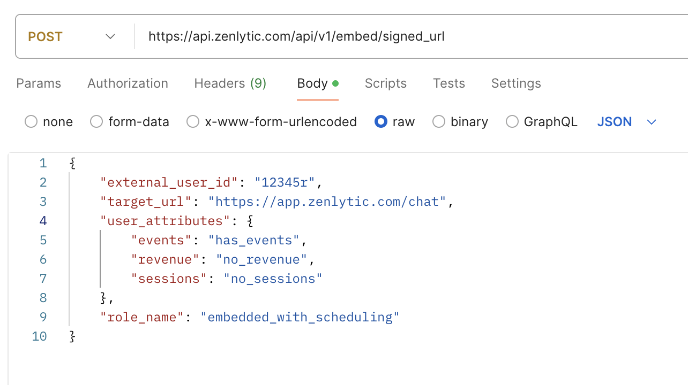
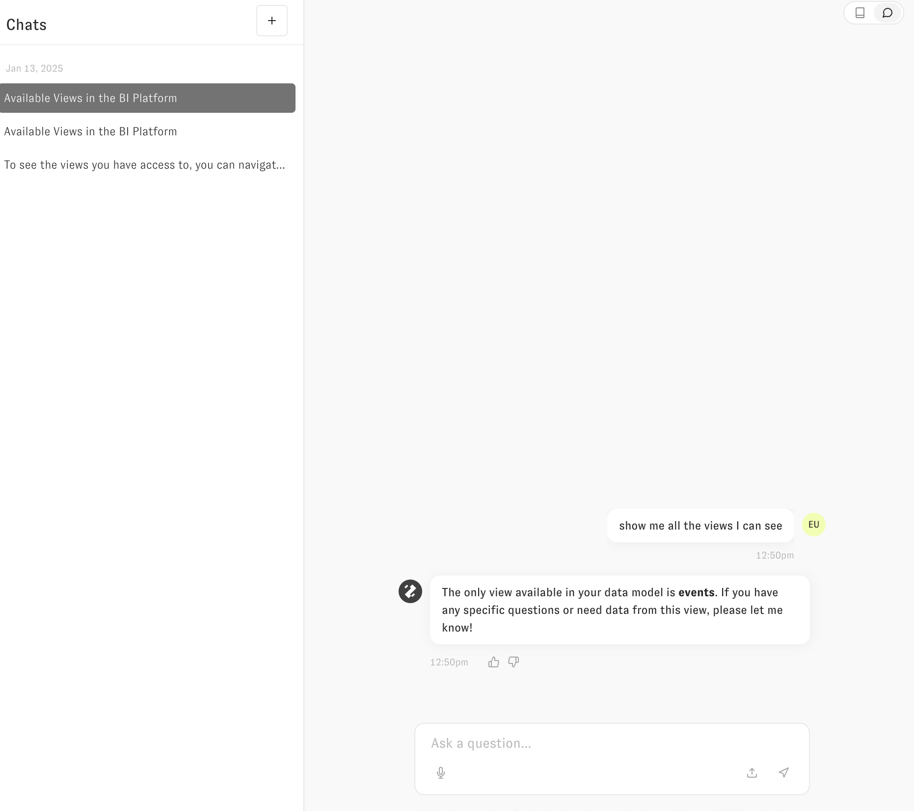
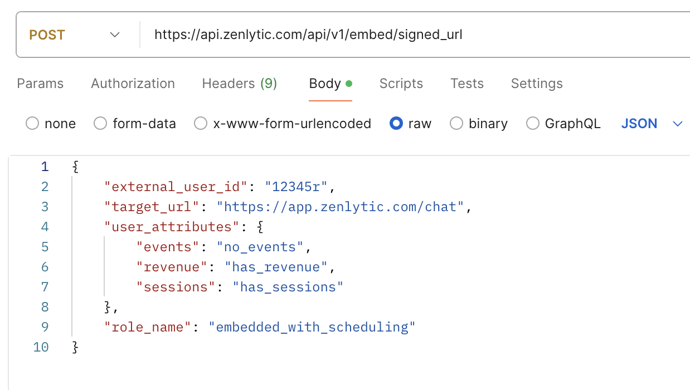
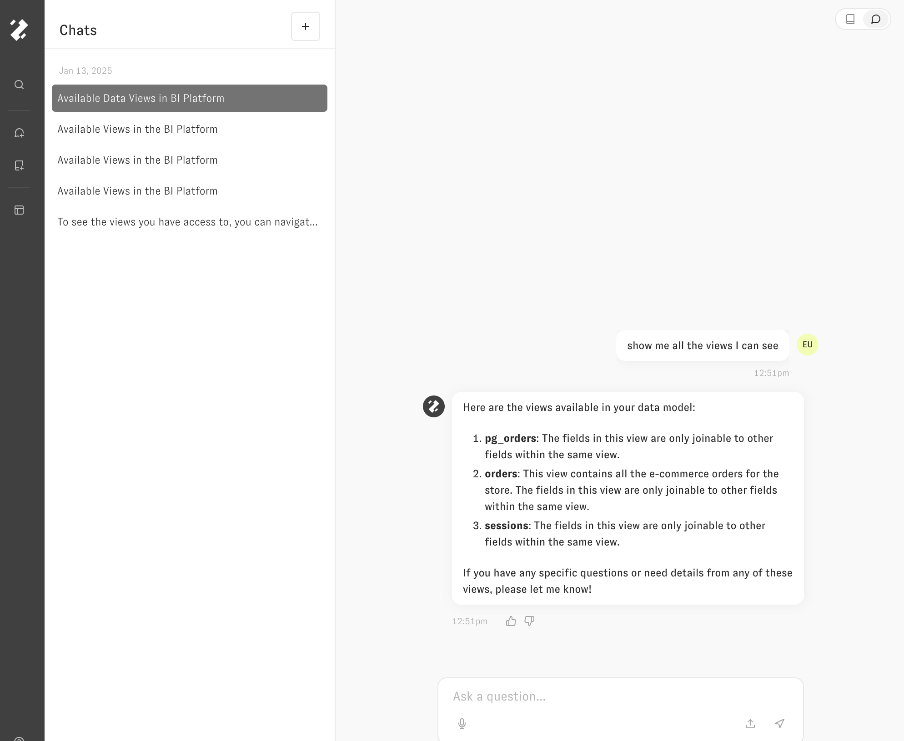

# Permissions in Embedding

Permissions for embedded users in Zenlytic come in two layers:

* The **role bundle** that determines which Zenlytic features (chat, scheduling, downloads, SQL visibility, etc.) an embedded user can access.
* **Access controls** — access filters for row-level security and access grants for column-level security — that govern which data they can see.

This page covers both.

## Role bundles for embedded users

Three role bundles are available for embedded users. They aren't selectable in the workspace role picker — they're assigned automatically through the embedding APIs. For the full role and permission reference for non-embed users, see [User Roles](../zenlytic-ui/user_roles.md).

### Embed

The default permission set for embedded users.

### Embed with SQL

Same as Embed plus `see_sql`.

### Embedded with Scheduling

Same as Embed plus `schedule_content` and `see_sql`.

### Permissions × embed roles matrix

✓ means the role includes that permission. Blank means it doesn't.

| Permission            | Embed | Embed with SQL | Embedded with Scheduling |
| --------------------- | :---: | :------------: | :----------------------: |
| `view_content`        |   ✓   |        ✓       |             ✓            |
| `explore_from_here`   |   ✓   |        ✓       |             ✓            |
| `download_with_limit` |   ✓   |        ✓       |             ✓            |
| `chat`                |   ✓   |        ✓       |             ✓            |
| `see_sql`             |       |        ✓       |             ✓            |
| `schedule_content`    |       |                |             ✓            |

All other Zenlytic permissions are unavailable to embed roles.

## Access controls

You can control data access in Zenlytic via [access filters (row-based) and access grants (column-based)](../data-modeling/access_grants.md). The sections below walk through configuring access grants for embedded sessions.

## Setting up the access permissions

To start, you'll define the logic to determine when an access grant is allowed or not allowed. For example, with these definitions, which are found in the [model](../data-modeling/model.md) file:

```yaml
version: 1
type: model
name: demo
connection: demo_snowflake

access_grants:
- name: events_access
  user_attribute: events
  allowed_values:
  - has_events

- name: revenue_access
  user_attribute: revenue
  allowed_values:
  - has_revenue

- name: sessions_access
  user_attribute: sessions
  allowed_values:
  - has_sessions

...
```

In this example, if you pass the user attribute `{"revenue": "has_revenue"}` the session will have access to all tables governed by the `revenue_access` access grant. Similarly, if you pass the user attribute with any other value besides `"has_revenue"` the session will _not_ have access to the tables governed by that access grant (e.g. `{"revenue": "no_revenue"}`).

When using access grants in embedding, pass an explicit value for every user attribute referenced by your grants. Do not omit the attribute for users who should be denied. If the attribute is missing, the grant is not triggered and does not block access. Instead, pass a non-granting value such as `"no_revenue"`.

You can restrict a view or a field with an access grant by name, by adding the property `required_access_grants` with an array of the grants the user must possess. If you list multiple grants, they must all pass for the user to have access, except that a missing user attribute on a grant is non-blocking for that grant:

```yaml
required_access_grants:
- revenue_access
```

## Full Example

Using the above model as our model, consider the following four views:

```yaml
name: orders
type: view
model_name: demo
default_date: order_created_at

required_access_grants:
- revenue_access

fields:
...
```

```yaml
name: events
type: view
model_name: demo
sql_table_name: DEMO_PROD.EVENTS
default_date: event_timestamp

required_access_grants:
- events_access
```

```yaml
name: pg_orders
type: view
model_name: pg_demo
sql_table_name: demo.public.orders
default_date: order_created_at

required_access_grants:
- revenue_access
```

```yaml
name: sessions
type: view
model_name: demo
sql_table_name: wcb.sessions
default_date: session_date

required_access_grants:
- sessions_access
```

When requesting the signed API for the session if you pass the set of user\_attributes:

```yaml
{
    "events": "has_events",
    "revenue": "no_revenue",
    "sessions": "no_sessions"
}
```

Which looks like this in Postman



The session that is generated will NOT have access to any of `pg_orders`, `orders`, or `sessions`. It will only have access to the `events` table (assuming these four tables are the only ones in our model). Zoë will not be able to see those three tables the user does not have access to, and will have no idea that they exist.



Conversely, if you pass the following user\_attributes:

```yaml
{
    "events": "no_events",
    "revenue": "has_revenue",
    "sessions": "has_sessions"
}
```



The user will have access to the `pg_orders`, `sessions`, and `orders` tables, but will NOT have access to the `events` table.



You can apply similar logic to fields as well to define more granular permissions inside of tables.
