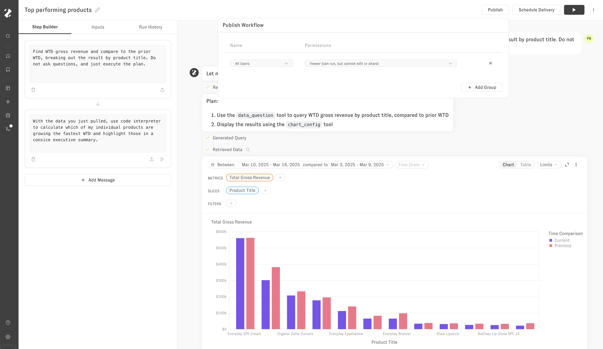

# Workflows in Embedding

You can add [Workflows](../workflows/getting-started.md) to the embedding experience by creating the Workflows in the UI, and then sharing those Workflows with "all users" as Viewer (which only gives the ability to _run_ the Workflow).

Once you have those Workflows created and shared, you will see the lightning bolt option in the embedded UI to run the Workflow.


Use the right role

Only the `embedded_with_scheduling` role has access to Workflows, so you will not see the option to run Workflows if you only use the `embed` role.


In the chat UI, that will look like this

## Running automatically

To run Workflows without making the user pick which workflow they want to run, you will pass query parameters to select the workflow you want to use.

You can get the Workflow ID from the 3 dot menu or the URL from the Workflow Builder page. You will pass query parameters like this to run a Workflow

`https://app.zenlytic.com/chat?workflowId=<my-workflow-id>`

That will kick off the run of the Workflow. If the Workflow requires inputs, it will open a modal asking the user for the inputs. If it does not require inputs, the workflow will start running immediately.

Note: you can also run a normal chat question via query parameters as well. To do that you will pass query parameters in the URL like this:

`https://app.zenlytic.com/chat?q=hello`

This will initiate the conversation with the user's question `"hello"`.
