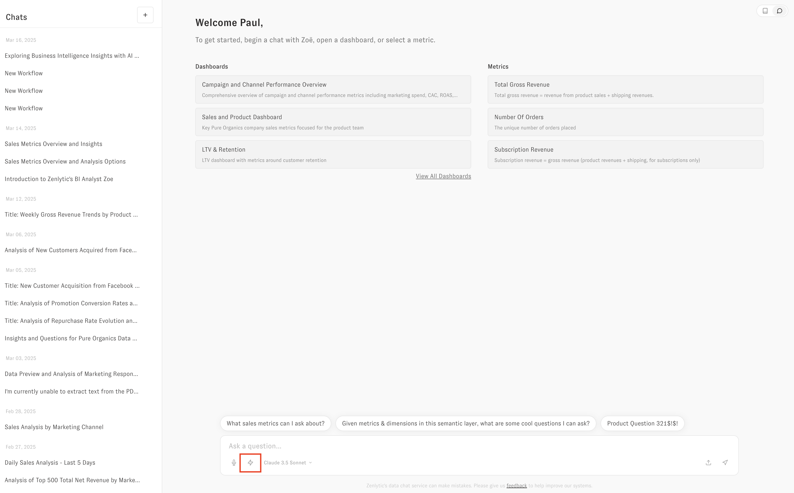

# Proactive Agents in Embedding

You can add [Proactive Agents](../proactive-analytics/getting-started.md) to the embedding experience by creating the Proactive Agents in the UI, and then sharing those Proactive Agents with "all users" as Viewer (which only gives the ability to _run_ the Workflow).

<figure><figcaption></figcaption></figure>

Once you have those Proactive Agents created and shared, you will see the lightning bolt option in the embedded UI to run the Proactive Agents.


Use the right role

Only the `embedded_with_scheduling` role has access to Workflows, so you will not see the option to run Workflows if you only use the `embed` role.


In the chat UI, that will look like this

## Running automatically

To run Proactive Agents without making the user pick which workflow they want to run, you will pass query parameters to select the Proactive Agent you want to use.

You can get the Proactive Agent ID from the 3 dot menu or the URL from the Proactive Agent Builder page. You will pass query parameters like this to run a Proactive Agent

`https://app.zenlytic.com/chat?workflowId=<my-proactive-agent-id>`

That will kick off the run of the Proactive Agent. If the Proactive Agent requires inputs, it will open a modal asking the user for the inputs. If it does not require inputs, the Proactive Agent will start running immediately.

Note: you can also run a normal chat question via query parameters as well. To do that you will pass query parameters in the URL like this:

`https://app.zenlytic.com/chat?q=hello`

This will initiate the conversation with the user's question `"hello"`.
