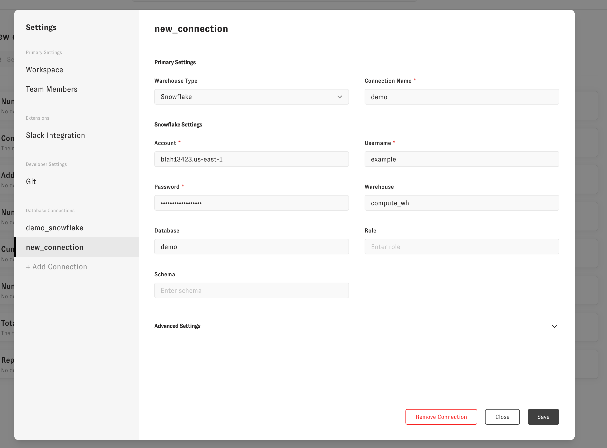

# Start Here

We're going to walk through setting up Zenlytic from scratch. You should have received a login to your workspace to begin the setup process.

There are two external connections Zenlytic needs to make to function.

1. Your data warehouse.
2. Git for your data model.

## Connecting to your data warehouse

You can click "+ Add Connection" under "Database Connections" in the settings menu. You'll first need to select your warehouse type from the drop down, and name your connection.

The naming of the connection is how Zenlytic links database credentials with your data model. The name of the connection here must be the same as the `connection` property in the [model](../data-modeling/model.md) or the same as the dbt `profile` if integrating with dbt Metricflow without a model file

For example, to connect with this [example repo](https://github.com/Zenlytic/demo-data-model) we'd use the connection name `demo` because that's the value of `connection` in the [model file](https://github.com/Zenlytic/demo-data-model/blob/master/models/pure_organics_model.yml)

Finally, finish filling out your data warehouse's connection information and click save



## Git

Git should be already connected. You should continue using Zenlytic's default "Managed Repo", which involves no setup. If you want to switch from that to a separate repo, you can contact support.

## Defining your data model

Documentation on defining your data model can be found [here](../data-modeling/data_modeling.md). In the repo you connected earlier, you'll define the [models](../data-modeling/model.md) and [views](../5_data_modeling/5_view.md) you want. Here's an example repo for an direct-to-consumer cosmetics brand in our [standard yaml](https://github.com/Zenlytic/demo-data-model) syntax.

To start defining metrics, go to the [Data Model Editor](https://app.zenlytic.com/data-model-editor) in the Zenlytic UI.

To add a new table click "Create view from table" and select tables to bring into your data model. When you import tables, Zenlytic will use the information\_schema table to pull in metadata, and (for warehouses like Snowflake, BigQuery, and Databricks) pull in column and table level descriptions.

<p align="center"></p>

Once, the table is imported, you'll see a yaml file with dimensions defined. Make sure you select your desired `default_date` for the [view](../data-modeling/view.md) if you're defining metrics, define the [topics](../data-modeling/topic.md) for joins, and define the aggregates ([metrics / measures](../5_data_modeling/1measure.md)) you want to use.

To make your changes live for other users on the production branch (if you are not making changes on the production branch), click "Deploy to Production" in the upper right of the data model editor page. That will publish your changes and make sure Zoë (the AI Analyst) has the latest information on your production metrics.

## FAQ

**Not seeing metrics in the Zenlytic interface?**

* If you have the `hidden` property set to `true`, you won't see those metrics or dimensions anywhere in the UI. Make sure you remove the hidden property or set it to `false` if you want those metrics to show up in the UI.

```yaml
# This metric won't show up in the UI because hidden is set to true
- name: number_of_orders
  field_type: measure
  type: count_distinct
  sql: ${order_id}
  description: "The unique number of orders placed"
  value_format_name: decimal_0
  hidden: true
```

## Where do I go from here?

If you want to learn more about how to use the user interface and the different capabilities it has, check out the [documentation on the user interface](../zenlytic-ui/using_zenlytic.md)!

If you want to learn about data modeling and how to define your metrics check out the [documentation on the data model](../data-modeling/data_modeling.md)

As always, feel free to reach out to your Zenlytic contact if you have questions that aren't answered in the documentation!
